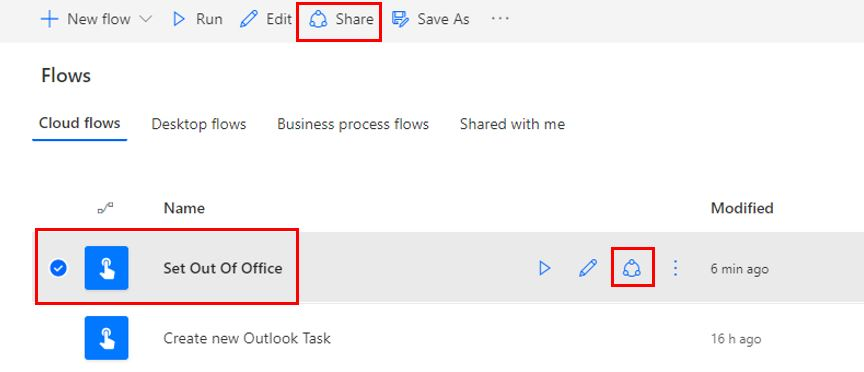
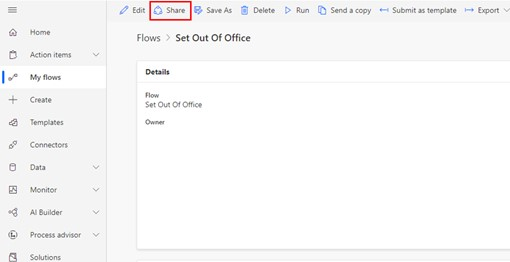
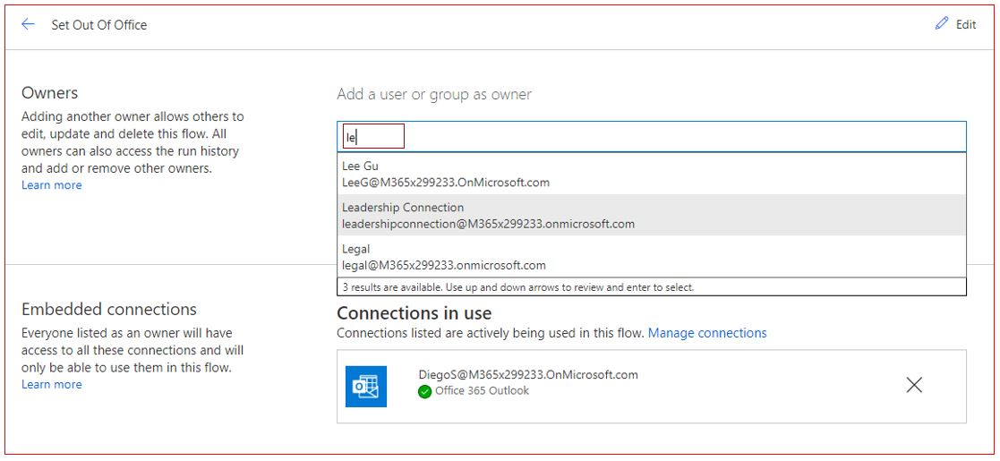
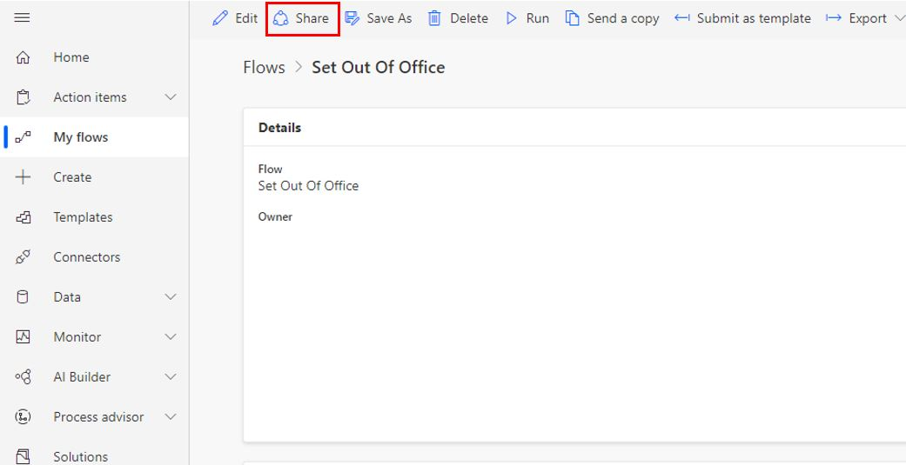
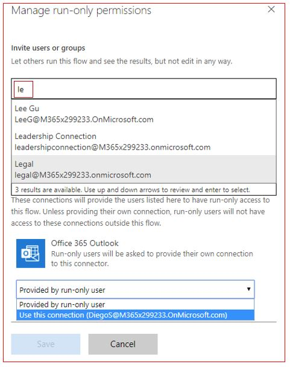
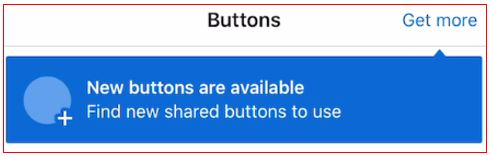
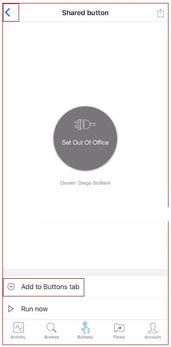

Microsoft Power Automate provides two options to share your flows with
your colleagues. You can either add your colleagues as **co-owners** or
**run only users**. Co-owners have full edit permissions for the flow
while run-only users can only run the flow. You can add users as
individuals, security groups or Office 365 groups. Here's an example of
how to share your button flow:

1.  If you do not wish to share your app as a **co-owner**, then go straight to step 7 below. If you wish to invite other users using your mobile Power Automate app then go to step 9 below.

1.  From the computer browser, to share your app with a co-owner, go to your flow's **Share** option by either clicking on the three vertical dots next to your flow in the **My flows** list or by going to your flow and clicking on the **Share** button available on the top.

    

    

1.  Type in either the user or the group name and select it.

    

1.  You will receive a message stating owners of the flow will have full access to all connections in the flow and the content within the connected accounts. Click **OK**.

1.  Next, click on the left arrow which is right next to the flow name.

1.  You have now successfully shared your button flow by adding a co-owner.

1.  To add run-only users click on Edit in the **Run only users** section.

    

1.  Select either the username or the group name and select which data connector the user should use. The user can either use the connection you created, or a connector provided by the user. Click **Save**.

    

1.  You can invite users to run your button flow directly from your mobile app. To do that, log into your Power Automate mobile app and click on the **Buttons** icon available on the bottom horizontal menu.

	Click on the ellipses or the three dots next to the flow button and select **Invite Others**. Search for the name of the person or group in the **Search people or groups** field. Click on the user or group name and click on **Send** which is available on the top right of the screen.

1. Click on **Done** which is available on the top right of the screen.

1. You can now see a list of users and groups with whom the button flow has been shared.

1. Next, let the user with whom you just shared the button with log into the Power Automate app and click on **Button** icon available on the bottom horizontal menu.

1. Click on **New Buttons are available**.

    

1. The user will now see the new button that was shared. Click on the flow button name.

1. Click on **Add to Buttons** tab which is available on the bottom of the screen.

    

1. Click on the arrow on the top left of the screen.

You will now see the new button in your Buttons.
