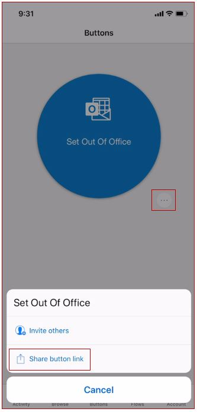
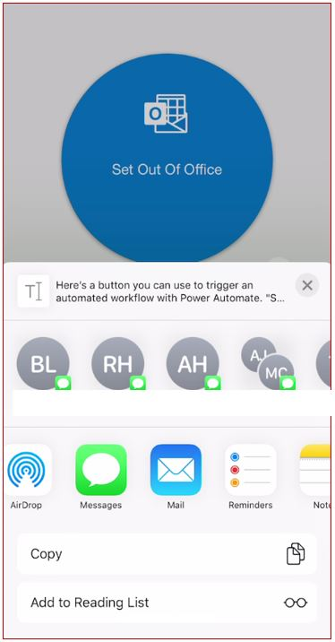

Let's look at how to share a button link.

1.  You can share your button link directly from your mobile app. To do that log into your Power Automate mobile app and click on the **Buttons** icon available on the bottom horizontal menu.

1.  Click on the ellipses or the three dots next to the flow button and select **Share button link**.

    

1.  There are a few options to share the button link.

    

1.  Let's send the button link using text messages. Click on **Messages** and in **To** add the phone number manually or find it using the address book in your device. The user you are sending it to needs to be part of your office 365 tenant.

1.  When the receiving user clicks on the text message, the users **Power Automate** mobile app will automatically open and have access to the app. Depending on how the flow was built the user may need to approve the connectors.

You have now successfully shared the button link!
