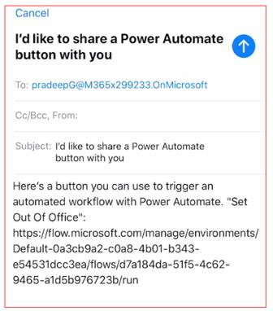

Let's look and how to share a button flow that has been shared with you.

Consider a scenario where a button flow was built by the maker, in this case Diego Sicillani, and was shared with another user, in this case Lee Gu. Now let's look at how Lee Gu is going to share with others.

1.  Log into **Power Automate** mobile app and click on **Buttons** which is available on the bottom horizontal menu.

1.  Click on the ellipses or the three dots next to the flow button and select **Share button link**.

1.  There are a few options to share the button link. Let's click on **Mail** and share the app with another user who is part of the same Office 365 tenant. In this case, we are sharing the link with Pradeep who is the receiving user.

    

1.  When the receiving user, Pradeep, clicks on the text message, the users Power Automate mobile app will automatically open and have access to the app. Depending on how the flow was built the user may need to approve the connectors.

You have now successfully shared the button link!
