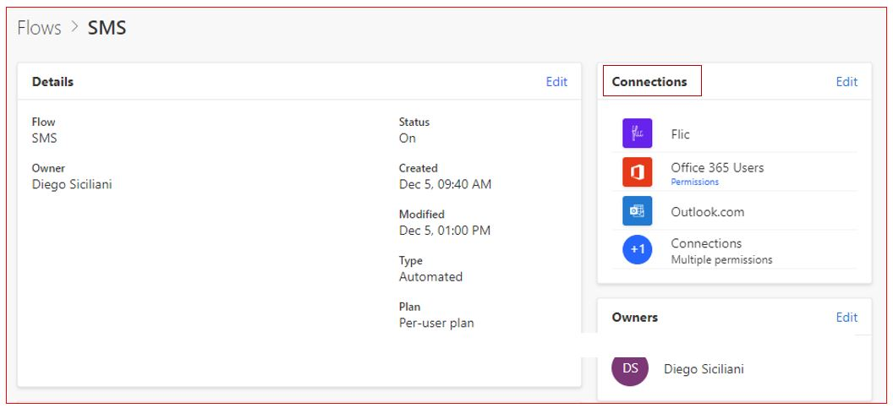
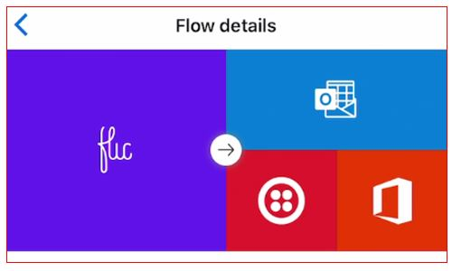
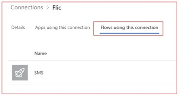
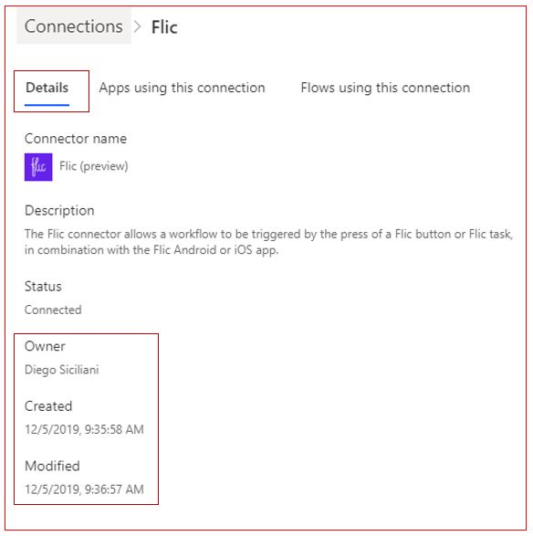
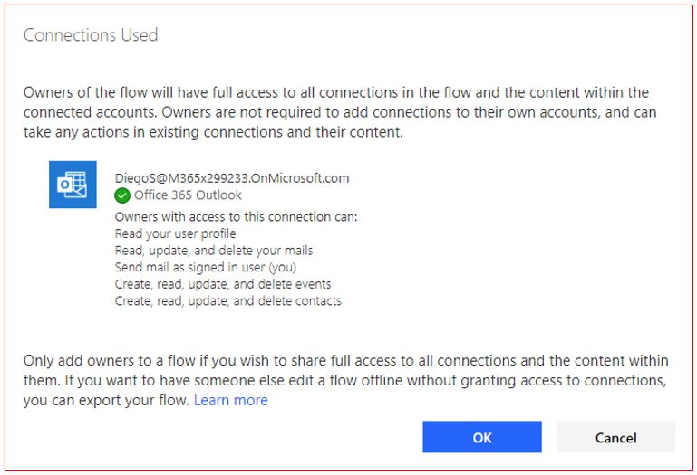
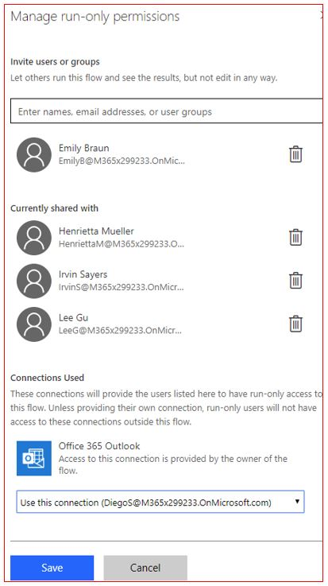

All flows including button flows use connections. The security of
connections can be viewed via a flow or the connector. From a flow, you
can view all the connectors used. From a connector, you can view all
the flows using that connector.

Here's a screenshot of all the connectors used for the SMS button flow.

You can see all the connectors from the mobile Power Automate app as well.

To view all the apps using a connector, log in to Power Automate from a
browser. Click on settings, which is on the top right of the
screen, and select **Connections**. Click on any connector and then
select **Flows using this connection**. You can see all the flows using
that connector.

The **Flow details** show other important information such as the owner of
the connection and when it was created and modified.

It is important to note that when you are sharing the ownership of the
flow button, you are also giving full access to all of the connections 
used in the flow and the contents within the connected accounts. 

Owners are not required to add connections to their own accounts. Thus,
you should only add owners to a flow if you want to share full access 
to all the connections in the flow. If you want to have someone else 
edit a flow offline without granting access to connections, you can 
export the flow.

If you are giving run only access, then the flow connections will
provide the run only access to this flow. These users won't have
access to the connections outside of this flow.

