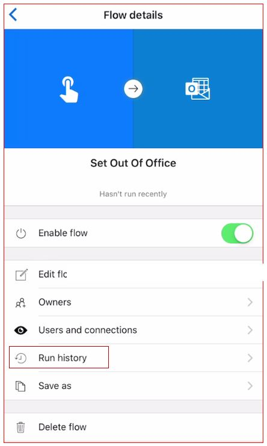
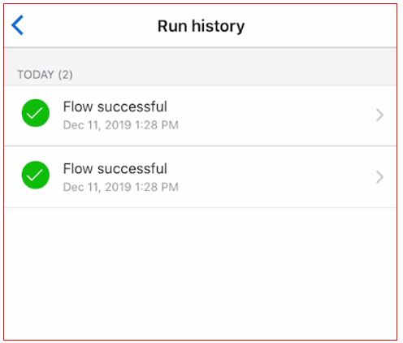
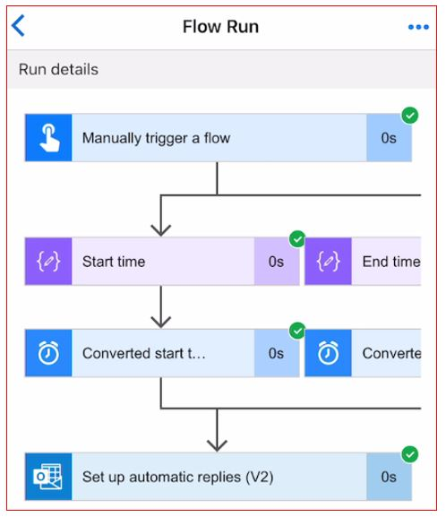

To monitor the run history of a button flow you need to look at the flow
history. You can view the flow history both from the desktop browser or
the mobile Power Automate app. Both the flow name and the button name
are the same. Let's look at how you can view the history from the mobile
app

1.  Log into your Power Automate mobile app and click on the **Buttons** icon available on the bottom horizontal menu. Make a note of button name whose flow history you would like to view.

1.  Next, click on Flows icon which is also available on the bottom horizontal menu. Find the flow and click on it.

1.  In the flow details section look for **Run history** and click on it.

    

1.  You can see all the flow runs both successful and unsuccessful.

    

    You can click on each run and see the details.

    
