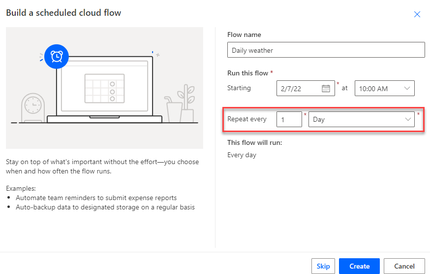
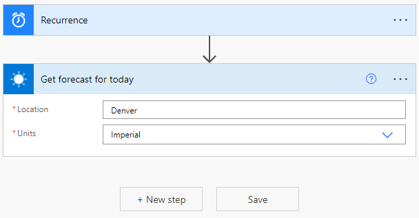
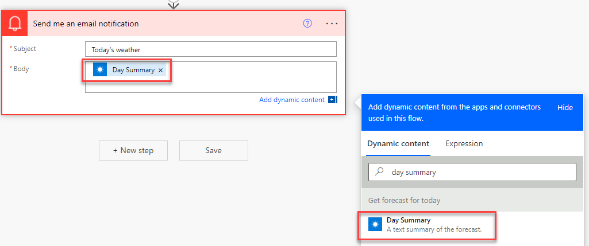
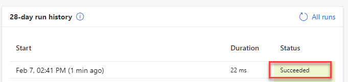
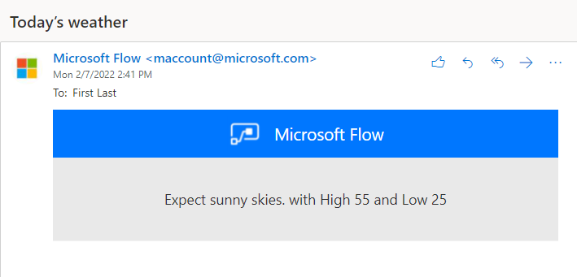
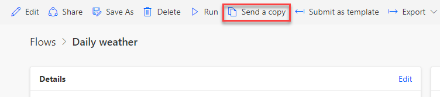
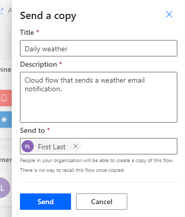
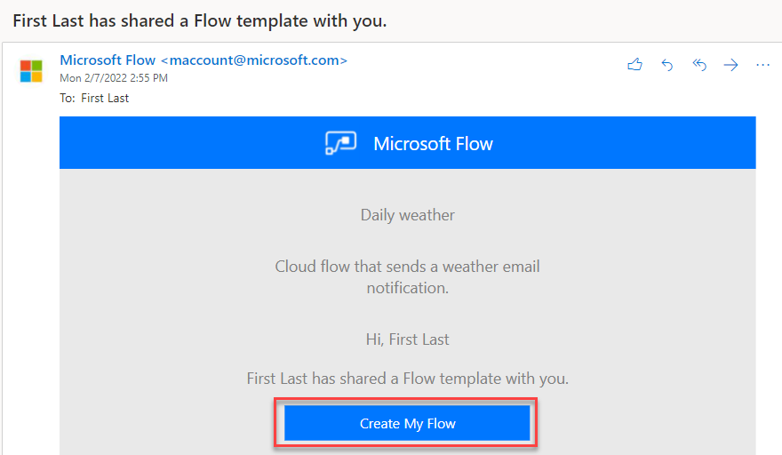
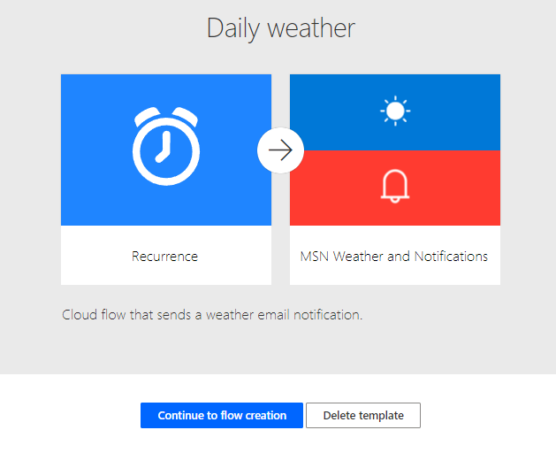
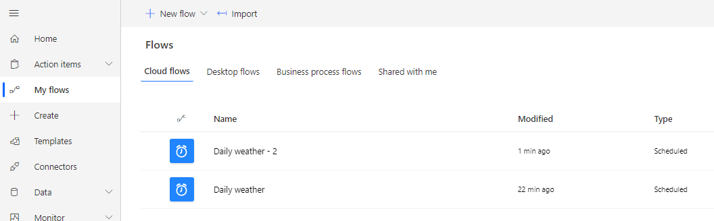

In this exercise, you'll create a cloud flow, send a copy of the cloud flow to yourself, and then test the cloud flow.

> [!IMPORTANT]
> Use a test environment for the exercise.

## Task 1: Create a cloud flow

In this task, you'll create a cloud flow that will send a daily weather notification for a certain city.

1. Go to [Power Automate](https://us.flow.microsoft.com/?azure-portal=true) and make sure that you're in the correct environment.

1. Select **My flows > Scheduled cloud flow**.

1. Enter **Daily weather** for **Flow name**. For **Repeat every**, select **1 Day** and then select **Create**.

    > [!div class="mx-imgBorder"]
    > 

1. Select **+ New step**.

1. Search for **weather** and then select **Get forecast for today** (MSN Weather).

1. Enter **Denver** or any city that you want for **Location**, select **Imperial** for **Units**, and then select **+ New step**.

    > [!div class="mx-imgBorder"]
    > 

1. Search for **send email** and then select **Send me an email notification**.

1. Enter **Today's weather** for **Subject**, select the **Body**, and then select **Day Summary** from the **Dynamic content** pane.

    > [!div class="mx-imgBorder"]
    > 

1. Type **with High** in the **Body** field and then select **Temperature High** from the **Dynamic content** pane.

1. Type **and Low** in the **Body** field and then select **Temperature Low** from the **Dynamic content** pane.

1. The **Send me an email notification** step should now resemble the following image. Select **Save** and then wait for the flow to be saved.

    > [!div class="mx-imgBorder"]
    > 

1. Select the back button.

    > [!div class="mx-imgBorder"]
    > 

1. Select **Run**.

1. Select **Run flow**.

1. Select **Done**.

   The flow run should succeed.

    > [!div class="mx-imgBorder"]
    > 

1. Select the **App** launcher, right-click **Outlook**, and then select **Open in new tab**.

    > [!div class="mx-imgBorder"]
    > 

1. You should receive the email notification that was sent by the flow. Select to open the email.

   The email should resemble the following image.

    > [!div class="mx-imgBorder"]
    > 

1. Go to the flow details browser tab.

1. Don't navigate away from this page.

## Task 2: Send a copy

In this task, you'll send a copy of the cloud flow that you created to yourself. You might send the copy to another user if you have more than one user in your tenant.

1. Select **Send a copy**.

    > [!div class="mx-imgBorder"]
    > 

1. Enter **Cloud flow that sends a weather email notification** in the **Description** field, select your username and any other user that you want to send the copy to, and then select **Send**.

    > [!div class="mx-imgBorder"]
    > 

1. Go to the Outlook browser tab.

1. You should receive an email from Power Automate. Select **Create My Flow**.

    > [!div class="mx-imgBorder"]
    > 

1. Power Automate should launch and display the flow template. Select **Continue to flow creation**.

    > [!div class="mx-imgBorder"]
    > 

1. Power Automate should display the connectors that the flow uses. Select **Create flow**.

1. Select **Run**.

1. Select **Run flow**.

1. Select **Done**.

   The flow should succeed, and you should receive the weather email notification.

1. Select **My flows**.

   The original flow that you created should display, and the flow copy that you sent to yourself should also display, assuming that you sent the copy to yourself.

    > [!div class="mx-imgBorder"]
    > 
