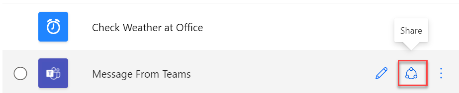
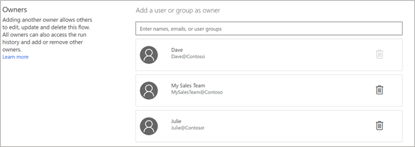
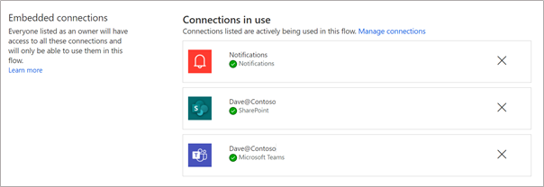
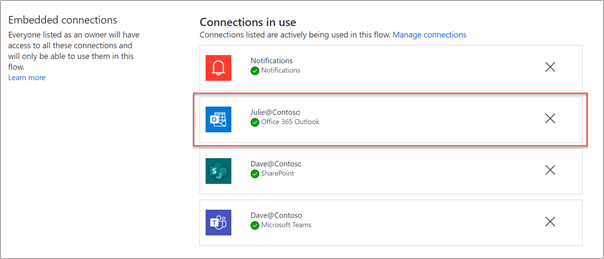

When you select the **Share** option on a selected cloud flow, you'll be directed to a page to manage the owners of the flow.

> [!div class="mx-imgBorder"]
> 

By adding users or groups to the list of owners, you'll create co-ownership of the flow with those users.

> [!div class="mx-imgBorder"]
> 

In the preceding example, Dave is the original flow owner who's shared it with Julie and My Sales Team. My Sales Team is a group, and anyone who is a group member will become the flow co-owner automatically.

Co-owners of the flow will have permission to perform the following actions:

- Run the flow on demand for instant and scheduled flows.

- Edit the flow definition (for example, add or remove an action or condition).

- Perform test runs of the flow.

- View the run history.

- Manage the properties of the flow (for example, start or stop the flow, add owners, or update credentials for a connection).

- Add or remove other owners (but not the flow's creator).

- Delete the flow.

Considering that co-owners have full permissions, including delete access, you should only add users whom you trust and need to perform these activities. If the flow is an instant flow and users only need to run the flow, it's better that you add them as run-only users instead of co-owners. You'll learn about run-only users in the next unit.

Users who have the Global Administrator and Microsoft Power Platform Administrator tenant roles can also manage the flow's owners, including adding themselves to the list.

Sharing critical business flows with at least one other user can be crucial in case the flow creator is out of the office or has left the company and a change is required.

> [!VIDEO https://www.microsoft.com/videoplayer/embed/RE4PwbB]

## Connections

When you build a flow and add actions, some actions will use connectors. The first time that a connector is used, a connection will be established and used by the actions. To establish the connection, the user who is modifying the flow will be required to authenticate. That connection will be associated with that user, and actions that are performed will be in that context. For example, if Dave added a SharePoint action to add an item to a list, it would show that Dave added the list item when that action ran.

On the **Share** page, the **Embedded connections** section shows which connections are used in the flow.

> [!div class="mx-imgBorder"]
> 

All flow owners have access to these connections, but only for this flow. That access allows them to add more steps to the flow by using these connections without the need to authenticate or create new connections. However, the access doesn't allow them to use the connection outside of the flow.

If Julie edits the flow and then adds a step to send an email by using the Office 365 connector, it's added to the list of connections with Julie as the connection user. If the flow is run, the emails will be sent from Julie and Dave will still be the creator of the list item in Microsoft Lists. The connection list will now resemble the following screenshot, which shows the connection that Julie added.

> [!div class="mx-imgBorder"]
> 

When collaborating with others on a flow, you might want to designate one user to manage the connections so that they're all in the same context.

Any flow owner can use any connection in this flow to perform actions on your behalf. Consequently, you should watch out for inadvertent elevation of the permissions and only add owners whom you trust. For example, in the previous flow, Julie can access information in SharePoint as Dave, regardless of whether they have permissions to do so as themselves.

## Determine the need to share by using co-ownership

The following table describes scenarios to help you determine whether you need to share by using co-ownership or not. 

| Scenario | Options |
| -------- |-------- |
| I want to allow another user to edit my flow | Co-ownership is the best option. |
| I have a flow that triggers when someone adds a list item to SharePoint or creates a row in a Dataverse table. Do I need to add every user who adds items as a co-owner of my flow? | No, this flow is an automated flow that's triggered by an event. As long as the flow connection user has access to the list or table, the flow will run properly without you needing to add all users as owners or run-only. |
| I have an instant flow and I want others to run the flow. | Co-ownership isn't required; you should set up the users as run-only. |
| I have a scheduled flow and I want others to run it on demand in addition to the scheduled times. | Co-ownership is the best option. However, be aware that the users will have more permissions than only running the flow. |
