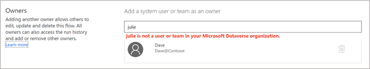
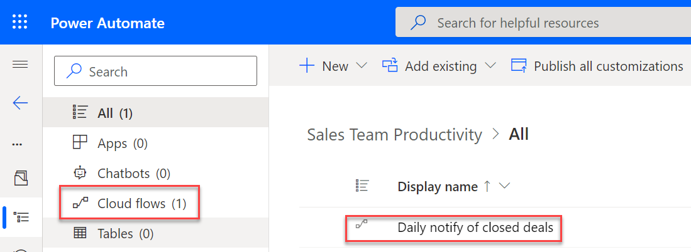
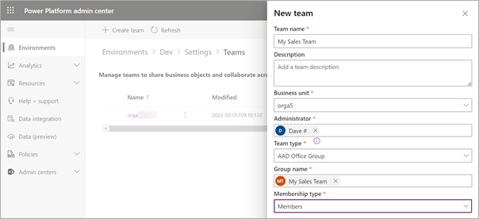
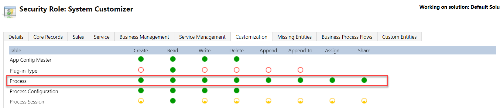
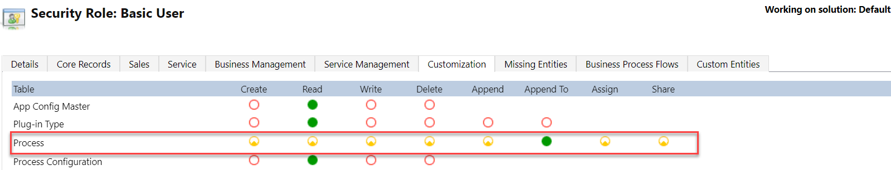

When a Power Automate cloud flow is created in a solution or added to a solution, an extra layer of security will be enabled and it will change how you share a cloud flow.

Solutions are the Microsoft Power Platform mechanism for implementing [application lifecycle management](/power-platform/alm/?azure-portal=true) (ALM) for Power Apps, Power Automate, and Power Virtual Agents. You can add Power Automate cloud flows as a solution component along with other resources, such as Power Apps and Dataverse table definitions. Then, solutions will act as a container for your changes and will allow you to transport them from one Microsoft Power Platform environment to another. Additionally, you can export solutions and store them in source control as part of your ALM strategy.

You can only create solutions in a Microsoft Power Platform environment with Microsoft Dataverse set up. Cloud flows that are associated with a solution have their definitions stored in a Dataverse table named Process. The ability of a user, other than the creator of the cloud flow, to run or modify the flow depends on the user's Dataverse security privileges.

For a user to run or modify a cloud flow, you first need to add them as a Dataverse environment user. For example, if you try to share with a user who isn't a member, the following **not found** message will display.

> [!div class="mx-imgBorder"]
> 

If you created the environment, you're an environment administrator and can [add the user](/power-platform/admin/add-users-to-environment/?azure-portal=true). Otherwise, any environment administrator can add users. The newly added user will need to have a security role assigned that gives them at least user-level privileges to the Processes table. A good built-in security role that would give them that ability is the [Environment Maker role](/power-platform/admin/database-security?azure-portal=true#environments-with-a-dataverse-database). However, you can also use or create a custom security role.

After you've added the user, you can share a solution cloud flow with them, and they'll be able to see the flow in Solution Explorer. They won't be able to view the shared flow in **My flows > Shared with me**; they'll only see it when using Solution Explorer.

> [!div class="mx-imgBorder"]
> 

You can share a solution flow with a group of users, but it's done by using [Dataverse Teams](/power-platform/admin/manage-teams/?azure-portal=true) instead of user groups. You can still use Azure AD security groups or office groups, but you need to first associate the group with a Dataverse team. The following image shows the process of adding a Dataverse team that is associated with the My Sales Team office group.

> [!div class="mx-imgBorder"]
> 

Before you can share flows with the team, you will need to associate it with a security role. After you've finished, you can share a solution cloud flow with the team, which will give owner access to the cloud flow to all members of the group.

## Run-only flows

You can use a similar process to share cloud flows in solutions as run-only. To be effective at limiting a user's access to read-only, the security role that grants them privileges to the Dataverse Processes table must be limited to their own processes. That way, the users won't be able to modify the processes that they didn't create. A good built-in role for run-only use would be the [Basic User role](/power-platform/admin/database-security?azure-portal=true#environments-with-a-dataverse-database).

## Impact of Dataverse security roles

Because Dataverse security controls the sharing of solution cloud flows, users can also gain access to solution cloud flows based on their security roles that were assigned directly or indirectly through a Dataverse team. For example, users with the System Administrator or System Customizer built-in roles have the equivalency of owner access to all cloud flows in the environment without a direct share being required. Users who gain access to a cloud flow through a security role and not a direct share aren't listed in the owner's list on the cloud flow. You can check what privileges that a security role provides by looking at its setup.

> [!div class="mx-imgBorder"]
> 

The full circle for each Process table privilege would grant permissions to perform the relevant operation (create, read, write, delete) for any solution flow in this environment. The following image shows what the Basic User role looks like.

> [!div class="mx-imgBorder"]
> 

Only a quarter of the circle is filled, giving user-level access where the operation is only permitted on the solution cloud flows that the user created. This security role configuration allows individual sharing of cloud flows with the user or team while only sharing the privileges that are granted by the type of share, such as owner or run-only.

A complete discussion of Dataverse security is beyond the scope of this module. For more information, see [Security concepts in Microsoft Dataverse](/power-platform/admin/wp-security-cds/?azure-portal=true).
