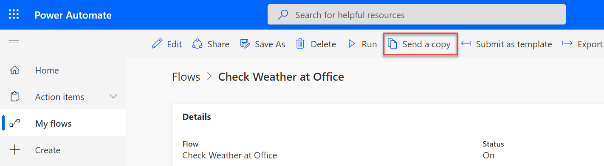
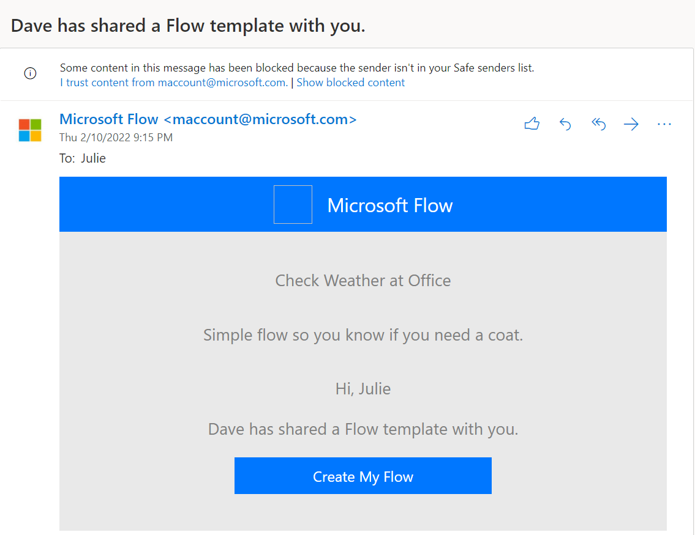
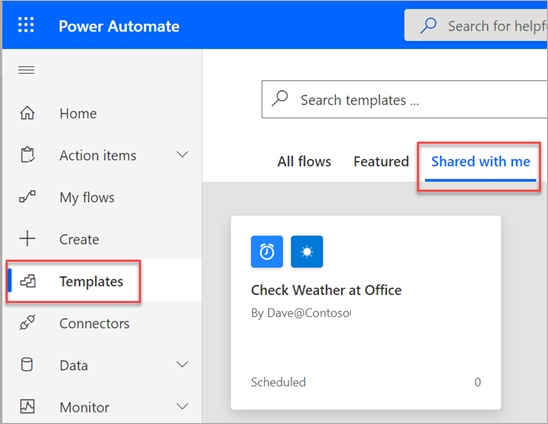
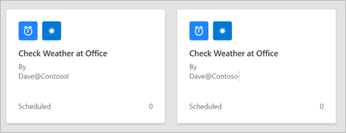

Thus far in this module, you've learned about sharing the same cloud flow definition with other users. When you use the **Send a copy** feature to share a flow, users will receive their own copy. You can initiate **Send a copy** when you have a cloud flow selected in the list or from the flow detail page.

> [!div class="mx-imgBorder"]
> 

You must be a cloud flow owner to use the **Send a copy** feature. Additionally, you must have successfully run the flow since it was last modified before you can send a copy.

:::image type="content" source="../media/group.png" alt-text="Screenshot showing the process of sending a copy to a group.":::

If you send a copy to an individual user, they'll receive an email similar to the following image to launch the ability to create the flow. An email won't be sent when you send a copy to a group. Instead, group members will be able to access the copy on the flow portal.

> [!div class="mx-imgBorder"]
> 

Individual users and users from groups can view and use the flow template by going to **Templates > Shared with me**.

After you've sent a copy, you can't recall or remove it. If you need to send an update, make sure that the title is unique so that the receiving users can differentiate which flow template is new. The following screenshot shows an example of sending the same title twice.

When people use the template, the following prompt will appear before they begin creating the flow.

:::image type="content" source="../media/template.png" alt-text="Screenshot showing the process of creating the flow from the template.":::

If the flow uses connectors, the recipient needs to create their own connections; therefore, they need to have relevant permissions. For example, if the flow uses the SharePoint connector, then the recipient would need to have access to SharePoint to be able to re-create the connection. After the connection has been created, the recipient will be taken to the detail page to edit and manage the flow as they would any other flow that they own.

## Decide whether to use Send a copy

**Send a copy** is the best approach to sharing when you have a cloud flow that would help others but needs personalization. When users have their own copy, it removes concerns about them modifying and breaking your flow.

**Send a copy** is also a good approach for someone to use as a starting point for building their own flow. For example, a sales team might create five flows that they send to new sales staff to get them started on building their own productivity automation.

> [!Important]
> After you've sent a copy to a user or group, it's impossible to recall, change, or remove it. Avoid sharing flows with sensitive information.

For flows that frequently change, a single shared flow works better. When you share by using a copy, you will need to make changes in each copy individually.

**Send a copy** allows the user to create the flow in the same Microsoft Power Platform environment that your flow is in. If you want to have the flow run in a different Microsoft Power Platform environment, review the Solutions and sharing unit in this module.

**Send a copy** works seamlessly in the default environment because everyone has access. If you send a copy of a flow to a user from an environment that they don't have access to, they'll get an error when they try to create the flow. To avoid errors, make sure that the same users and groups have access to the environment that you're sending the flow from prior to sending.
