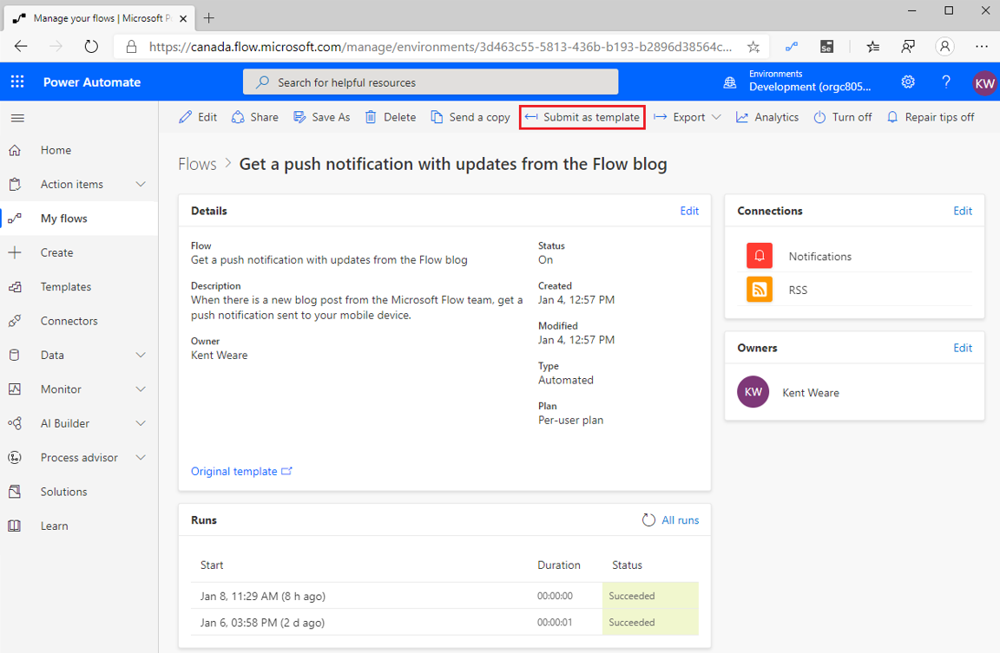
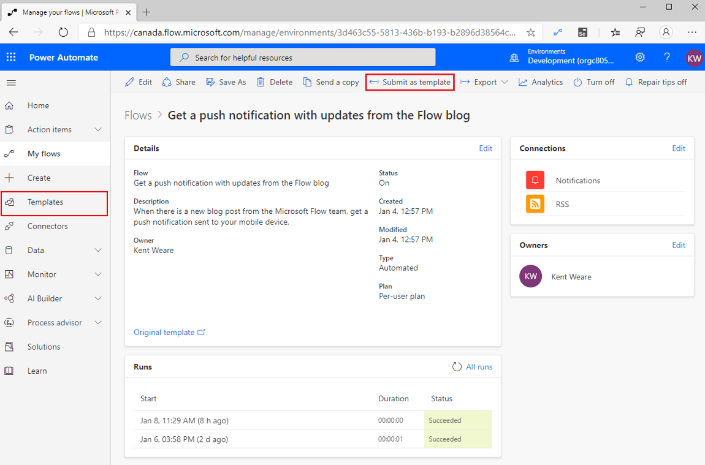

Within Power Automate, templates exist that allow makers to use
blueprints that have been provided by Microsoft, Microsoft Partners and
the community. These templates are free to use and act as accelerators
for people who are looking to solve a pre-determined problem. Once a
maker has provisioned the template, they are free to make changes as
they wish.

Anyone can submit a template, provided its last run was successful, from
within the Power Automate Maker Portal. Once submitted, Microsoft will
review the template for suitability, remove any personal identifiable
information and publish it to the public gallery.

The public gallery can be accessed from the Templates link that exists
in the left navigation. From the gallery, makers can search for specific
connectors or keywords that they are interested in. Additionally,
Microsoft has categorized the templates based upon popular scenarios
like approvals, email and calendar.

While many of the templates that exist in the gallery target information
workers, there are some templates that target Power Platform governance
use cases. In this module, we are going to explore some of these
templates that can be used by administrators to improve their
productivity when governing the Power Platform.

