The following sections describe some of the templates that allow
administrators to automate the governance of their environments.

### Template 1 - List New Microsoft Flow Connectors

The **List New Microsoft Flow Connectors** template will help you discover new connectors that have been deployed in a Power
Platform environment. You can provision this template by accessing the
[List new connector template](https://preview.flow.microsoft.com/galleries/public/templates/5a6ef26db3b749ed88b7afb377d11ecf/list-new-microsoft-flow-connectors/?azure-portal=true)
directly or by searching for it in the **Templates** gallery.

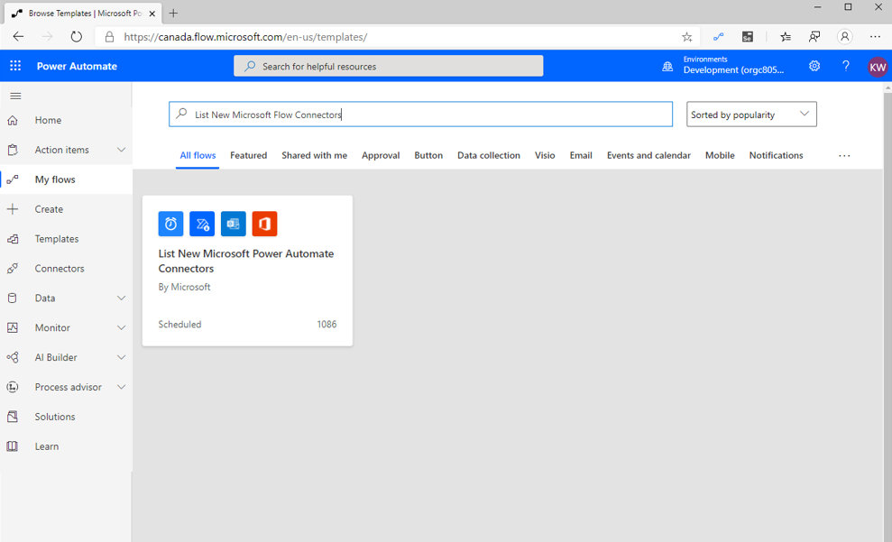

After you have selected this template, you will find a description of what the
flow does and will be prompted to establish new connections for the
connectors that are used by the flow. If you already have existing
connections for these connectors, you can select the **Continue** button.

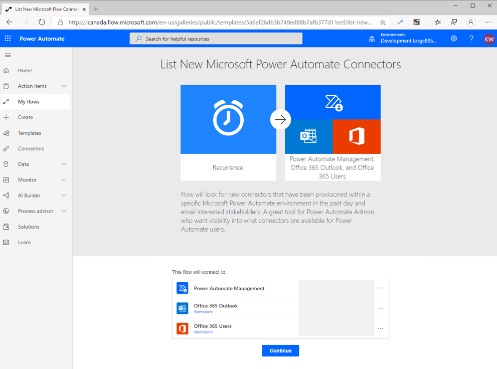

After selecting the **Continue** button, the flow will be loaded into the
Power Automate designer experience where you can modify the flow to
suit your needs. For example, this flow is configured to run every day at
9:00 AM. The flow allows you to select an environment and the flow then checks
if any connectors have been provisioned within the
past 24 hours. Optionally, you can modify this expression to include a broader duration.

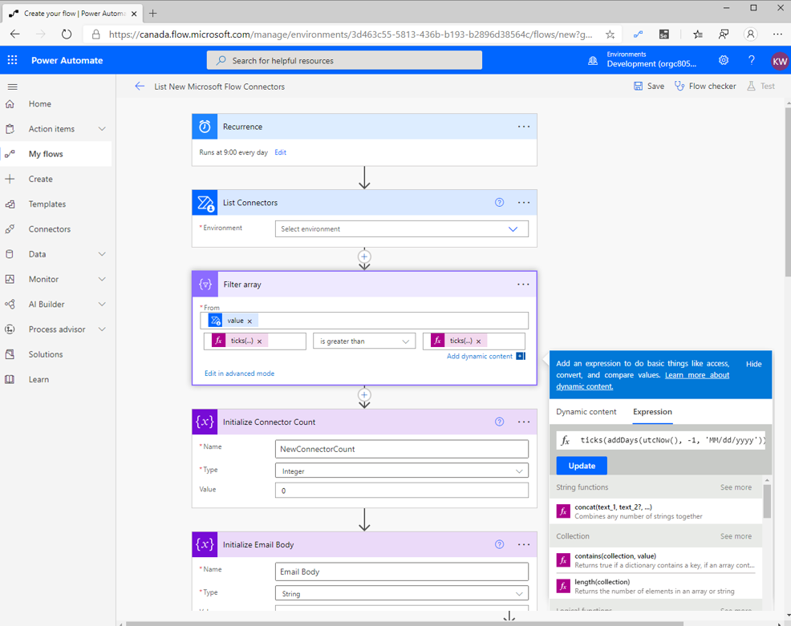

Because you do not need to make additional configuration changes, you
can now run this flow. If new connectors have been deployed in the
past day, you will receive an email similar to the following. In this case, you
have a custom connector that has been recently deployed in your environment.

This email is important for an administrator because they can now adjust their DLP policies to ensure that this connector has been placed in the correct data group.

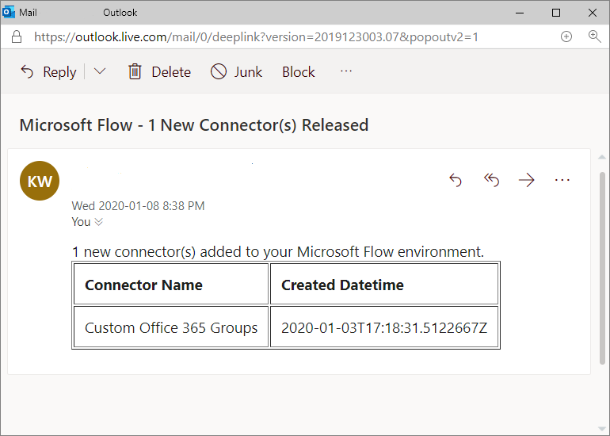

> [!NOTE]
> Depending on what environment you are running this flow in,
you might encounter a DLP error based on activities that are performed in
previous modules. Modify or remove DLP policies as appropriate.

### Template 2 - Get list of new PowerApps, Flows, and Connectors

Another useful template that administrators can take advantage of is
**Get list of new PowerApps, Flows, and Connectors**, which can be found by
searching in the Templates gallery or by selecting the
[template](https://preview.flow.microsoft.com/galleries/public/templates/0b2ffb0174724ad6b4681728c0f53062/get-list-of-new-powerapps-flows-and-connectors/?azure-portal=true).

This template is similar to the template that was previously discussed, except
that it will search all environments within the tenant and
will also identify new apps, flows, and connectors.

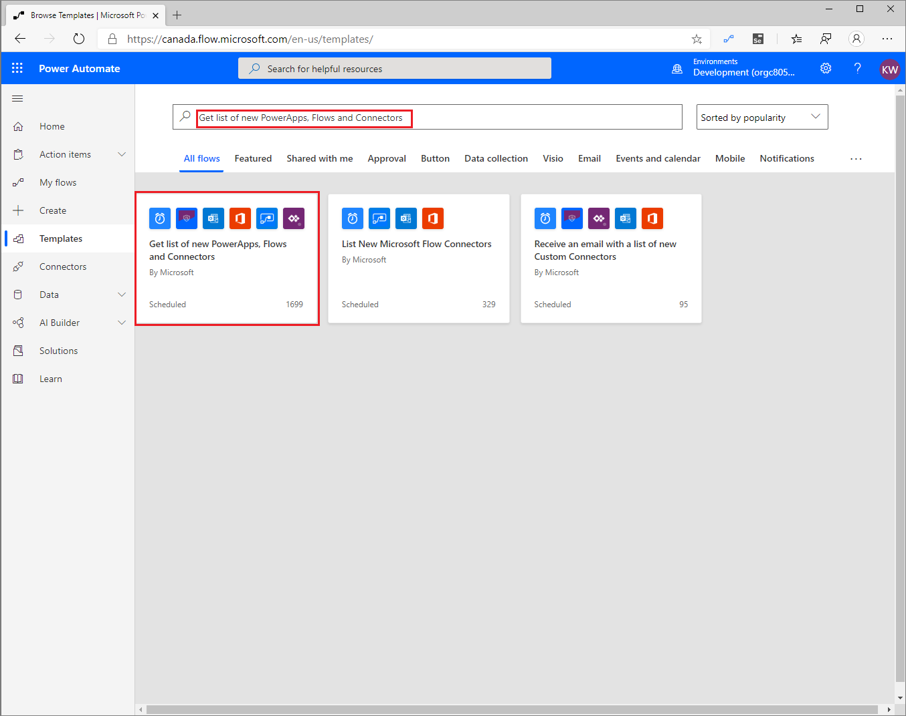

When you select this template, you will also have to create connections
to the connectors that are used in the flow, if they have not already been
established. After your connections have been established, you can select
the **Continue** button to provision the flow.

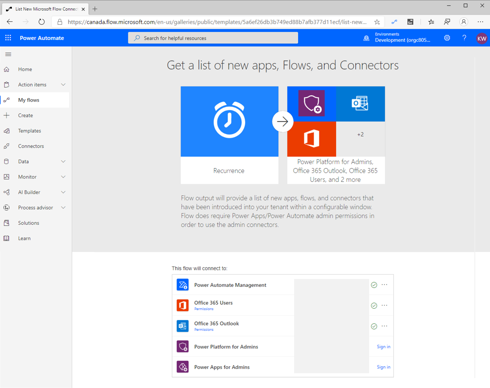

This flow is also configured to run daily, and you can modify a variable called
**reportingperiod**. This value indicates the number of
days back that the flow should evaluate when looking for new apps, flows, and
connectors. The default value is **-7**, which means that this flow will
look for new assets that were created in the past seven days.

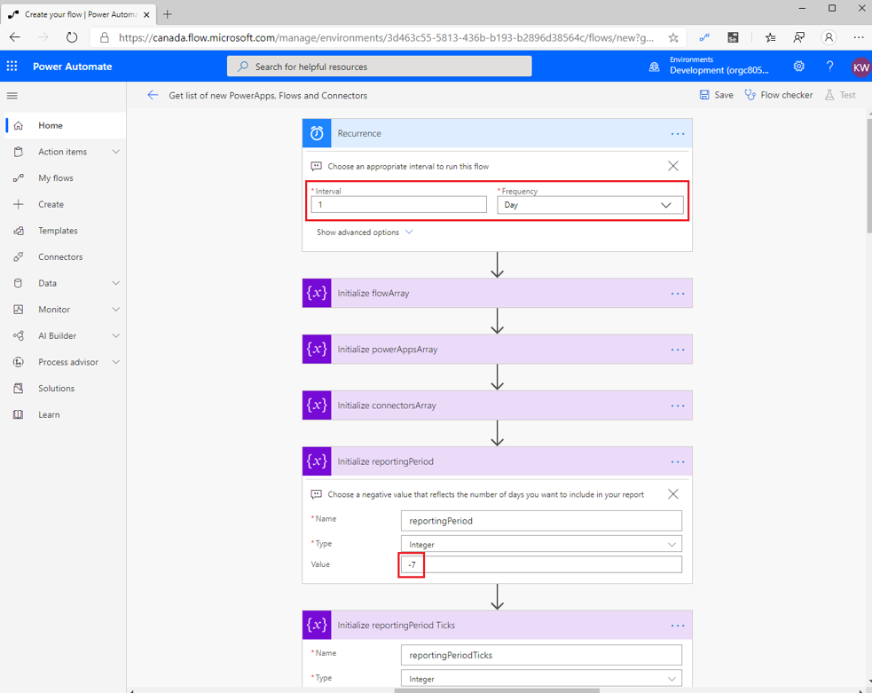

When you run this flow, a report will be generated that identifies every
new flow, app, and connector that has been created in your tenant over the
past seven days. Depending on how many environments, apps, and flows that you
have in your tenant, this flow can take several minutes to complete.

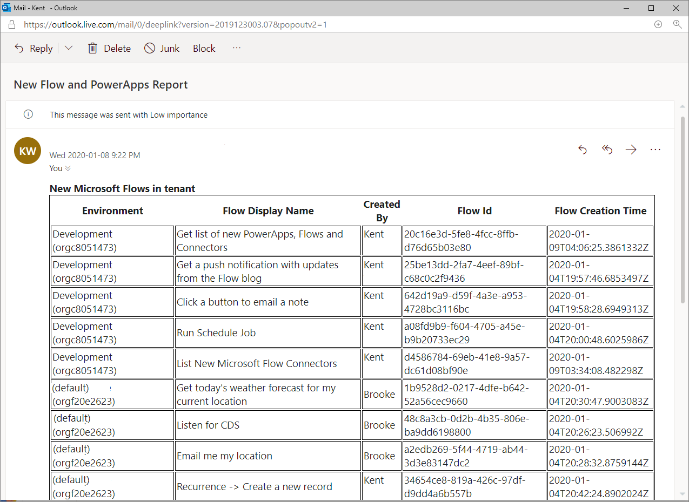

### Template 3 - Monitor Office 365 audit logs for specific details and send alerts

The **Monitor Office 365 audit logs for specific details and send alerts** template can be found by
searching for it in the Templates gallery or by directly selecting the
[template](https://preview.flow.microsoft.com/galleries/public/templates/4a7ea95259f1404e95855f6b053360b1/monitor-office-365-audit-logs-for-specific-details-and-send-alerts/?azure-portal=true).

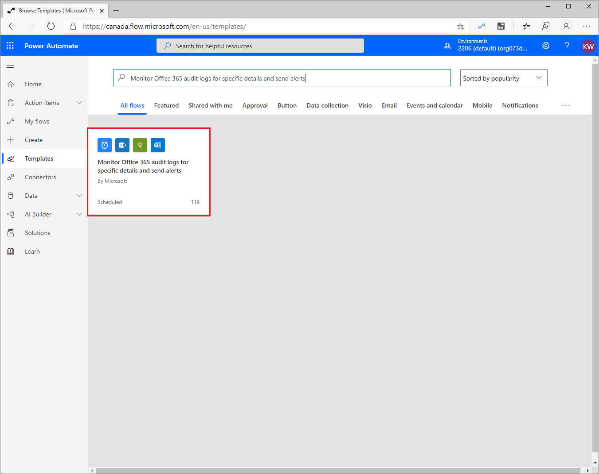

The purpose of this template is to search the [Office 365 Security and Compliance](https://protection.office.com/unifiedauditlog/?azure-portal=true) logs for Power Automate events on a configured interval. The events that are captured in these logs include:

- Created flow

- Edited flow

- Deleted flow

- Edited flow permissions

- Deleted flow permissions

- Started a Flow paid trial

- Renewed a Flow paid trial

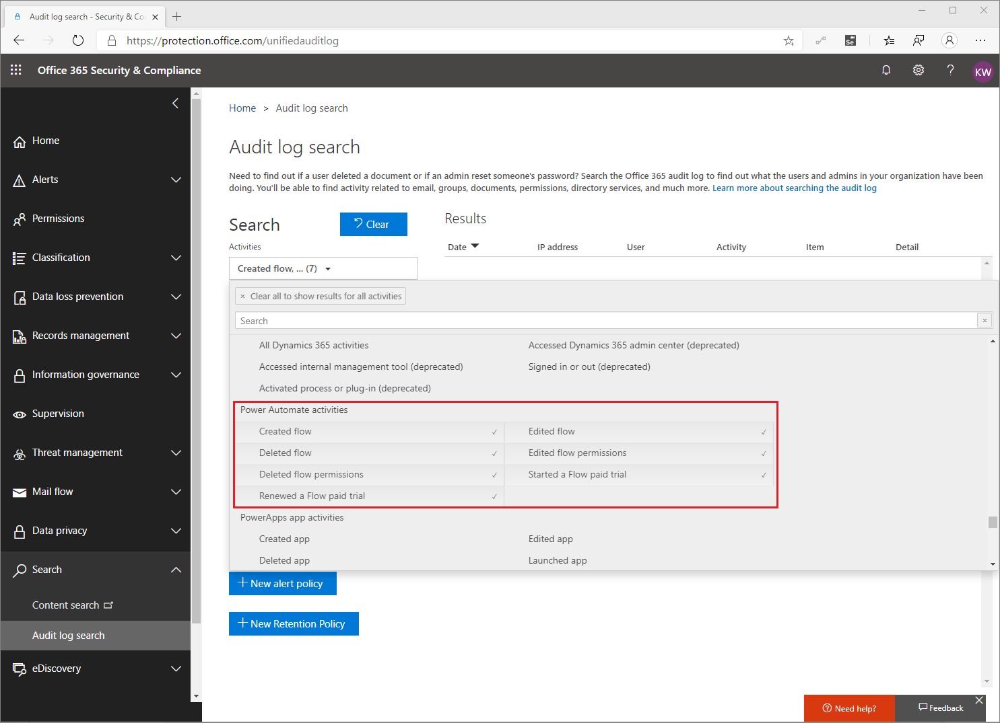

Before using this flow, you need to establish connections to
SharePoint and Office 365 Outlook. The reason is because you will
store the names of events that you want to subscribe to in SharePoint and
you will use the Office 365 Outlook connector to send your results to
your intended audience. After you have created your connections, you can
select the **Continue** button to edit the flow.

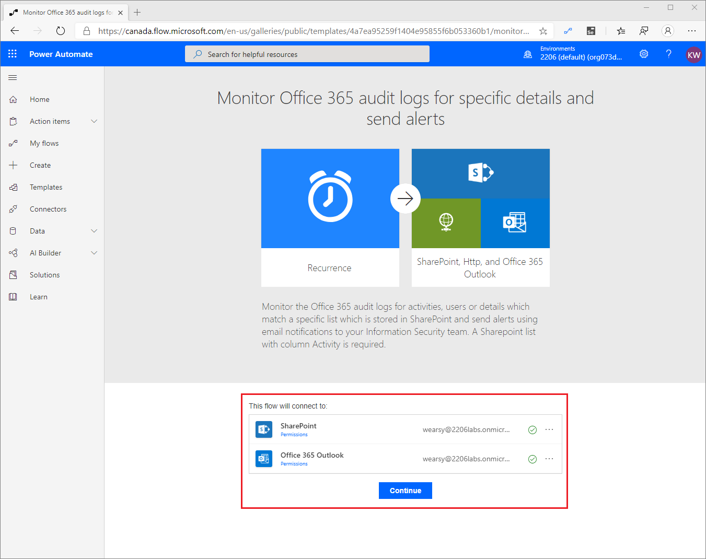

Before configuring your flow, you need to create a list
where you can store the operations that you will pass into the Office 365
API. In this scenario, you are interested in knowing when new
flows are created. As a result, you will add a record that includes a **Title**
of **CreateFlow**. A complete list of supported operations can be found in this
[blog post](https://flow.microsoft.com/blog/accessing-office-365-security-compliance-center-logs-from-microsoft-flow/?azure-portal=true).

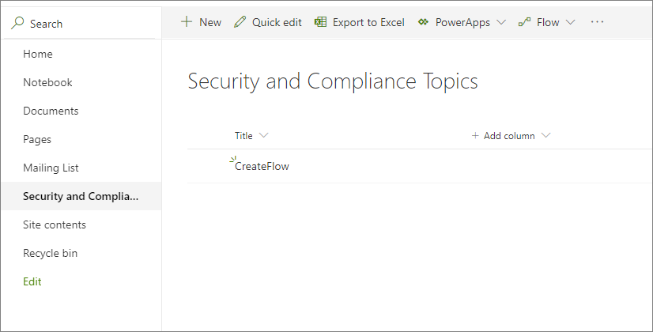

With your list in Microsoft Lists created, you can edit your flow so that you can
connect to your list. While you are in the flow designer, you need to configure a few
actions, including the Recurrence trigger that
indicates when your flow will run. You also need to populate a SendTo
variable, which represents an email address that you want to send your
output to. If you want a different duration of events to query for,
you can modify the expressions in the FromDate and ToDate variables.

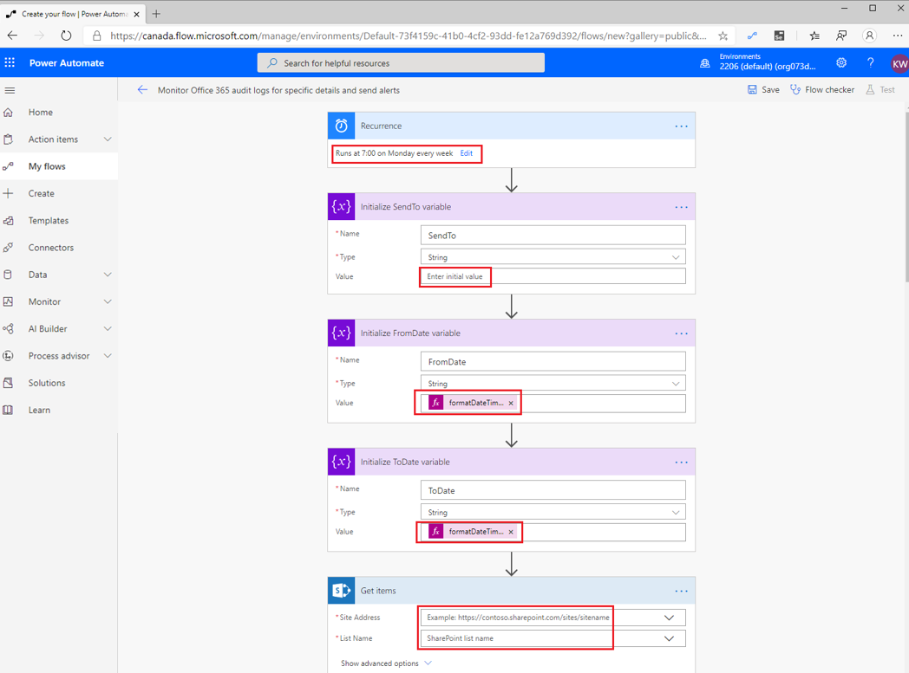

When connecting to the Office 365 Security and Compliance API, you need
to provide your Office 365 admin credentials. You will do so by
populating the **Username** and **Password** fields that are found in the
**advanced options** in the **HTTP** action.

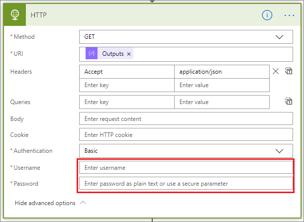

You are now ready to run your flow. If you have created a flow within
your tenant in the past 30 days, you should receive an email that looks
like the following example.

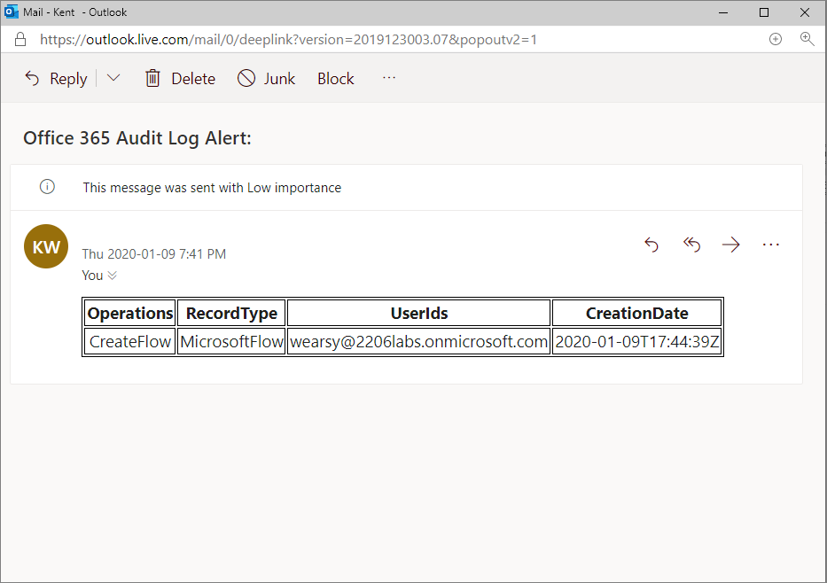
