As Power Automate flow consumption increases, it's important to monitor the health of these flows. Analytics is available at the flow level and the environment level.

## Analytics at the flow level

You can access flow-level analytics from two locations. One location is from the list of flows that you have access to.

> [!div class="mx-imgBorder"]
> [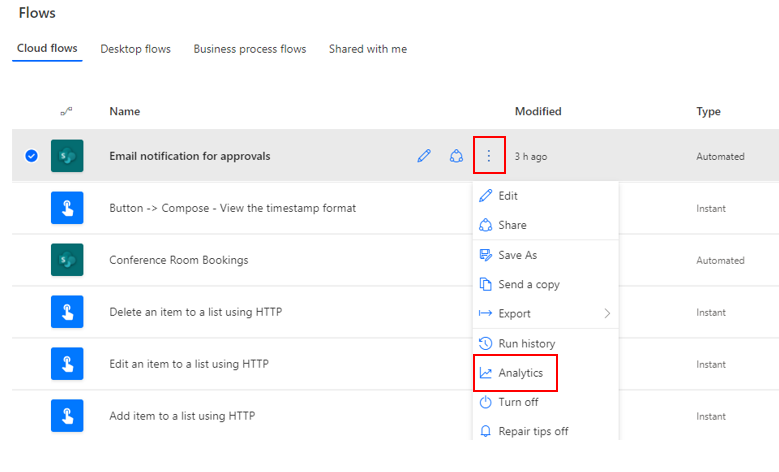](../media/image-14.png#lightbox)

The second analytics location is in the flow settings.

> [!div class="mx-imgBorder"]
> [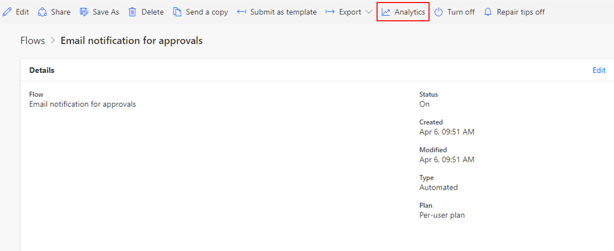](../media/image-15.png#lightbox)

Flow-level analytics provides information such as actions, usage, and errors. Each of these areas is a Microsoft Power BI report, and the data that is presented ranges from the last 7, 14, and 30 days.

The following screenshot shows an example of the flow **Actions** analytics. It presents the total number of billable actions that have run so far.

> [!div class="mx-imgBorder"]
> [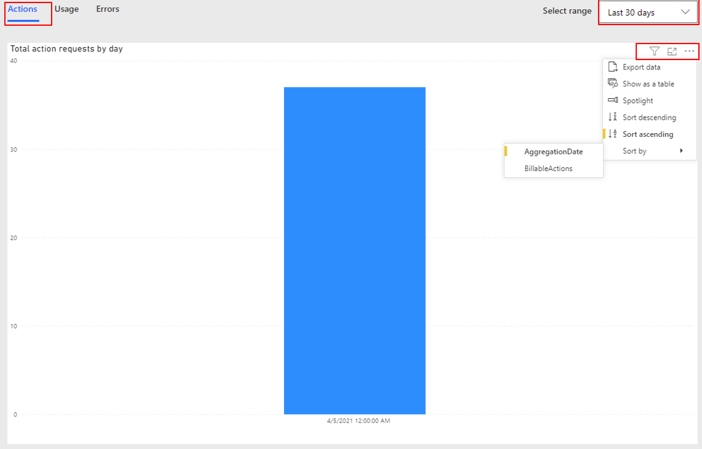](../media/image-16.png#lightbox)

The following image shows an example of the flow **Usage** analytics. This report provides a breakdown of the total number of runs that you had in a day and how many of those runs were successful and how many failed. This report only provides numbers.

> [!div class="mx-imgBorder"]
> [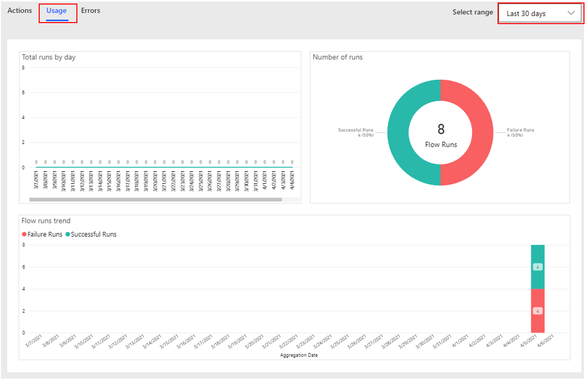](../media/image-17.png#lightbox)

The **Errors** tab also provides you with a total count by day and **Error details**, such as the error types and details of that error.

> [!div class="mx-imgBorder"]
> [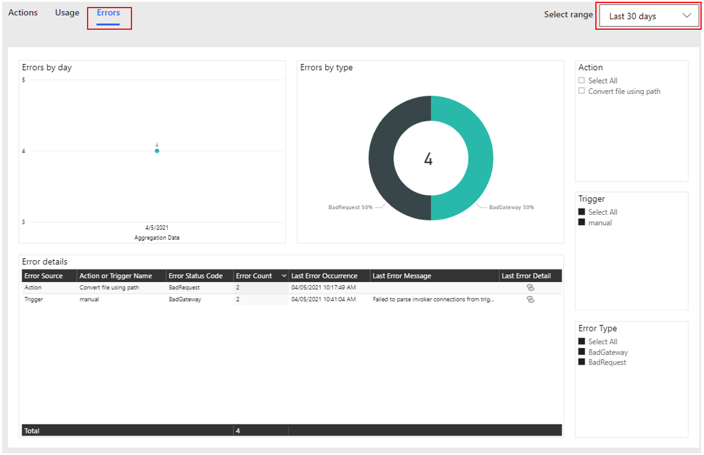](../media/image-18.png#lightbox)

## Analytics at the environment level

Admins with the following roles and a license can view the reports in Power Automate analytics:

- **Environment admin** - Can view reports for the environments that the admin has access to.

- **Microsoft Power Platform admin** - Can view reports for all environments.

- **Dynamics 365 admin** - Can view reports for all environments.

- **Microsoft 365 Global admin** - Can view reports for all environments.

The reports provide insights into runs, usage, errors, types of flows that are created, shared flows, and details on connectors that are associated with different flow types such as automated flows, button flows, scheduled flows, approval flows, and business process flows. Each report is a Power BI report, and the data that is presented ranges from the last 7, 14, and 28 days.

> [!div class="mx-imgBorder"]
> [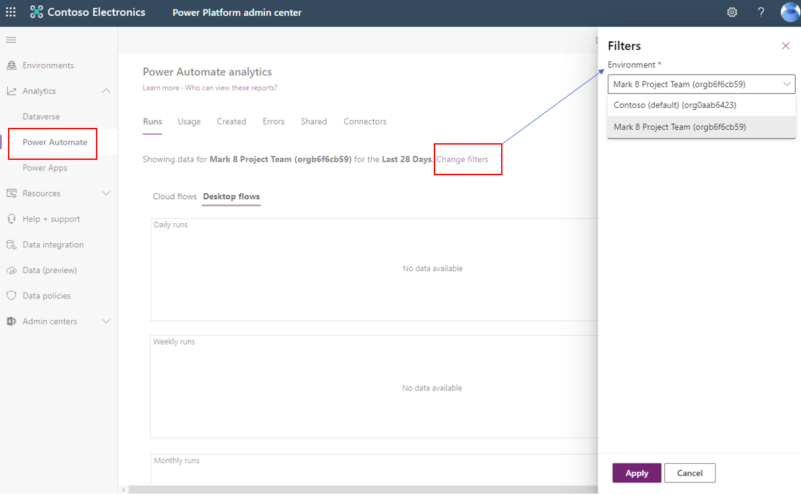](../media/image-19.png#lightbox)

By default, the **Runs** report appears first. It provides a view into the daily, weekly, and monthly run data of all flows in an environment.

> [!div class="mx-imgBorder"]
> [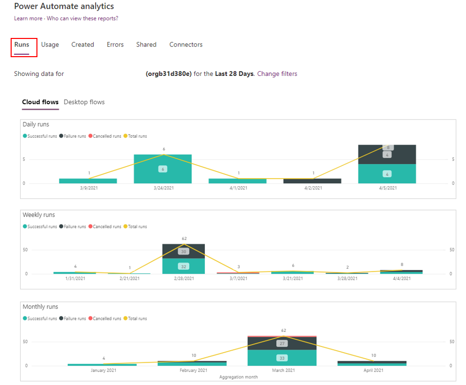](../media/image-20.png#lightbox)

The **Usage** report provides insights into the different types of flows in use, the trends, and the flow creators' names.

> [!div class="mx-imgBorder"]
> [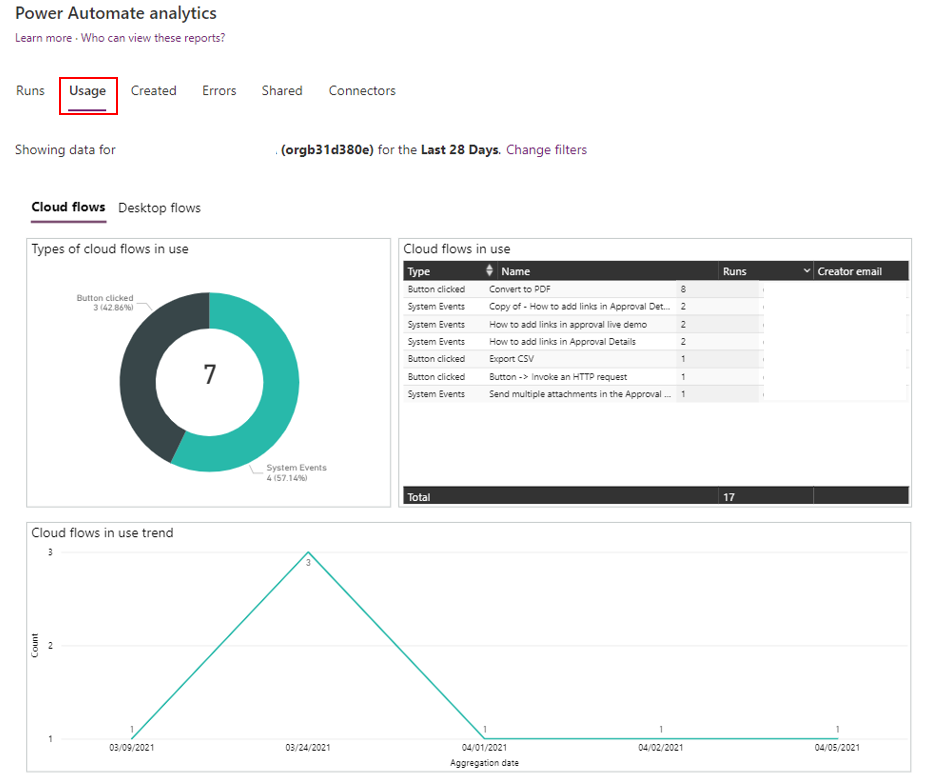](../media/image-21.png#lightbox)

The **Created** report provides insights into the types of flows that are created, creation trends, and details such as the created date and the creator's email address.

> [!div class="mx-imgBorder"]
> [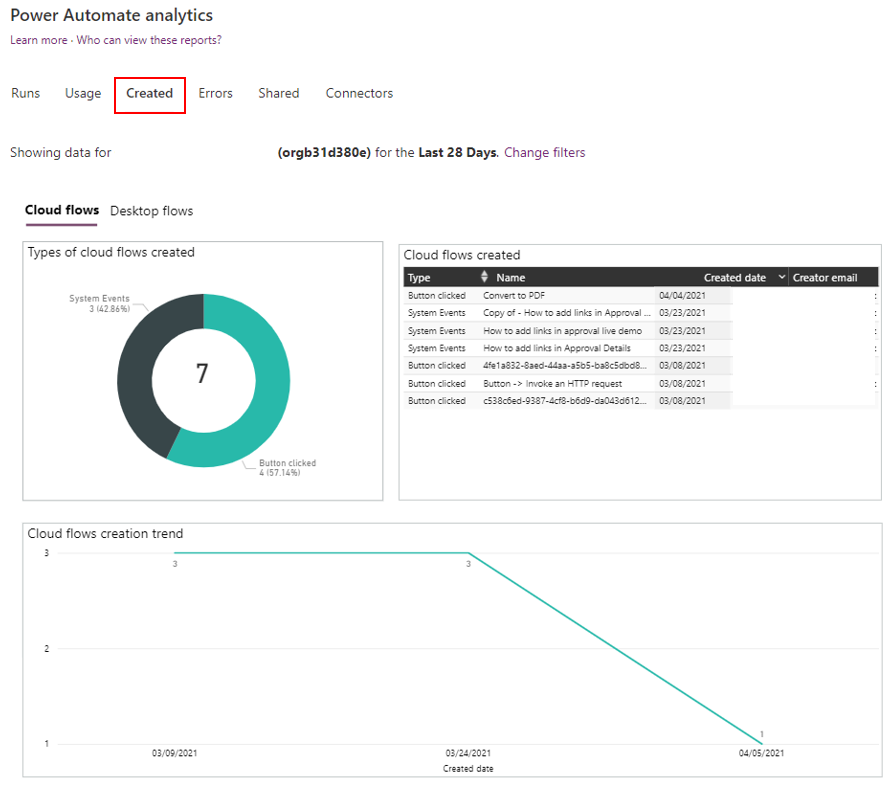](../media/image-22.png#lightbox)

The **Errors** report provides insights into recurring error types and details such as the error count, creator's email address, last occurred time, and the creator's email address for each flow.

> [!div class="mx-imgBorder"]
> [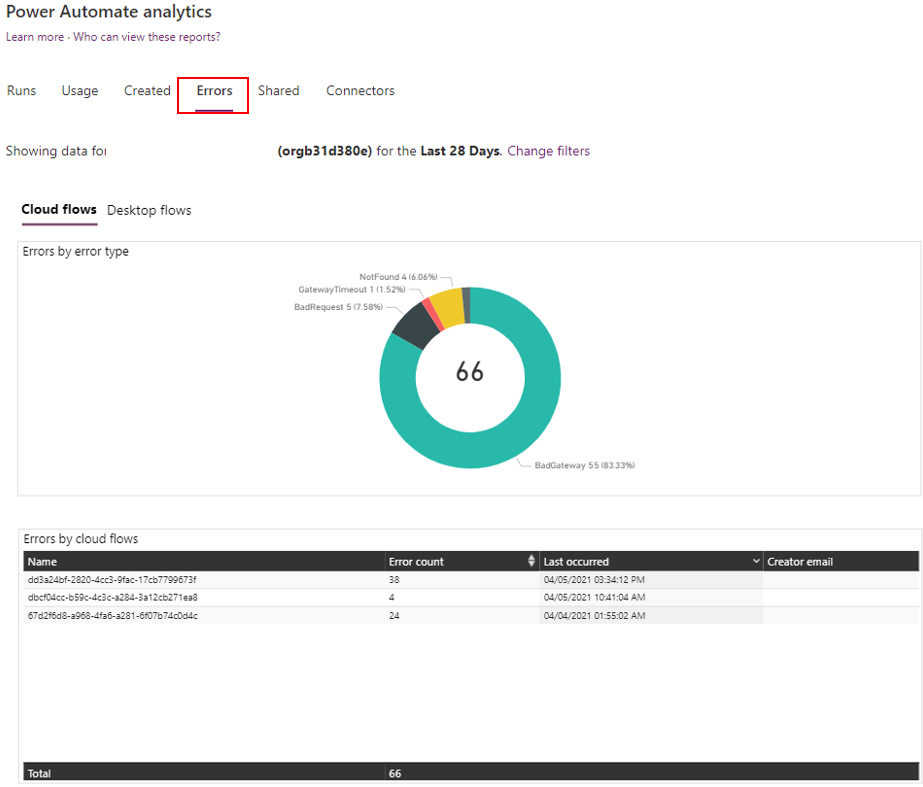](../media/image-23.png#lightbox)

The **Shared** report provides details on the shared flows and trends in the environment.

> [!div class="mx-imgBorder"]
> [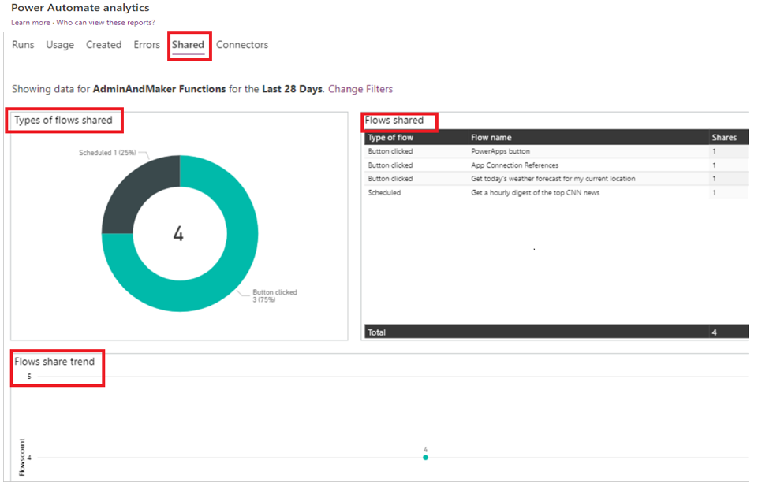](../media/image-25.png#lightbox)

The **Connectors** report provides details on connectors and their associated flows. Metrics such as the number of calls from each flow for each connector, flow runs, and the flow creator's email address are available for standard and custom connectors.

> [!div class="mx-imgBorder"]
> [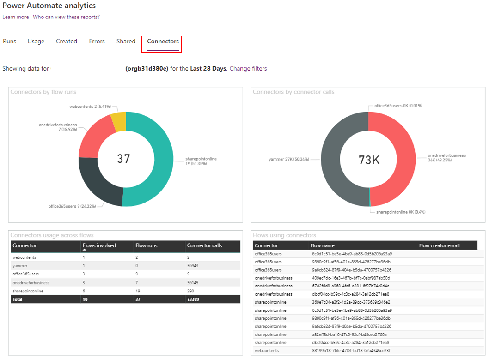](../media/image-26.png#lightbox)
