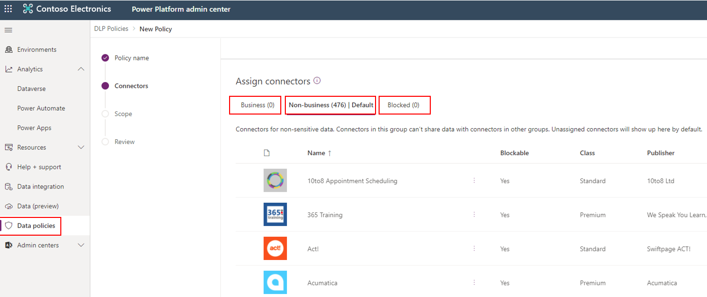
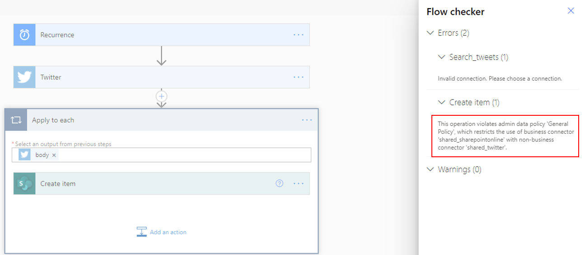

Generally, users have good intentions, but they can occasionally overlook the potential for exposure to data leakage to services and audiences that shouldn't have access to the data.

## Data policies

You can create data loss prevention (DLP) policies that can act as guardrails to help prevent users from unintentionally exposing organizational data. DLP policies can be scoped at the environment level or tenant level, offering flexibility to create sensible policies that establish the ideal balance between protection and productivity. For tenant-level policies, you can define the scope to be all environments, selected environments, or all environments except the ones that you specifically exclude. Environment-level policies can be defined for one environment at a time.

DLP policies enforce rules for which connectors can be used together by classifying connectors as **Business** or **Non-Business**. If you put a connector in the **Business** group, it can only be used with other connectors from that group in any given app or flow. Occasionally, you might want to block the use of certain connectors altogether by classifying them as **Blocked**.

> [!div class="mx-imgBorder"]
> 

When a new policy is created, all connectors are placed in the **Non-Business** group by default. From that point, the connectors can be moved to **Business** or **Blocked** based on your preference. You can manage the connectors in a data group when you create or modify the properties of a DLP policy from Microsoft Power Platform admin center.

## Confirm that connectors are in the same group

Data can't be shared among connectors that are in different groups. For example, if you place SharePoint and Outlook connectors in the **Business** group, and you place Twitter in the **Non-Business** group, makers can't create a flow that uses both SharePoint and Twitter connectors. Consequently, this action restricts data flows between these two services in Microsoft Power Platform.

Though data can't be shared among services in different groups, it can be shared among services within a specific group. From the previous example, because SharePoint and Outlook were placed in the same data group, makers can create a flow that uses both SharePoint and Outlook connectors together. As a result, the action allows data flows between these two services in Microsoft Power Platform.

The following screenshot shows an example of the error that generates when you try to use two connectors that aren't part of the same DLP group.

> [!div class="mx-imgBorder"]
> 
