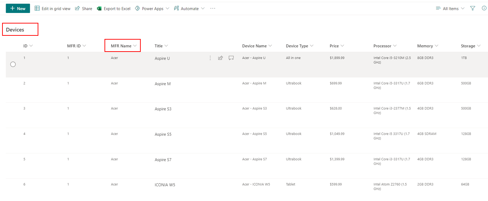
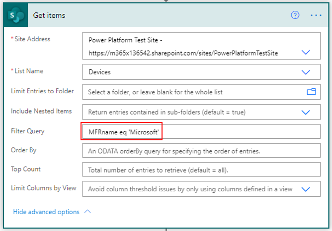
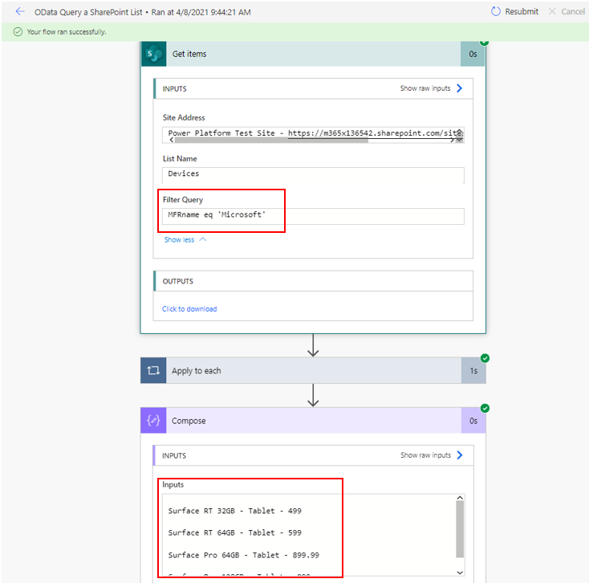
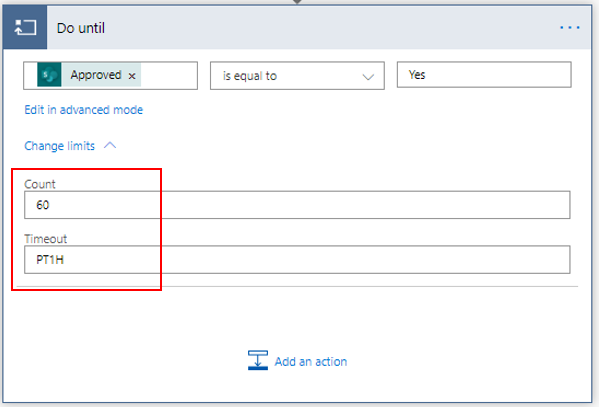
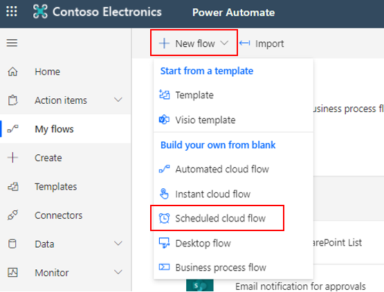
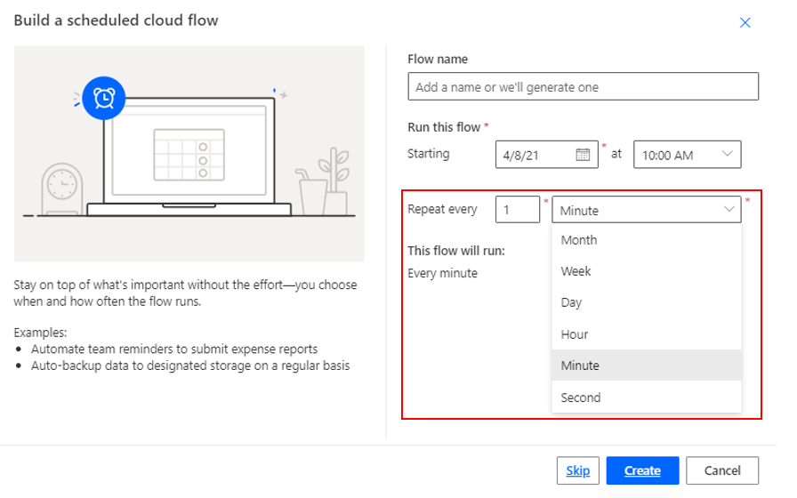

Occasionally, it's best to revisit the flow to determine if its design can be modified to improve the overall performance. This reassessment also allows you to apply new features or enhancements that weren't available when the flow was originally implemented.

## Use OData filter query to restrict returned entries

Because SharePoint connector is built on REST APIs, it supports your ability to filter data on the server side by using OData. Benefits of using OData include reducing the amount of data that you're bringing into your flow and reducing the need to loop through a record set to find values of interest.

Consider a list in Microsoft Lists that has over 100 items of computer device information. The list has a column called MFR Name that lists all manufacturers. The availability of this column and OData allows you to filter down to the manufacturer level on the server side, reducing the total amount of time that it takes for the flow to run.

> [!div class="mx-imgBorder"]
> 

In the SharePoint **Get items** action, in the **Filter Query** field, add the formula to filter the Microsoft devices.

> [!div class="mx-imgBorder"]
> 

Now, when you run the flow, only the Microsoft devices will be visible.

> [!div class="mx-imgBorder"]
> 

## Modify the Do until condition

The **Do until** step does a certain action until a certain condition is true.

Changing the limits of the **Do until** condition can help speed the flow. The default setting is a count of 60, which is run every hour. Essentially, the flow will check every hour, 60 times, to determine if the condition has been met. The highest duration count is 30 days and a count of 5,000.

> [!div class="mx-imgBorder"]
> 

Approaches that you can take to improve performance:

- Change the **PT1H** to **PT24H** for 24 hours, or change to **PT72H**, which means 72 hours.

- Reduce the count, which will reduce the total number of loops.

- Add a filter query if you're adding a query type action such as **Get Items** inside the **Do until** condition.

- Leave the **is successful** check box selected in the **Configure run after** field. You don't want this step to run if the previous one has failed.

- Avoid nesting of actions.

## Reduce the frequency of scheduled flows

Power Automate allows you to create scheduled cloud flows that trigger a flow based on the starting time.

> [!div class="mx-imgBorder"]
> 

While you do have the flexibility to run flows every second, running them that often will exhaust your API request limits.

> [!div class="mx-imgBorder"]
> 

All users of Microsoft Power Platform have limits on the number of requests based on the license that they're assigned. The following table defines the number of requests that a user can make in a 24-hour period.

| User licenses | Number of API requests per 24 hours |
|---------------|-------------------------------------|
| Power Apps per-user plan | 5000 |
| Power Automate per-user plan | 5000 |
| Microsoft 365 licenses | 2000 |
| Power Apps per-app plan | 1,000 per app pass |
