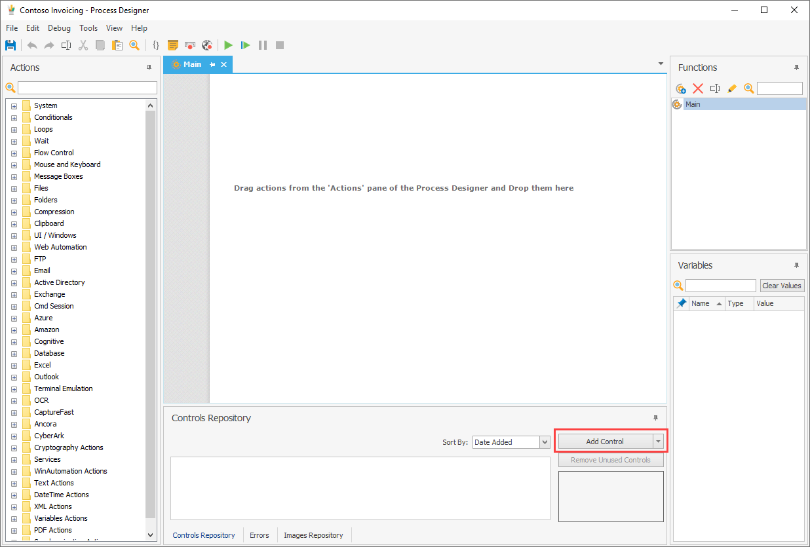
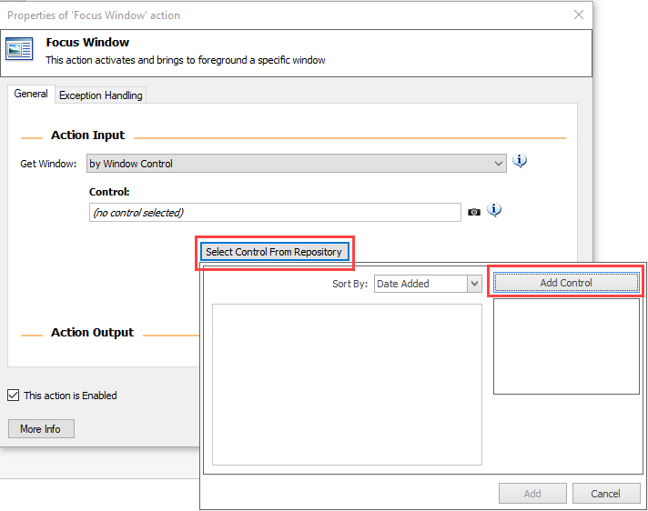
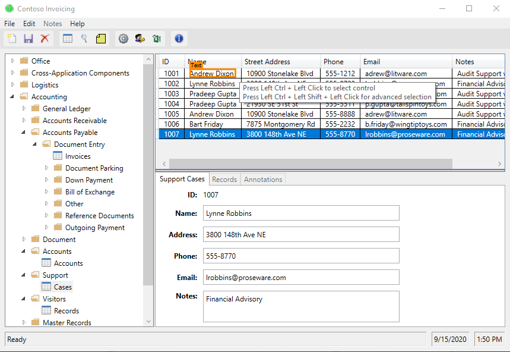

In order to interact with UI items, WinAutomation must first identify them. To do so without resorting to image recognition or on-screen positions, WinAutomation utilizes **UI controls** to identify windows and their elements.

## Adding controls

When creating a process, add a control by selecting **Add Control** in the **Controls Repository**:

Alternatively, when configuring a UI/Windows action, press **Select Control from Repository**, and then **Add Control**:

To capture a control, highlight it and press **Ctrl & Left click**:

