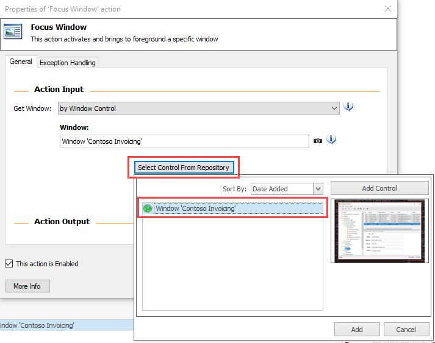
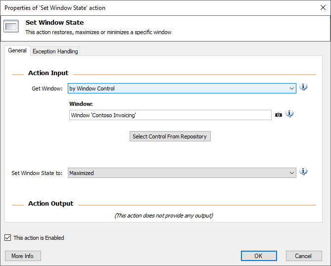
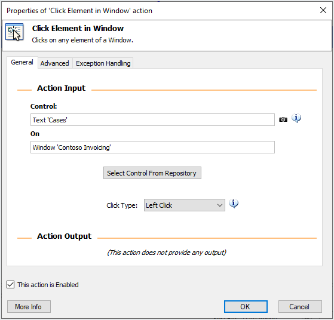
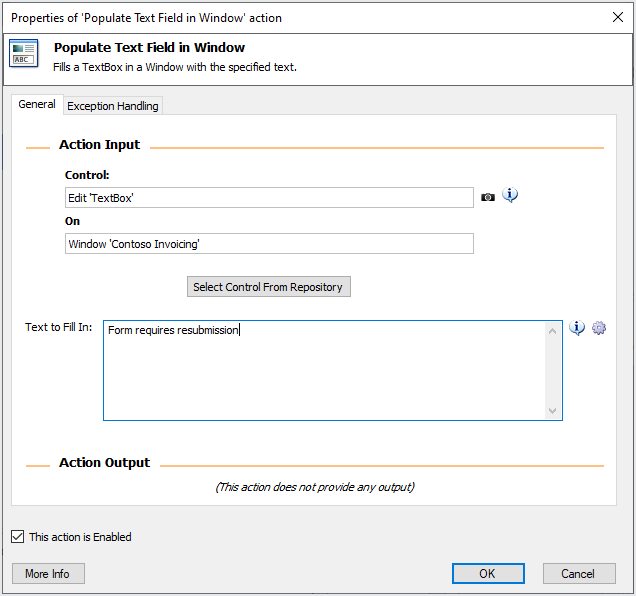
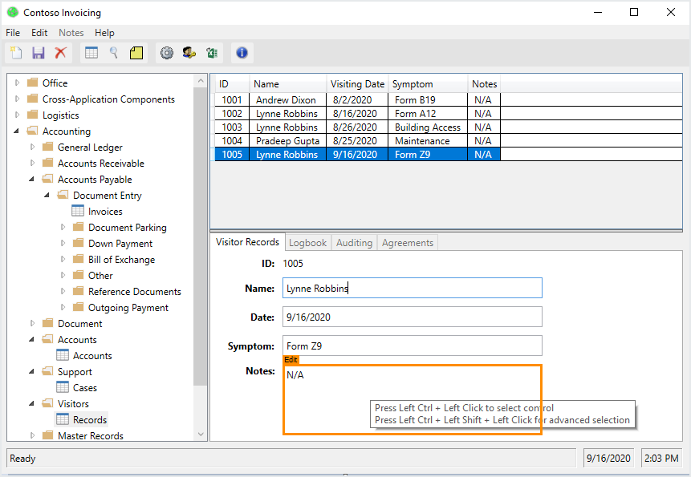
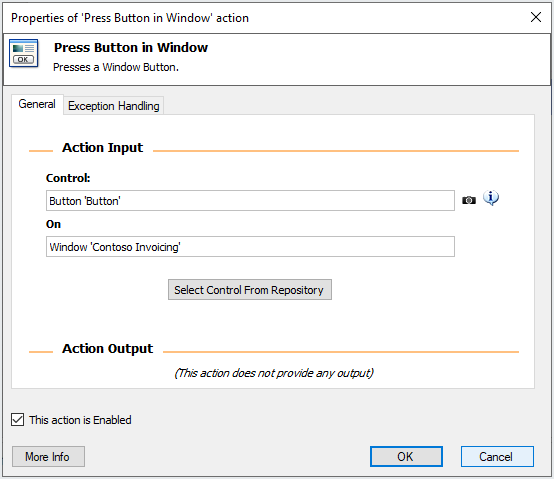
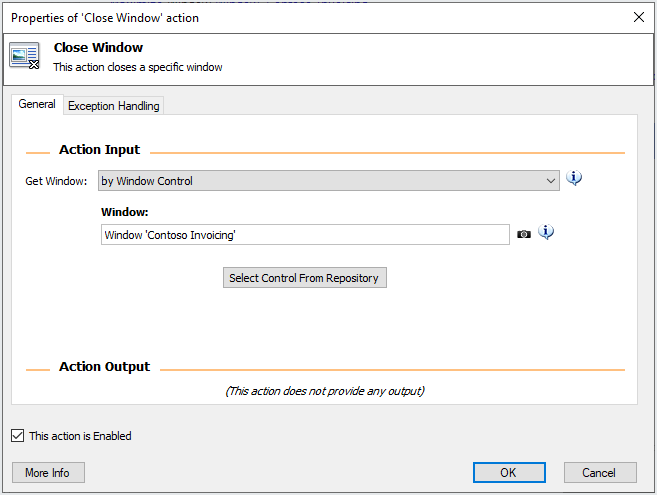

The windows sub group of actions is responsible for helping you interact with entire UI windows.

## Window handling

Use the **Focus Window** action to bring a window to the foreground. You can identify the window by its control and then capture it, or you can use an already captured window control, as shown in the following screenshot.

Similarly, you can add a **Set Window State** action to maximize the now focused application.

## Element interaction

Use the **Click Element in Window** action to perform a mouse click on a UI element.

> [!NOTE]
> The **Click Element in Window** action requires a UI element control, in contrast to the previous actions that required a window control.

To edit the contents of a text field, use the appropriate action.

Select the **Save** button to save the changes by using the **Press Button in Window** action.

Your final task is to use the **Close Window** action to close the app, as shown in the following screenshot.

