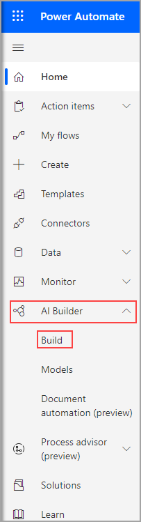
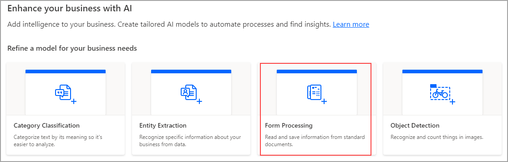
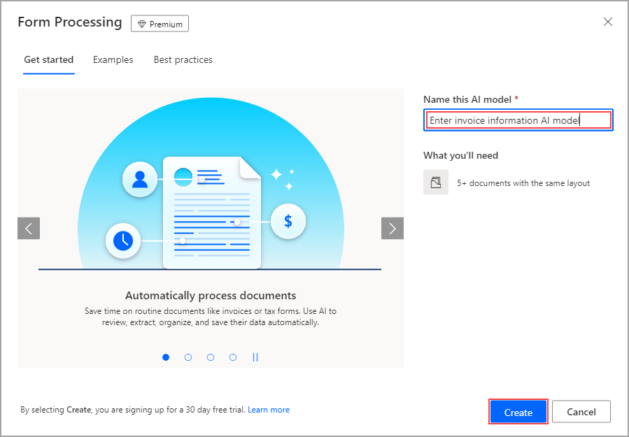

Begin in Power Automate and select **AI Builder** and **Build**.

> [!div class="mx-imgBorder"]
> 

Many models are available that you can choose from. Take a moment and read the descriptions to become familiar with the various models. This module uses the **Form Processing** model, which reads information from documents to extract pertinent details. Choose the appropriate model to continue.

> [!div class="mx-imgBorder"]
> 

Name your model and then select **Create**.

> [!NOTE]
> If you're using the **Form Processing** model, you'll need at least five documents to train your model. The more documents you have, the better.

> [!div class="mx-imgBorder"]
> 

A new screen will appear, which will demonstrate the process of creating and training your model.
