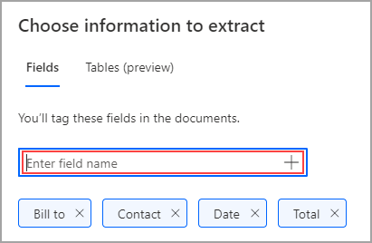
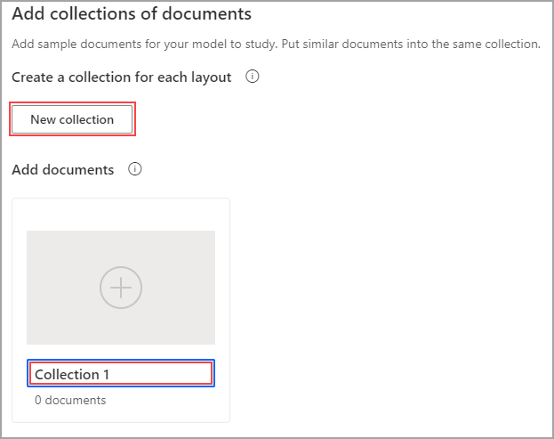
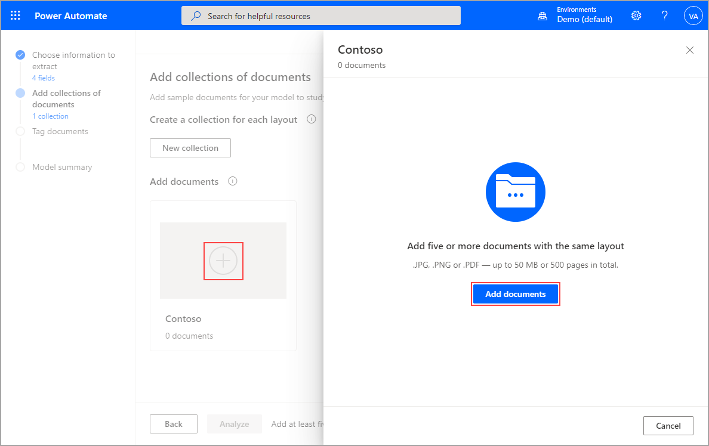
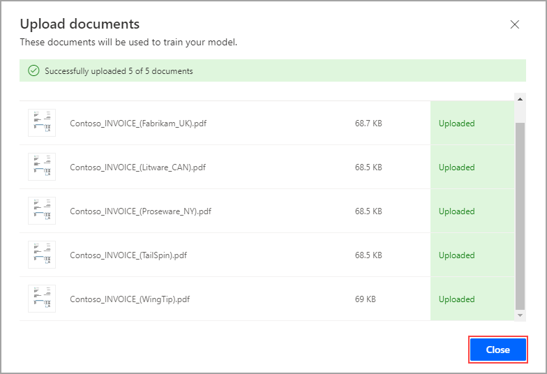

After having initialized a model, your first step toward customization is to choose information to extract, called fields. Later, you can use fields in flows inside of actions to contribute to your RPA. In this scenario, you'll use the fields to populate the input variables for a desktop flow.

To add fields, enter the field name in the provided text box and select the plus sign (**+**) or press the **Enter** key. The following screenshot shows that **Bill to**, **Contact**, **Date**, and **Total** have been added.

> [!div class="mx-imgBorder"]
> 

Select **Next** to continue.

Next, you'll add collections of documents for your model to study. Collections allow you to group documents with different layouts, such as when you have customers or organizers who have different layouts for invoicing or other repeated documentation. The same model can process as many as 100 distinct collections. To add a new collection, select **New collection**. To rename the newly created collection, double-click the automated collection name (in this case, **Collection 1**).

> [!div class="mx-imgBorder"]
> 

For this example, the collection has been renamed to **Contoso** and five invoice documents have been added, as shown in the following image. To add documents, select the plus sign (**+**), select **Add documents**, and then select your desired data source.

> [!div class="mx-imgBorder"]
> 

Select the documents that you want. An upload screen will appear, showing the documents that you've chosen. Select **Upload documents**, and a screen will display with the status of each document. When the upload is complete, select **Close**.

> [!div class="mx-imgBorder"]
> 

Now that you've completed your collection and have added your fields, you're ready to analyze and train your model.
