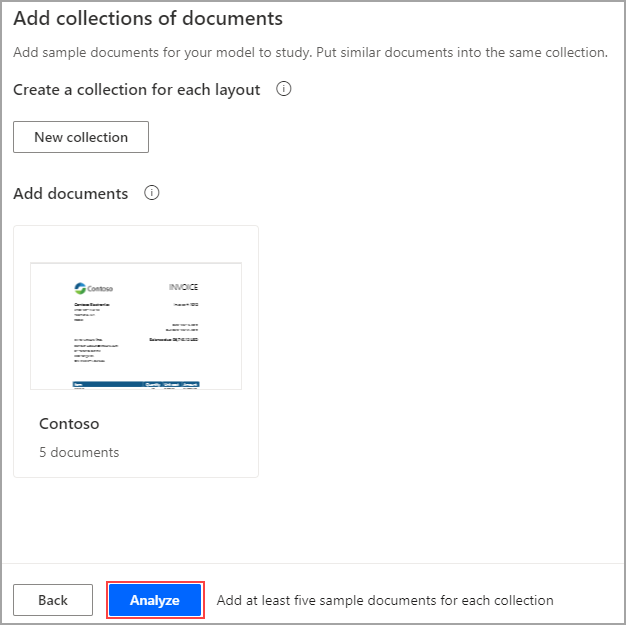
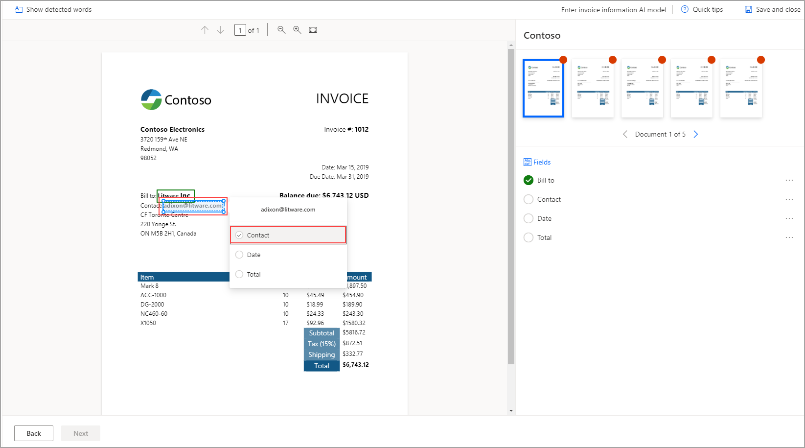
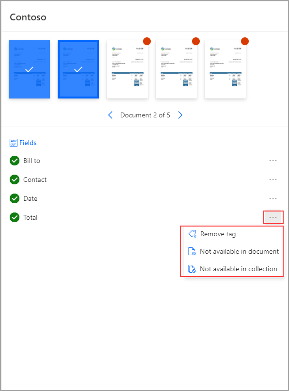
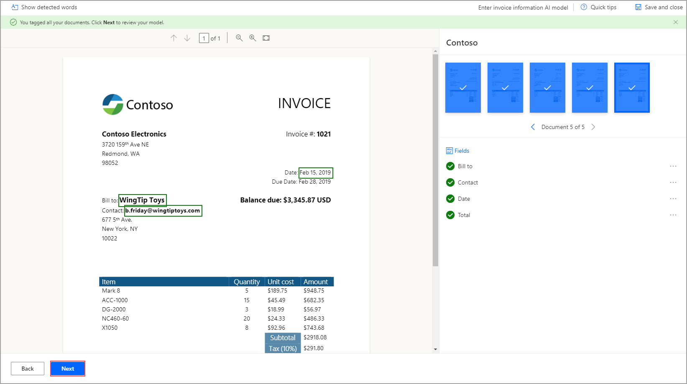
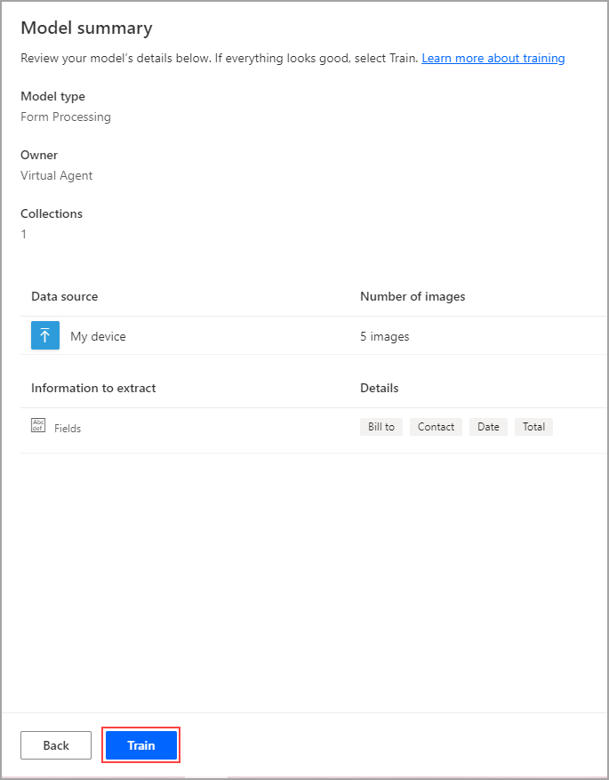
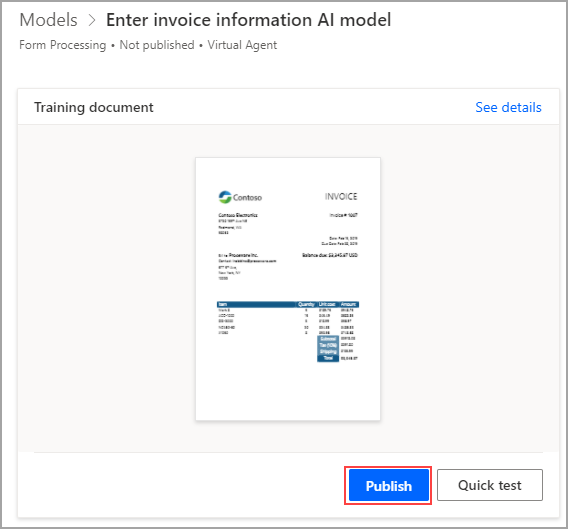

When your collections are complete and all documents are uploaded, select **Analyze** to prompt Power Automate to analyze your documents to identify their overall structure, detect form fields, and extract values.

> [!div class="mx-imgBorder"]
> 

> [!NOTE]
> The analysis might take a few minutes as Power Automate works in the background.

When the analysis is complete, your documents will appear organized by collection. In the document, you can use the mouse to select and drag the values that you want to capture. After you've made a selection, a pop-up window will appear showing the fields that you added previously. Select the **Bill to** field, as shown in the following screenshot. A green check mark will appear on the right panel as you locate and identify the various fields.

> [!div class="mx-imgBorder"]
> 

After you've identified all necessary fields, you can select the next document. Completed documents will be highlighted in blue with a white checkmark. The model might pick up on some fields automatically, and if this occurs, you should look at each document to ensure that each field is correct. You can view which field is related to which value by hovering over the field name. If a field is incorrect or not in the document, select the ellipses (**...**) by the field name to reveal more actions.

> [!div class="mx-imgBorder"]
> 

If you're having difficulty selecting a value, you can use the magnifying glasses in the upper portion of the screen to adjust the zoom.

When you've finished identifying the values for every field on every document, select **Next**.

> [!div class="mx-imgBorder"]
> 

Select **Train** to start training the model. This process might take a few minutes.

> [!div class="mx-imgBorder"]
> 

When the process is done, select **Go to Details page** and select **Publish** on the following screen.

> [!div class="mx-imgBorder"]
> 

You can now use the model in Microsoft Power Apps or Power Automate.
