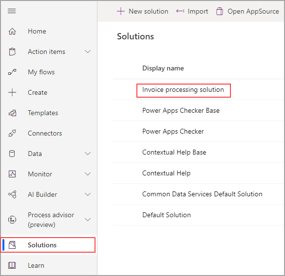
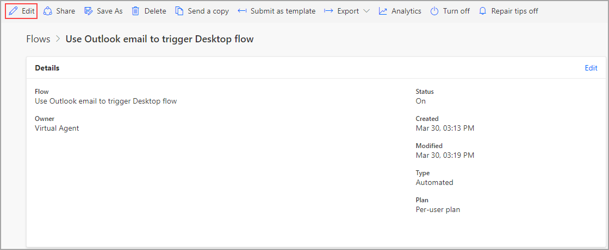
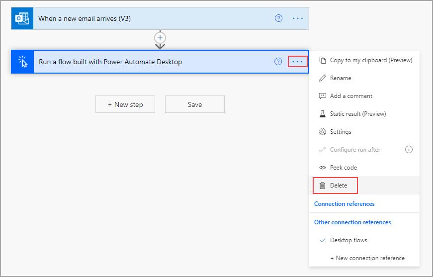
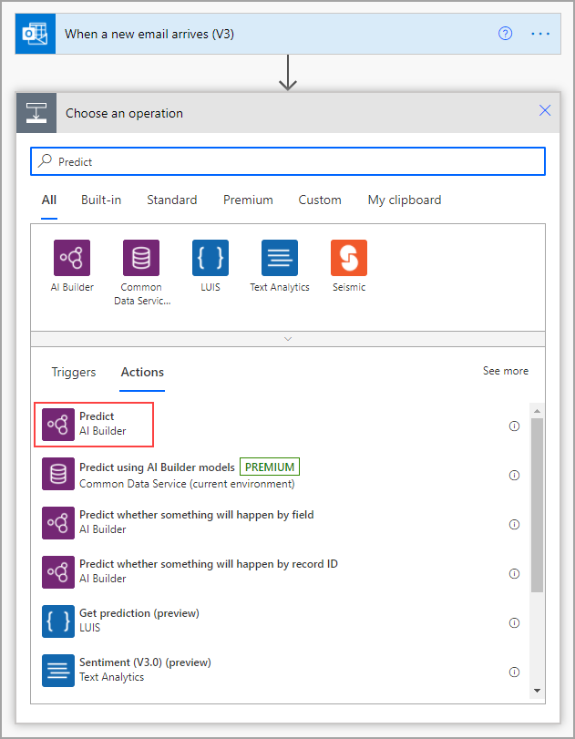
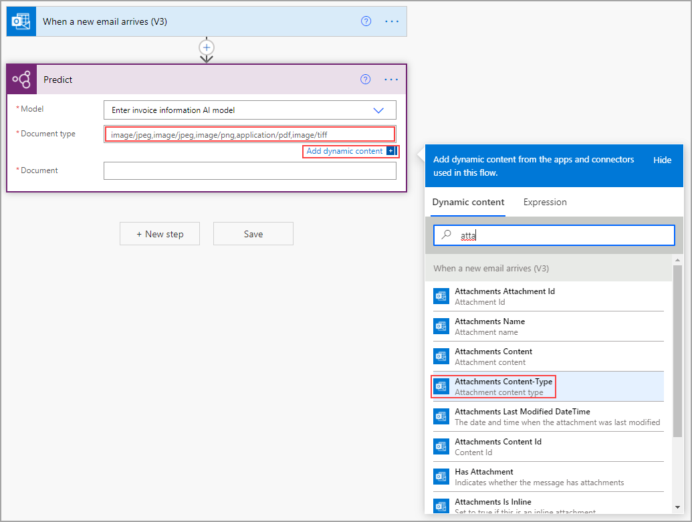
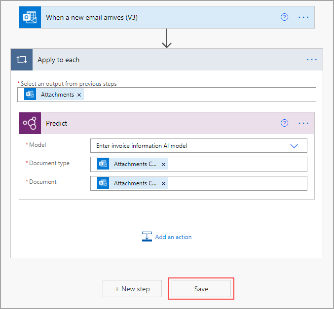
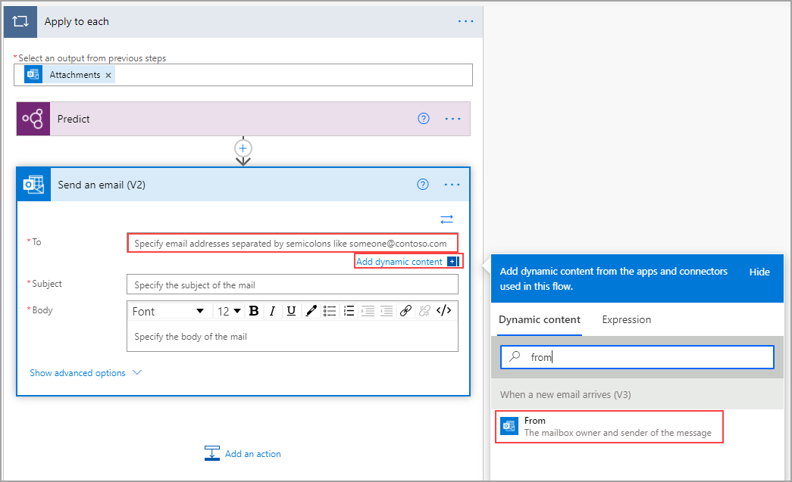
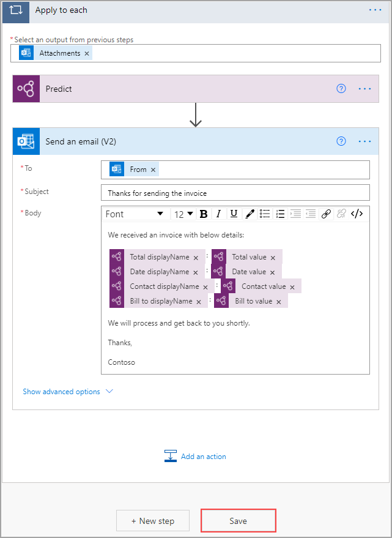
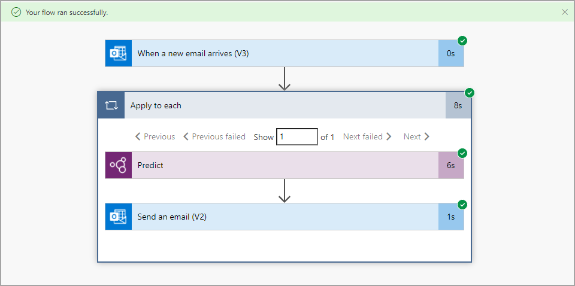
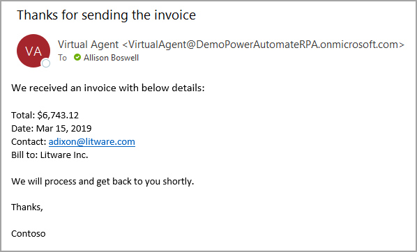

Now that you've created and customized your AI model, you can integrate it into a cloud flow. The flow in this example is a solution-aware cloud flow, meaning that it's packaged in a solution. To locate it, select **Solutions** and then the name of the solution (in this case, **Invoice processing solution**).

> [!div class="mx-imgBorder"]
> 

Select the flow in which you want to use the AI model. If you're following from the previous models, the name of the flow is **Use Outlook email to trigger Desktop flows**. Select **Edit**.

> [!div class="mx-imgBorder"]
> 

Delete the **Run a flow built with Power Automate Desktop** action by selecting the ellipsis (**...**) and then selecting **Delete**. You're deleting this action now so that you can test the AI model without constantly triggering the desktop flow.

> [!div class="mx-imgBorder"]
> 

After the action is deleted, select **New step** and then search for and select **Predict** under AI Builder.

> [!div class="mx-imgBorder"]
> 

Select the model that you want to use, which in this case is **Enter invoice information AI model**. After your model is selected, more fields will appear. For the form processing model, a document is required. Because this flow is triggered by receiving an email with an attachment, you can specify that attachment with dynamic content. For the document type, search for and select **Attachments Content-Type** in the **Dynamic content** menu.

> [!div class="mx-imgBorder"]
> 

This selection will put your **Predict** action inside an **Apply to each** action so that the model will run for each attachment, if more than one exists. You might need to open the **Predict** action again to specify the **Attachment Content** dynamic content for the document. Select **Save**.

> [!div class="mx-imgBorder"]
> 

While inside the **Apply to each** action, select **Add an action**. Search for and add the **Send an email (V2)** action. Use the **Dynamic content** tab to set the **To** field to the email sender by entering **From** in the search box.

> [!div class="mx-imgBorder"]
> 

Use **Thanks for sending the invoice** for the **Subject**. The body will be a mix of text and dynamic content from the AI model. The following screenshot shows an example of the end result. The model has a display name and a value for each field. Select **Save**.

> [!div class="mx-imgBorder"]
> 

Select **Test** in the upper-right corner of the screen, select the **Manually** option, and then select **Save & Test**.

> [!div class="mx-imgBorder"]
> 

Send yourself an email with an attachment (in either .pdf or .jpg file format) that matches the layout of one of the collections in the model and a subject line of "New invoice." The flow will appear with indications on each step to show you where your flow is in the process. When testing is complete, the following screen will display, indicating that your flow ran successfully.

> [!div class="mx-imgBorder"]
> 

The email will resemble the following image.

> [!div class="mx-imgBorder"]
> 
