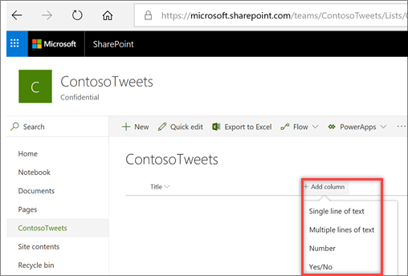
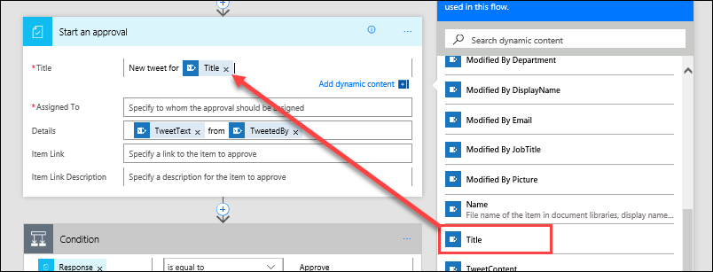
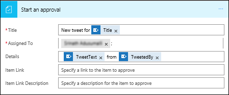
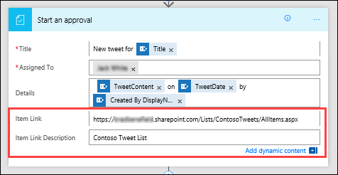

In this unit, you'll learn how to build a business-friendly scenario that uses approvals.

In this scenario, anyone who has access to the Microsoft SharePoint list can contribute tweets without knowing anything about Twitter. The social media team can then approve or reject those tweets. That team maintains control of the account and the content that goes out to customers. 

## Step one: Create a SharePoint list for tweets

You'll use a template that starts an approval process whenever a new item is created in a specific list. If the item is approved, a tweet is then posted to Twitter. For this unit, you'll change the process by adding steps that update a SharePoint list with the approval response, indicate whether the item was approved, and add any comments that the approver added to the proposed tweet. 

First, let's create the SharePoint list.

1. On your SharePoint site, create a SharePoint list named **ContosoTweets**.
1. Open the list, and select **Add column**.
1. Select **+ Add column** to add the following columns:

    - Add a **TweetContent** column, and set the column type to **Multiple lines of text**. This will contain the content of the tweets for later approval. Select **Save** after each column you create.
    - Add a **TweetDate** column, and set the column type to **Date and Time**. Select **More** to find the **Date and Time** type.
    - Add an **ApprovalStatus** column, and set the column type to **Yes/No**. The approver can then select **Yes** or **No** to approve or reject the tweet.
    - Add an **ApproverComments** column, and set the column type to **Single line of text**. The approver can then add a comment about the approval status.

    

1. Copy the URL of the SharePoint list. You'll use it when you create the flow.

## Step two: Create an approval request flow
1. Sign in to [Microsoft Flow](https://ms.flow.microsoft.com), and then select **Approvals**.

1. Select **Create approval flow**, and then scroll down and select the **Post list items to Twitter after approval** template. 

    

1. Make sure your account credentials for **SharePoint**, **Approvals**, and **Twitter** are correct, and then select **Continue**. 

    

1. Back in Microsoft Flow, in the **When a new item is created** action, enter the following values:

    * **Site Address**: Enter the URL of your team's SharePoint site.
    * **List Name**: Select *ContosoTweets*.

    

1. In the **Start an approval** action, select **Edit** to show all the fields. 

    

1. For **Title**, enter *New tweet for*, and then select **Title** in the dynamic content list. 

    

1. For **Assigned to**, enter and select either your name or a test user name. 

    

1. For **Details**, remove the default items, and add **TweetContent**, **TweetDate**, and **Created by DisplayName** from the dynamic content list. Be sure to add the words *on* and *by* to make the content more readable. 

    

1. For **Item Link**, paste the URL of your SharePoint list, which you copied in the procedure in **Step one**. For **Item Link Description**, enter *Contoso Tweet List*. 

    

1. In the **Condition** action, hover over the **IF YES** box, select the plus sign (**+**), and then select **Add an action**. 

    

1. Search for *update item*, select the **SharePoint** connector, and then select the **SharePoint – Update item** action.

    

1. For **Site Address** and **List Name**, enter the URL of the team's SharePoint site and *ContosoTweets* again. For **ID**, add **ID** from the dynamic content list. The **ID** field is used to match the actual tweet request in the SharePoint list.

    

1. Select the **Title** field, and then, in the dynamic content list, search for *title*. Add the **Title** item from the **When a new item is created** action. 

    

1. Select **ApprovalStatus**, and set the value to **Yes**. Then select **ApproverComments**, and set the value to **Comments** from the dynamic content list. 

    

1. Near the bottom of the **IF NO, DO NOTHING** box, select **Add an action**.

    

1. Repeat steps 11 through 14 to create a **SharePoint – Update item** action. Set the same values you set for the **IF YES** condition. The only difference is that you should set **ApprovalStatus** to **No**. 

    

1. Select the **Post a tweet** action, select **Edit**, and set **Tweet text** to **TweetContent** from the dynamic content list. This will create the actual tweet and then post it to Twitter when it's approved. 

    

1. Select **Create flow**.

Congratulations! You just created your first flow. 

This is just one way that Microsoft Flow can empower your team to be more productive. Your team can contribute ideas, relevant news, or product guidance, but you still maintain control over what's tweeted out to customers.

In the next unit, you'll see what it looks like when an approver receives a new request for a proposed tweet.