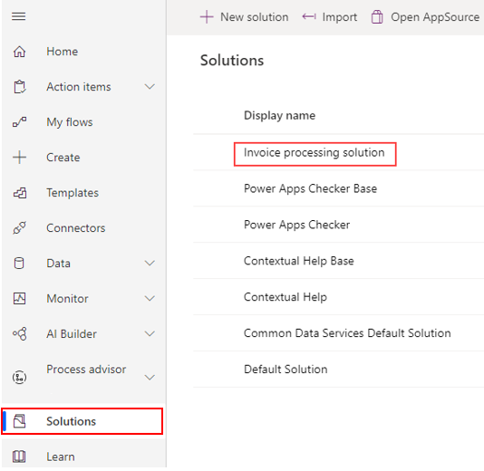
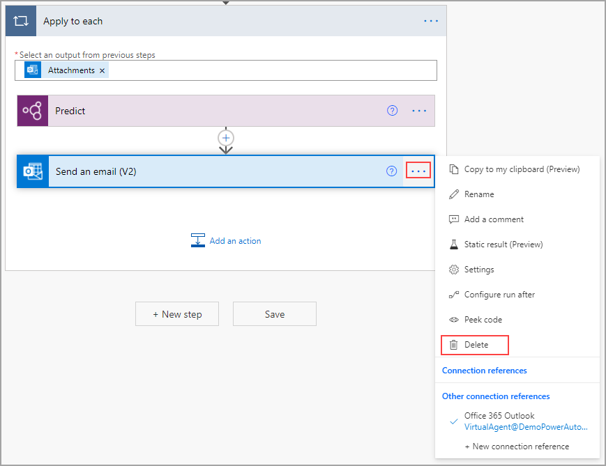

Because this module requires you to work from an existing solution, you must first open the appropriate solution. Start in Power Automate, select **Solutions**, and then select the name of your solution (in this case **Invoice processing solution**).

> [!div class="mx-imgBorder"]
> 

Select the flow in which you want to use the AI model. If you're following from previous models, the name of the flow is **Use Outlook email to trigger Desktop flows**. Select **Edit**.

> [!div class="mx-imgBorder"]
> 

For now, you can delete the **Send an email (V2)** action by selecting the ellipses and then selecting **Delete**. This step was primarily used to test the AI model and isn't needed for this portion, but you can leave it if you want to use it as an example for future solutions.

> [!div class="mx-imgBorder"]
> 

Now that you are in the correct solution-aware cloud flow, you're ready to start posting in Teams with your flow.
