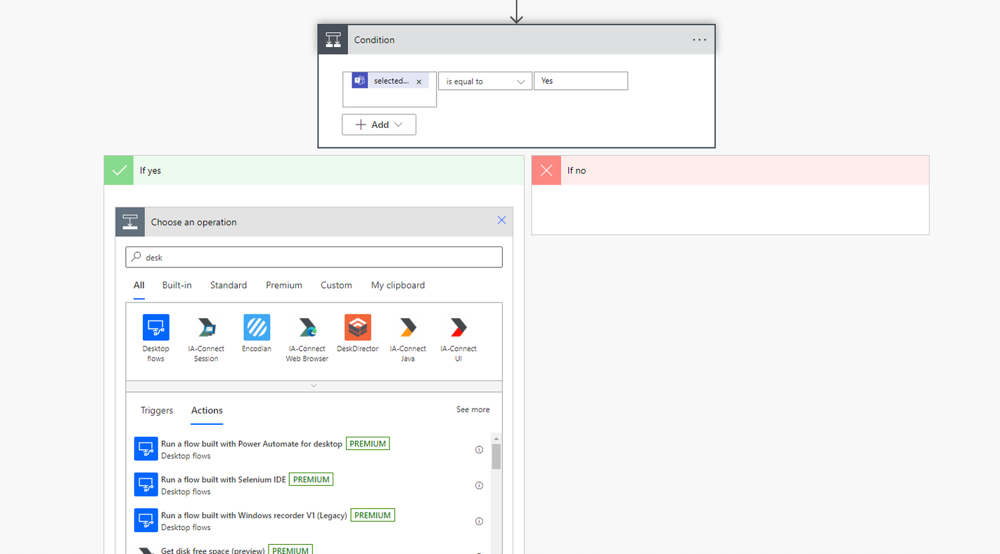
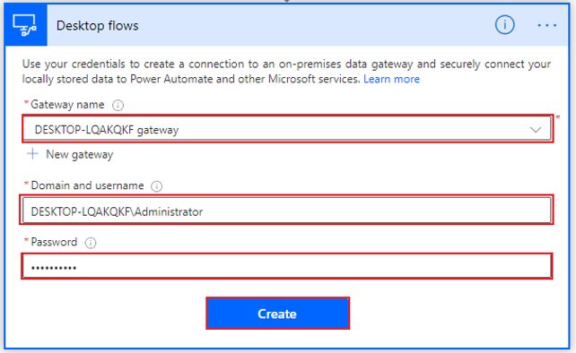
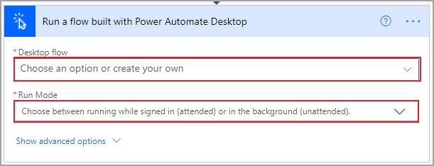
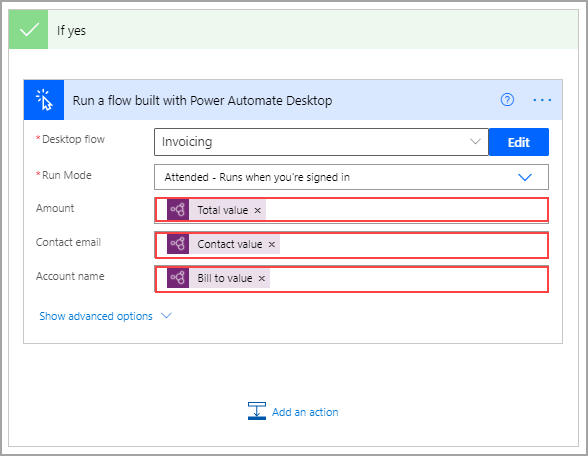

If an invoice is approved, the first step is to enter the invoice into the legacy desktop application. To accomplish this task, select **Add an action** under the **If yes** branch and then search for and select the **Run a flow built with Power Automate Desktop** option.

> [!div class="mx-imgBorder"]
> 

If you haven't already configured your gateway connection, use the **Gateway name** drop-down menu to select the appropriate gateway.

> [!NOTE]
> If you can't find your gateway, you might need to delete this step and re-create it to refresh the list. If your gateway still doesn't appear, you might need to restart the gateway on your PC and then retry the process.

The next two fields request your credentials to sign in to your computer. If you're unsure of what to put in the **Domain and username** field, you can open a command prompt window by opening the **Start** menu, entering **CMD**, and then pressing the **Enter** key. When the command prompt opens, enter **Set user** and then press the **Enter** key.

Several lines of code will appear. Separate the **user domain** and the **username** by a backslash (\), as shown in the following screenshot. Select **Create**.

> [!div class="mx-imgBorder"]
> 

When you've connected to your desktop, Power Automate will prompt you for information that is specific to your desktop flow. Use the drop-down menu to select the name of your desired flow (in this case **Invoicing**), and then in the **Run Mode** drop-down menu, select **Attended - Runs when you're signed in**.

> [!div class="mx-imgBorder"]
> 

After you've chosen your desktop flow, input variables that you've defined in your flow will be requested. Notice in the following screenshot that the invoice flow is requesting an **Amount**, a **Contact email**, and an **Account name** to feed into the Contoso Invoicing app. You can use the dynamic content from the AI model at this point. You can search through dynamic content to isolate the values that you need.

> [!div class="mx-imgBorder"]
> 

Now, your desktop flow will be able to use the values from the emailed and approved invoice to create the invoice in your desktop app. The only remaining step is to alert the sender of the approval or rejection.
