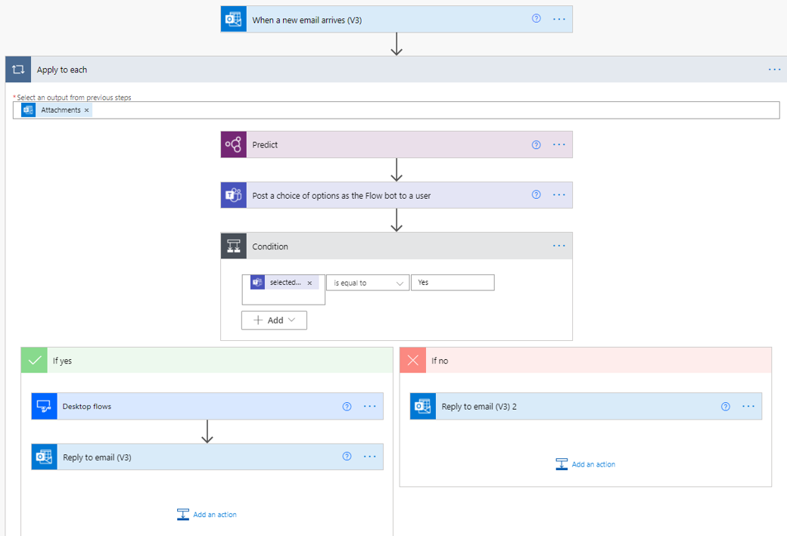
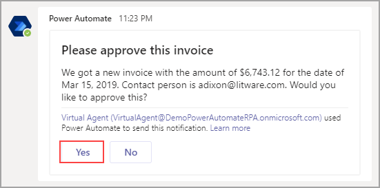
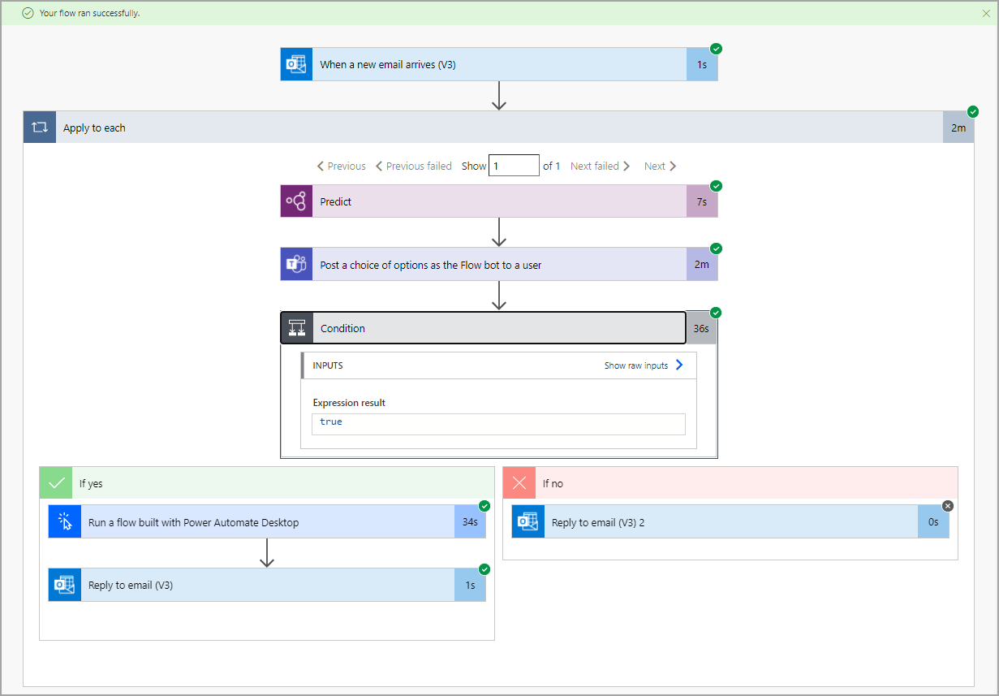

Your completed and saved flow should resemble the following image.

> [!div class="mx-imgBorder"]
> 

In a separate tab, open the Teams app. In another tab, open the Outlook app. Now, you only need to test and run your flow. Select **Test** in the upper-right corner of the screen, select the **Manually** option, and then select **Save & Test**.

> [!div class="mx-imgBorder"]
> 

Open the Power Automate Desktop application and send yourself an email with an attachment and the subject line of "New invoice." The flow will appear with indications on each step to show where your flow is in the process.

When the Teams message appears, select **Yes**.

> [!div class="mx-imgBorder"]
> 

Avoid interacting with your mouse or keyboard while the flow continues running because it might interrupt the process with the desktop app. When testing is complete, the following message will appear, indicating that your flow ran successfully.

> [!div class="mx-imgBorder"]
> 

You should also have a new email to alert you of your approved invoice. You can run the flow again and reject the invoice.

Now, you have successfully built a process that is triggered by the receipt of an email and integrates Outlook, a custom AI model, an approval in Teams, and a desktop flow.
