In this exercise, you will do the following:

- Set up Health Bot from Azure portal

- Configure and enable the integration between Dynamics 365 Omnichannel and Health Bot

- Configure and enable Bot channel to obtain a Bot ID

**Azure Health Bot** empowers developers in healthcare organizations to build and deploy AI-powered, compliant, conversational healthcare experiences at scale. It combines built-in medical database with natural language capabilities to understand clinical terminology and can be easily customized to support your organization\'s clinical use cases. The service ensures alignment with industry compliance requirements and is privacy protected to HIPAA standards. To learn more about Azure Health Bot, reference this [Azure Health Bot documentation](/azure/health-bot/).

Task 1: Install Azure Health Bot in Azure Subscription

1. While logged in to your Microsoft 365 tenant, open a new tab in your internet browser incognito or in-private mode and navigate to Azure portal at <https://portal.azure.com/>

1. Search for **Azure Health Bot** in the top search bar and **select** from the search results.

    > [!div class="mx-imgBorder"]
    > [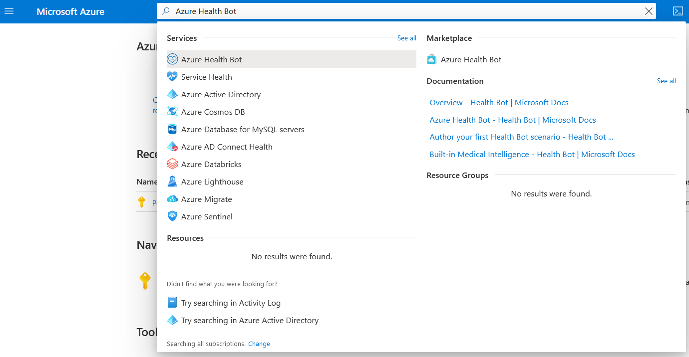](../media/2-azure-health-bot.png#lightbox)

1. Select **Create** button to create a new Azure Health Bot instance.

    > [!div class="mx-imgBorder"]
    > [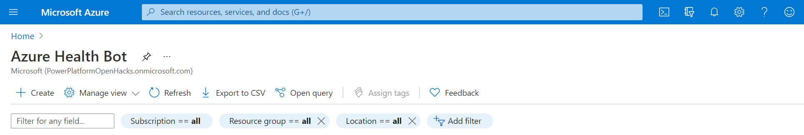](../media/3-create-button.png#lightbox)

1. You will be redirected to the Azure Health Bot page. Enter the following information:

    a.  **Subscription**: Choose your Azure Subscription

    b.  **Resource Group**: Use the resource group you created in environment preparation

    c.  **Name**: healthbot-iad (although you may choose any name)

    d.  **Region**: Choose the region closest to you

    e.  **Plan**: Free (F0)

    > [!div class="mx-imgBorder"]
    > [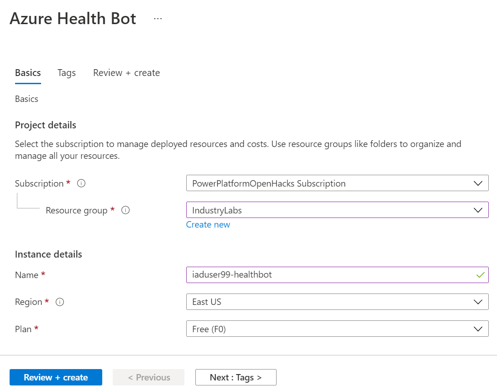](../media/4-azure-basics.png#lightbox)

1. Select **Review + Create**.

1. On the Review and create page, verify your details are correct as Azure validates your Health Bot. When the create button is enabled after validation passes, select **Create**.

    > [!NOTE]
    > It will take few seconds to run the backend process before the Create button is enabled.*

    > [!div class="mx-imgBorder"]
    > [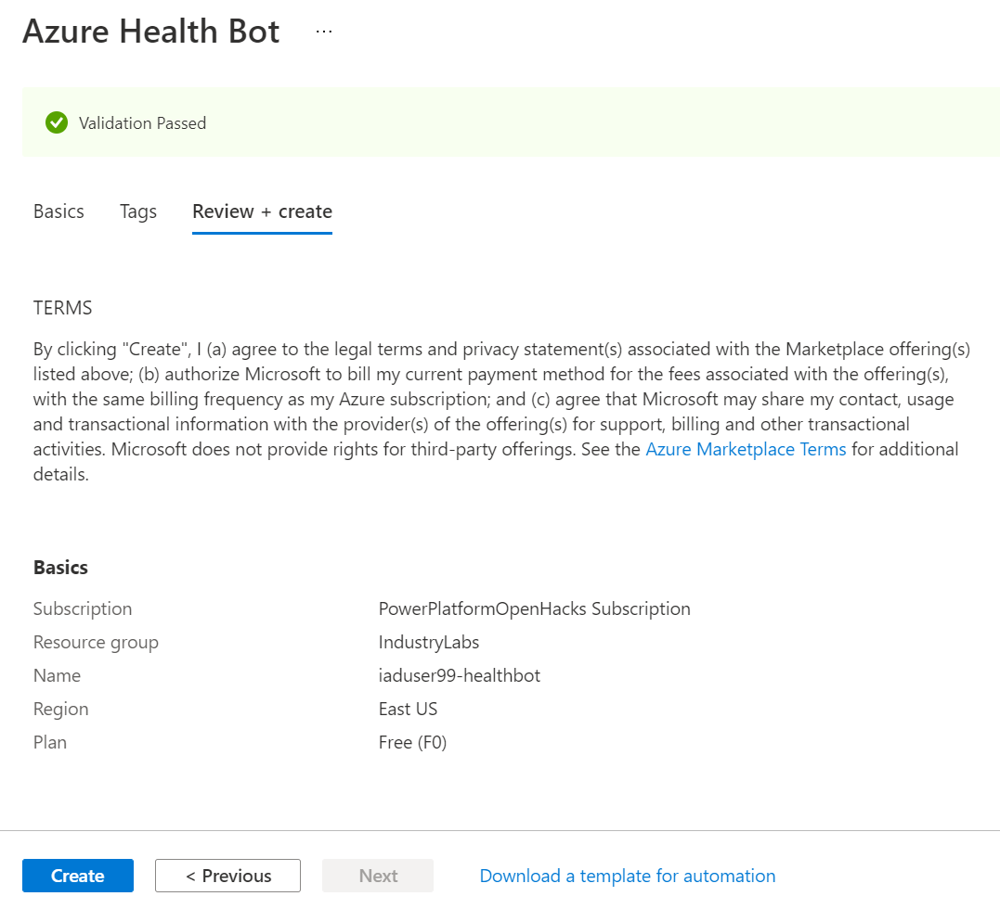](../media/5-review-create.png#lightbox)

1. You will be redirected to the **Deployment** page for your new Azure Health Bot.

    > [!div class="mx-imgBorder"]
    > [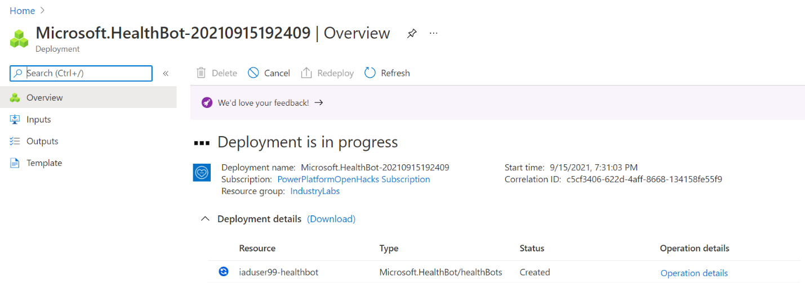](../media/6-deployment-page.png#lightbox)

1. When deployment is complete, the **Go to resource** button will enable. Wait until deployment is complete for the Azure Health Bot, then select **Go to resource** when enabled.

    > [!div class="mx-imgBorder"]
    > 

1. You will be redirected to the **Resource** page for your new Azure Health Bot. Select the **Management portal** link on the right of the Essential section to open your Azure Health Bot instance configuration page.

    > [!NOTE]
    > Please copy this Management portal link and store it to access the Health Bot later.

    > [!div class="mx-imgBorder"]
    > [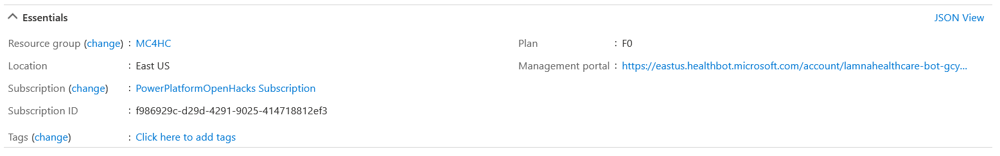](../media/11-management-portal.png#lightbox)

1. You will be navigated to your new Azure Health Bot instance homepage.

    > [!div class="mx-imgBorder"]
    > [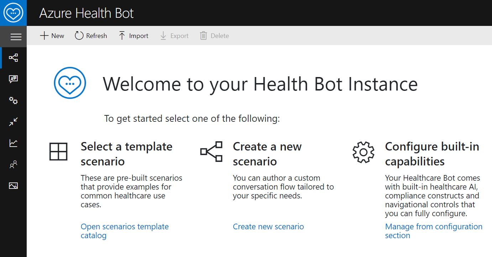](../media/12-welcome.png#lightbox)

**Congratulations!** You've successfully created a new Health Bot instance in your Azure tenant.

## Task 2: Update Azure Health Bot Settings to Enable Dynamics 365 Integration

1. On the Azure Health Bot homepage, **expand** the side navigation bar to see the sitemap labels.

    > [!div class="mx-imgBorder"]
    > [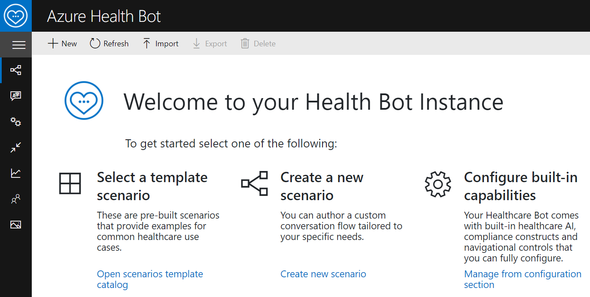](../media/13-welcome-navigation.png#lightbox)

    After expanding, you'll see the sitemap labels next to the icons.

    > [!div class="mx-imgBorder"]
    > [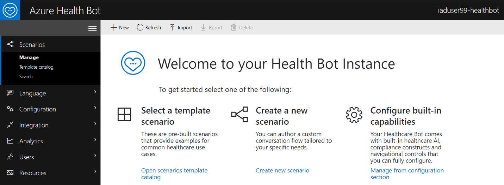](../media/14-sitemap-labels.png#lightbox)

1. Select **Configuration** > **Conversation** on the navigation bar.

    > [!div class="mx-imgBorder"]
    > [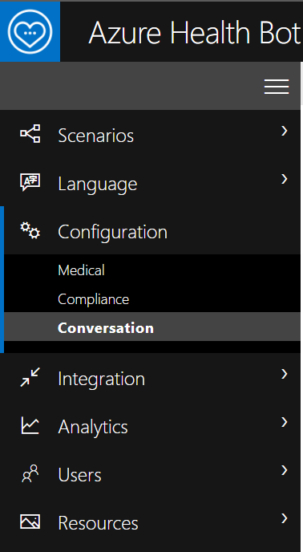](../media/15-configuration-conversation.png#lightbox)

1. You'll be landed in the **Interactions** tab.

    > [!div class="mx-imgBorder"]
    > 

1. Select **Human Handoff** tab in the Conversation settings.

    > [!div class="mx-imgBorder"]
    > [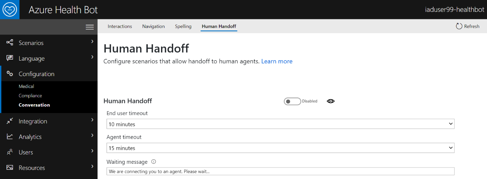](../media/17-human-handoff.png#lightbox)

1. Scroll to the bottom of the **Human Handoff** page. Under **Dynamics 365 Omnichannel**, toggle **Enabled** for **Bridge Messages**. This is required to allow communication and bridge messages between the Azure health Bot and Dynamics 365 Omnichannel for Customer Service.

    > [!div class="mx-imgBorder"]
    > [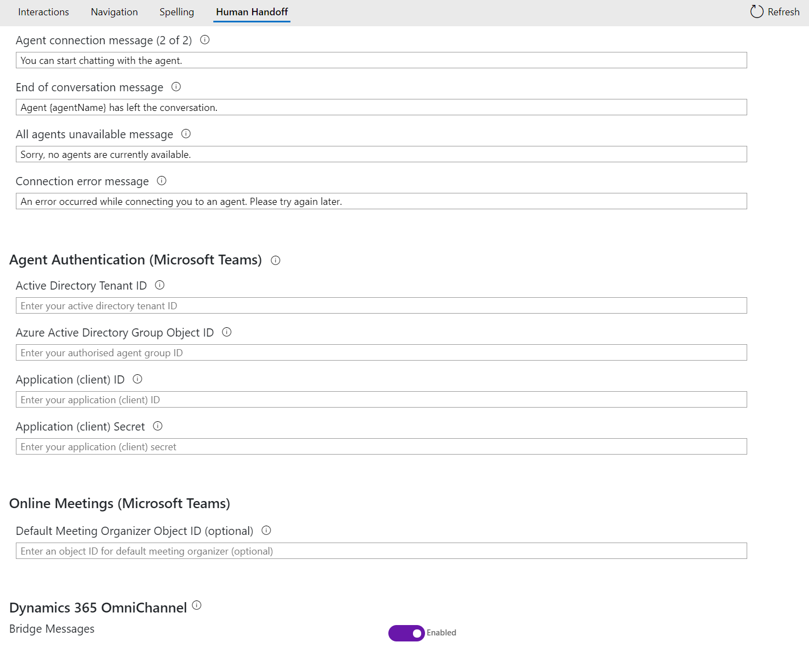](../media/18-bridge-messages.png#lightbox)

1. Select **Save** in the top right.

    > [!div class="mx-imgBorder"]
    > 

1. Now let's enable the Health Bot for **Microsoft Teams** Channel.

1. Navigate to **Integration** > **Channels.**

    > [!div class="mx-imgBorder"]
    > [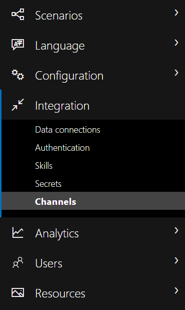](../media/20-integration-channels.png#lightbox)

1. In the Channels list, select the toggle to **enable Microsoft Teams.**

    > [!div class="mx-imgBorder"]
    > [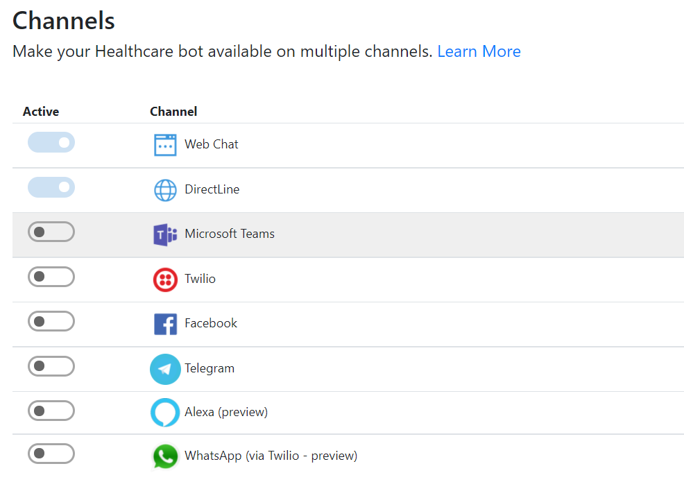](../media/21-teams.png#lightbox)

1. This will bring out a side window with your **Bot Id** information. **Copy and store** the BotId for later to use when creating the Dynamics 365 Application User.

    > [!div class="mx-imgBorder"]
    > [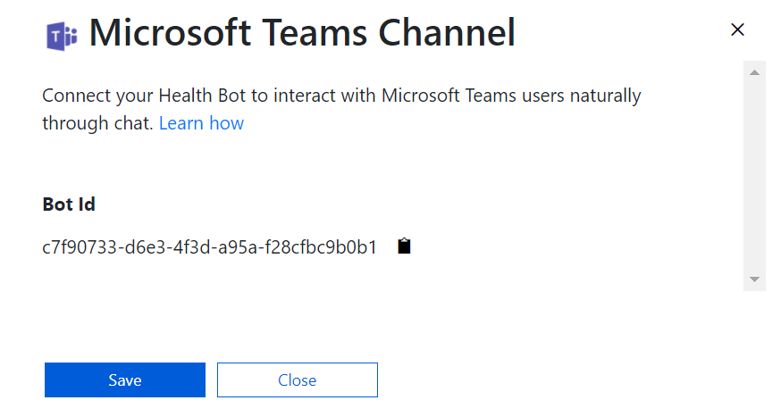](../media/22-bot-identification.png#lightbox)

1. Select **Save**. This should enable Teams channel and your Microsoft Teams toggle should reflect accordingly.

    > [!div class="mx-imgBorder"]
    > [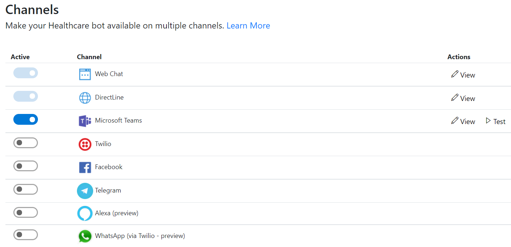](../media/23-teams-toggle.png#lightbox)

**Congratulations!** You completed the Azure Health Bot settings for integration with Microsoft Teams and Dynamics 365 Omnichannel for Customer Service.

## Task 3: Obtain Azure Application ID

In this task, you will be using the Azure Application ID you created in your Azure tenant during environment preparation. You may have called it "**MCH Application Id**". Registering this ID established a trusted relationship between your Dynamics 365 app and the Microsoft identity platform.

We will now obtain the client ID and store it to later create a Dynamics 365 Application User to bridge the authentication between Azure Health Bot and Power Apps.

1. Navigate back to the Azure portal and search for **App Registrations** in the Search box.

    > [!div class="mx-imgBorder"]
    > 

1. You will be landed in the App registrations homepage on the **Owned applications** tab.

    > [!div class="mx-imgBorder"]
    > 

1. Select the **All applications** tab.

    > [!div class="mx-imgBorder"]
    > [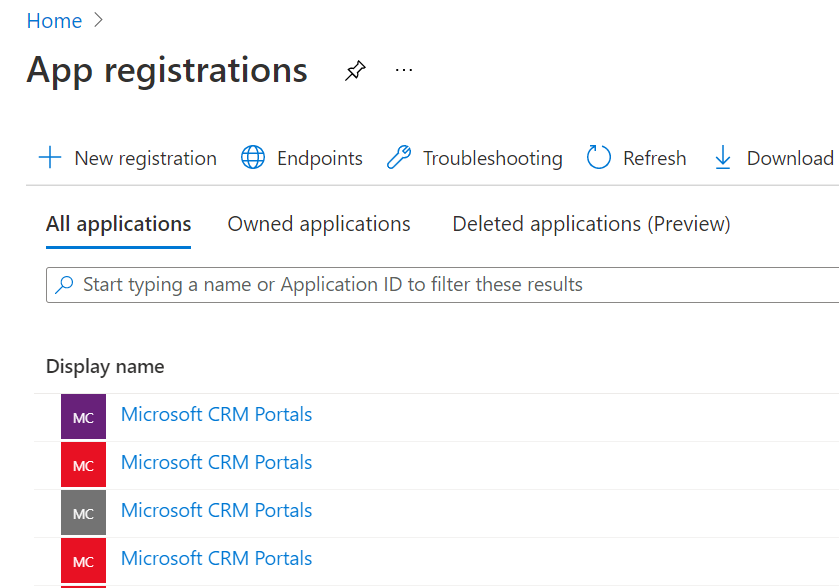](../media/26-all-applications.png#lightbox)

1. To **search** for our Application ID, type "**MCH Application Id**" in the Search box.

    > [!div class="mx-imgBorder"]
    > [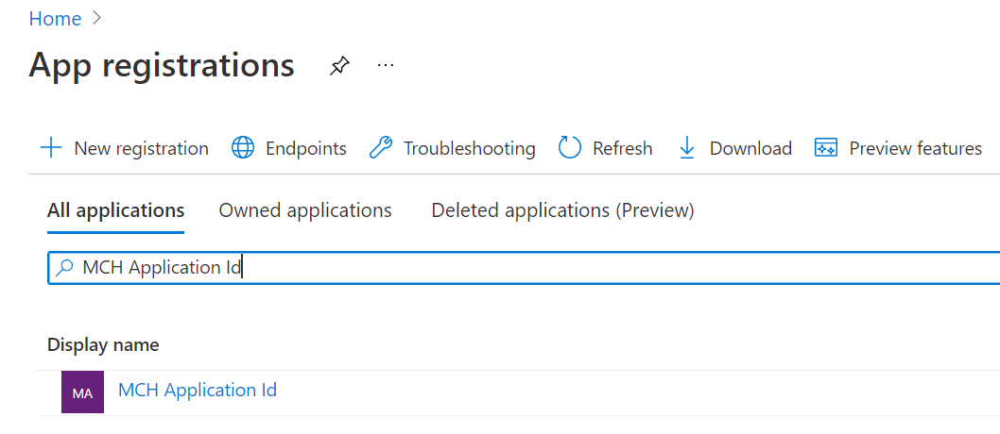](../media/27-mch-application.png#lightbox)

1. Select the **MCH Application Id** app registration resource. **Copy and store** the **Application (client) ID** for later to use when creating the Dynamics 365 Application User.

    > [!NOTE]
    > ID values have been removed in the screenshot for privacy purposes.

    > [!div class="mx-imgBorder"]
    > [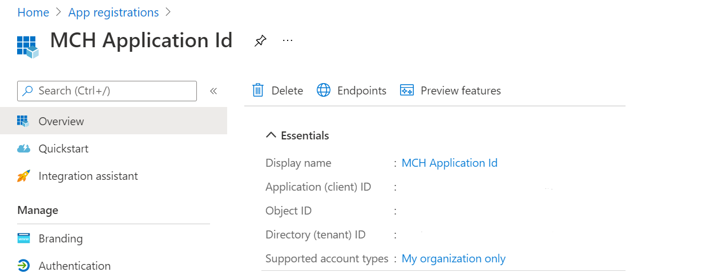](../media/28-application-overview.png#lightbox)

**Congratulations!** You've successfully obtained the MCH Application ID from Application Registrations in the Azure portal.
