In this exercise, you'll be configuring live chat for **Dynamics 365 Omnichannel for Customer Service**. Omnichannel for Customer Service offers a suite of capabilities that extend the power of Dynamics 365 Customer Service Enterprise to enable organizations to instantly connect and engage with their customers across digital messaging channels.

In the following tasks, you'll complete these steps:

1. Assign Omnichannel agent security role.

1. Create an application user using the **MCH Application Id** and your **Bot ID**.

1. Configure queues for bot and agent users.

1. Configure a context variable and routing rule to route the message either to a bot or agent.

## Task 1: Assign Omnichannel agent security role

1. While in the In-Private or Incognito window, navigate to [Power Apps](https://make.powerapps.com/?azure-portal=true).

1. Select your environment from the upper right **Environment** drop-down.

    > [!div class="mx-imgBorder"]
    > 

1. Select the **gear icon** in the upper right corner and navigate to **Advanced Settings**.

    > [!div class="mx-imgBorder"]
    > [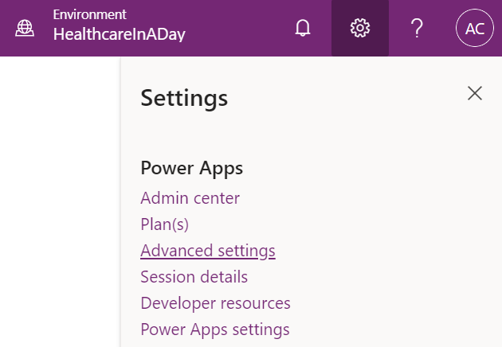](../media/30-advanced-settings.png#lightbox)

1. A new window should open and navigate to Dynamics 365. If loading takes a while, reload the page. It will navigate to the Business Management section of Dynamics 365.

    > [!div class="mx-imgBorder"]
    > [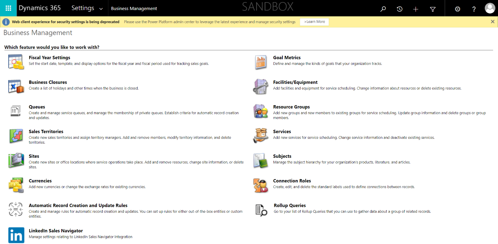](../media/31-business-management.png#lightbox)

1. On the top command bar next to Dynamics 365, select **Settings** to open the drop-down, then select **Security** in the third column under System.

    > [!div class="mx-imgBorder"]
    > 

1. Under Security, select **Users**.

    > [!div class="mx-imgBorder"]
    > 

1. Switch the view drop-down from Omnichannel Users to **Enabled Users** for the grid view so that your user will show in the list.

    > [!div class="mx-imgBorder"]
    > 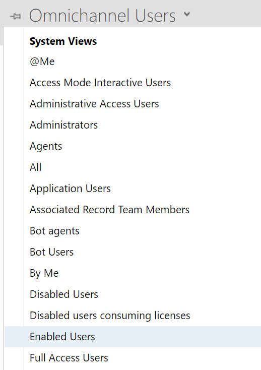

1. While in the Enabled User list, scroll to **find your user** or use the **Search** bar.

1. Select your user for the training and select **Manage Roles** on the top command bar.

    > [!div class="mx-imgBorder"]
    > [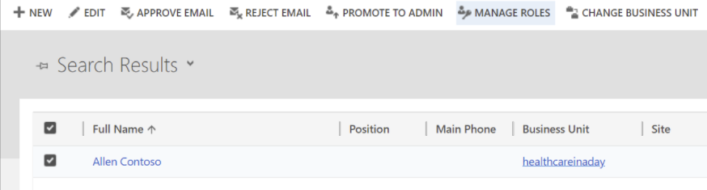](../media/36-manage-roles.png#lightbox)

1. Select the Omnichannel Agent roles to assign to your user and select **OK**.

    > [!div class="mx-imgBorder"]
    > [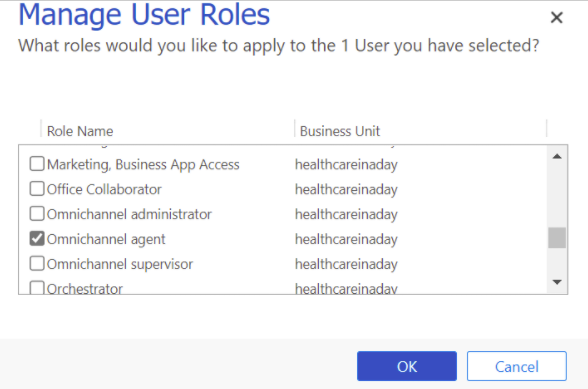](../media/37-manage-user-roles.png#lightbox)

**Congratulations!** You assigned the proper omnichannel agent role to your user to allow you to be a live agent in omnichannel.

## Task 2: Create Health Bot user in Dynamics 365 Customer Service

We need two users to configure in Omnichannel for Dynamics 365 Customer Service:

- **Health Bot User** - This is the Azure Health Bot user we created in the previous exercise.

- **Omnichannel Agent User** - This is your current user that you are logged into Dynamics 365 with. This will allow you to be a live agent in Customer Service who receives messages from portal users through Azure Bot escalations.

In this task, you'll create a **Bot User** which helps connect **Azure Health Bot** with **Omnichannel live Chat**.

1. While in Dynamics 365 in the User page, switch the view to **Application Users**.

    > [!div class="mx-imgBorder"]
    > 

1. Select the **New** button to create a new Application User.

    > [!div class="mx-imgBorder"]
    > [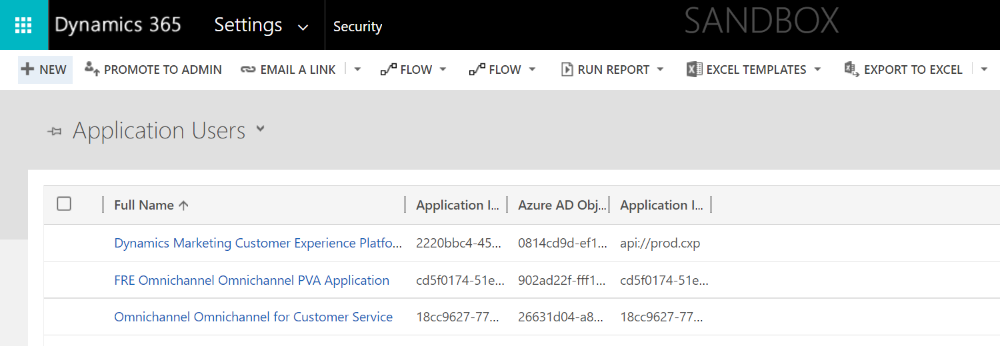](../media/39-new-application-user.png#lightbox)

1. Change the **form type** from User to **Application User** above the New User name.

    > [!div class="mx-imgBorder"]
    > [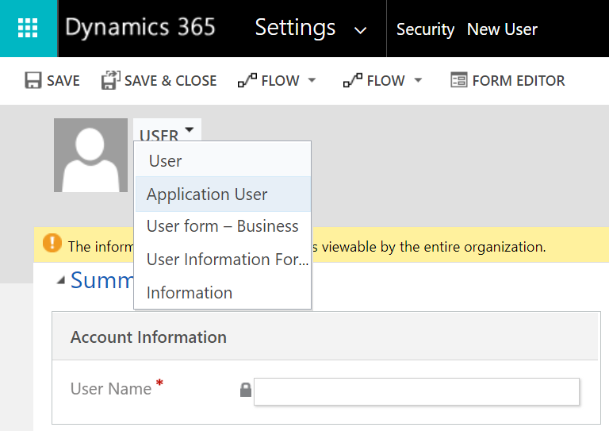](../media/40-application-user.png#lightbox)

1. You'll see a new form that aligns to an Application User appear.

    > [!div class="mx-imgBorder"]
    > [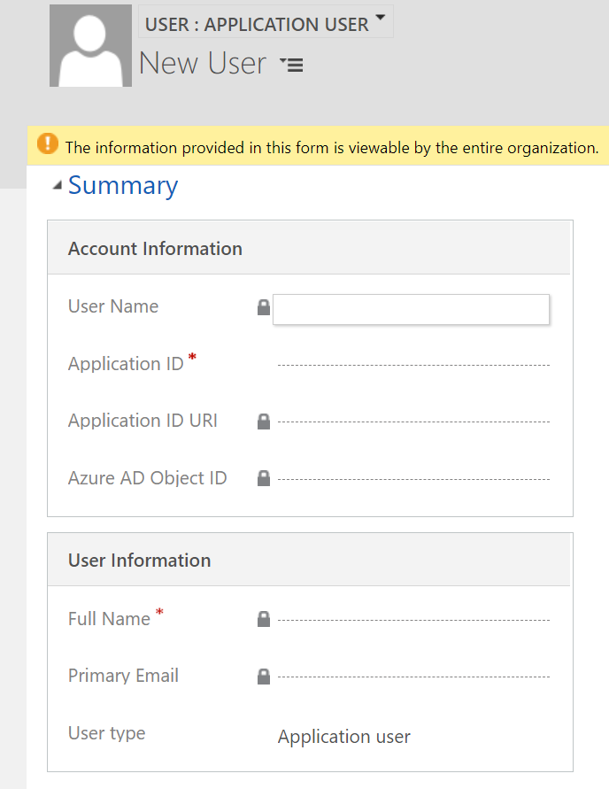](../media/41-new-user-form.png#lightbox)

1. On the **New User** record, enter or select the following information:

    1. **Application ID**: This is the Application (client) ID you obtained in the Azure portal for the supplied MCH Application ID.

    1. **User type**: Select **Bot application user**. This will display a new field to store the Bot application ID.

    1. **Bot application ID**: This is the Azure Health BotId you copied when enabling the Teams channel. This field is displayed once the User Type is selected to be Bot application user.

    > [!div class="mx-imgBorder"]
    > 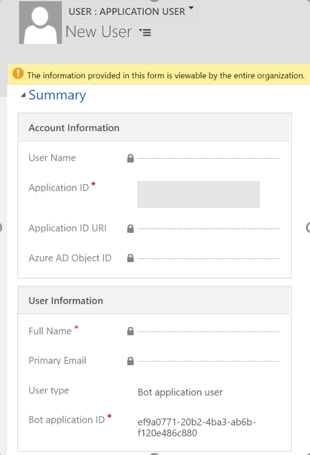

1. Select **Save**. It will auto populate the other values in the record.

1. Select **Manage Roles** on the command bar.

    > [!div class="mx-imgBorder"]
    > [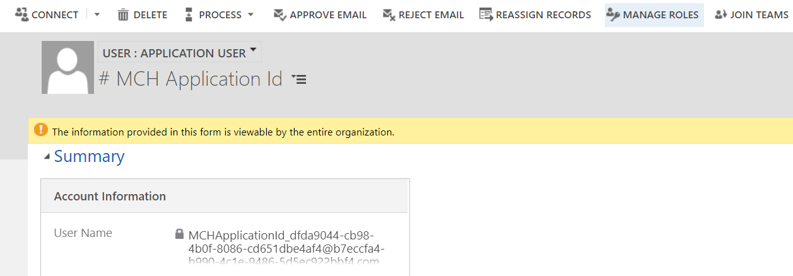](../media/44-application-manage-roles.png#lightbox)

1. Assign the **Omnichannel Agent** **role** to the Bot User as you did for your own user in the previous task. This will allow the bot to act as an omnichannel agent like your user.

    > [!div class="mx-imgBorder"]
    > 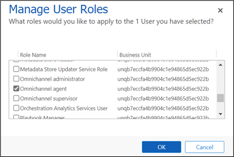

**Congratulations!** You successfully created a Bot User and assigned the Omnichannel Agent role to it.

## Task 3: Create and configure Omnichannel queues

In this task, you'll create and configure the omnichannel queues necessary to communicate with the correct bot or agent depending on the situation.

1. In [Power Apps](https://make.powerapps.com/?azure-portal=true), open the **Omnichannel Administration** app.

    > [!div class="mx-imgBorder"]
    > 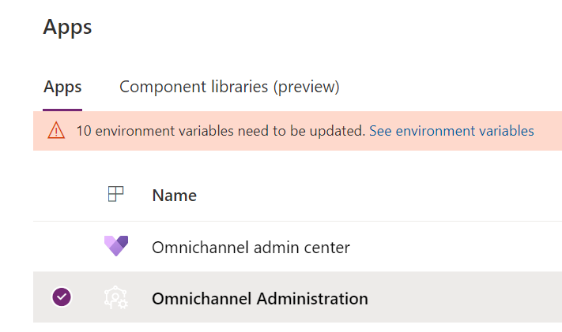

1. Select **Queues** on the left navigation bar.

    > [!div class="mx-imgBorder"]
    > 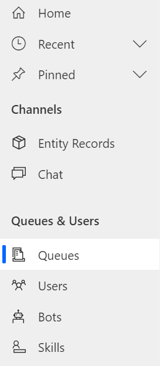

1. Open **Default Messaging Queue**.

    > [!div class="mx-imgBorder"]
    > [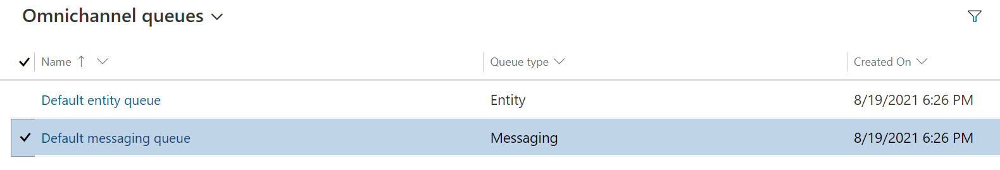](../media/47-default-messaging.png#lightbox)

1. We'll now associate the Default messaging queue with the Bot User so it will respond to incoming messages from customers without agent (human) intervention.

    Select **Add Existing User** on the **User (Agents)** subgrid to add the Bot user you previously created.

    > [!div class="mx-imgBorder"]
    > [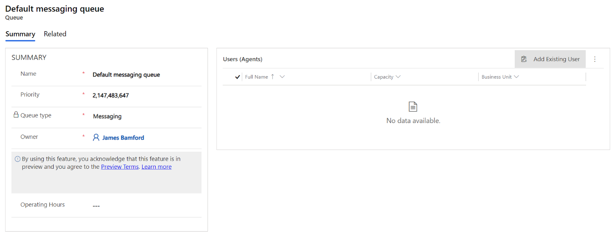](../media/48-add-existing-user.png#lightbox)

1. In the Lookup Records pane, search for your **Bot User** (MCHApplicationId) created in the earlier task.

    > [!div class="mx-imgBorder"]
    > 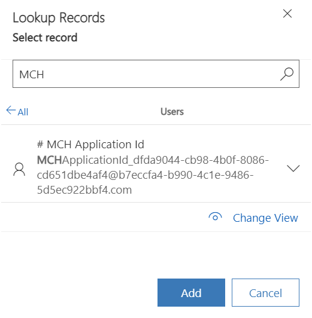

1. Select the record from the list and select **Add**.

    > [!div class="mx-imgBorder"]
    > 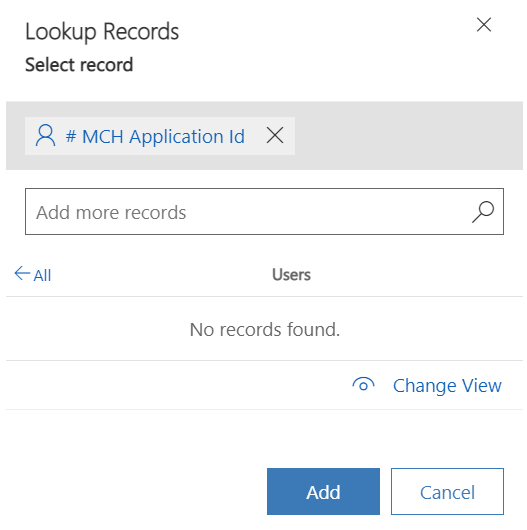

1. You should now see the Bot User (MCH Application ID) in the Users (Agents) list. If your current user is also in the subgrid, remove it.

    > [!NOTE]
    > If your user does not populate after adding, make sure you have assigned the bot user the correct omnichannel agent security role from the previous task. It may take up to 15 minutes for changes to take effect.

    > [!div class="mx-imgBorder"]
    > [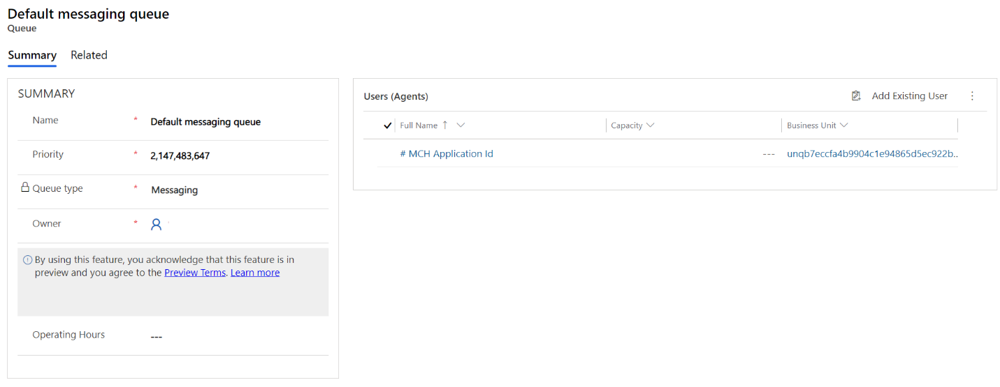](../media/51-default-messaging-summary.png#lightbox)

1. Go back to the **Omnichannel queues** grid. Select **+ New** to create a new Queue.

    > [!div class="mx-imgBorder"]
    > [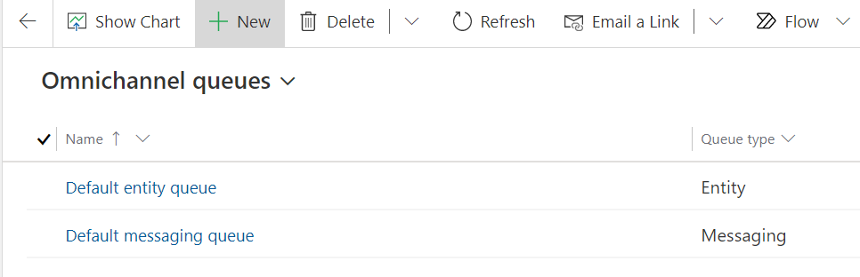](../media/52-new-omnichannel-queues.png#lightbox)

1. Give the new queue the following details:

    1. **Name**: "Escalate to Human"

    1. **Priority**: 1 (lower than default queue)

1. Select **Save**.

    > [!div class="mx-imgBorder"]
    > 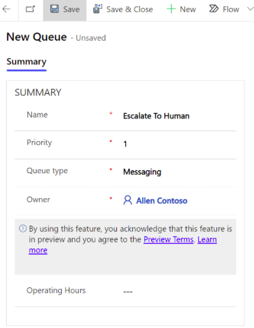

1. A **Users (Agents)** subgrid should appear on the right and your user should be automatically added to the list. If your user account isn't on the list, add it through the **Add Existing User** button now.

    The queue **Escalate to Human** is created to manage and redirect the incoming messages from a user to a customer service (human) agent when the bot sends the user through to a live agent.

    > [!div class="mx-imgBorder"]
    > [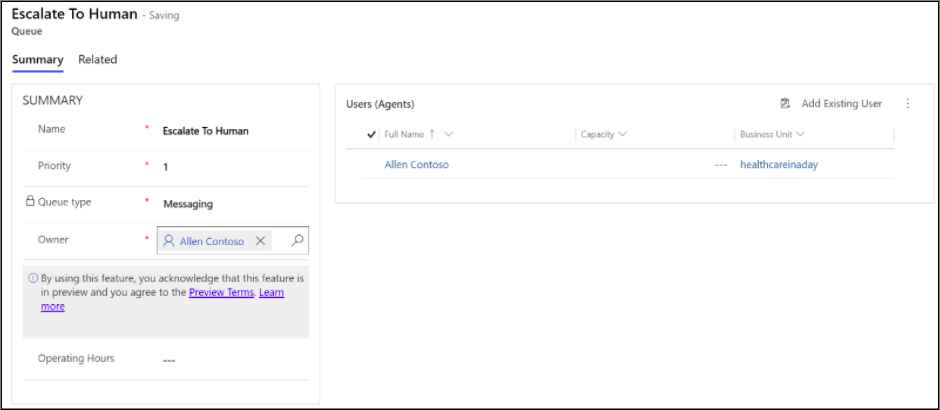](../media/54-escalate-human.png#lightbox)

**Congratulations!** You've created the necessary queue to escalate to a human agent and added the appropriate users to each messaging queue.

## Task 4: Update live work stream with context variables and routing rules

In this task, we'll set up basic chat routing. This lets users chat with a bot user in certain cases and a live human agent in other scenarios. The routing rules let chat behave as follows:

- **Route to Bot:** Initial customer conversation is through Health Bot in the default messaging queue. When the chat bot is first opened, route to Default queue, which only contains the bot user (agent).

- **Human Routing Rule**: When context variable **EscalateToAgent** is present and set to **1**, we route to the queue that has only human users (agents) who can take over the conversation.

1. Navigate to **Work Streams.**

    > [!div class="mx-imgBorder"]
    > 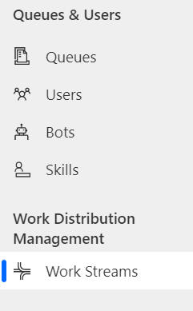

1. Select and edit the **Live chat workstream**.

    > [!div class="mx-imgBorder"]
    > 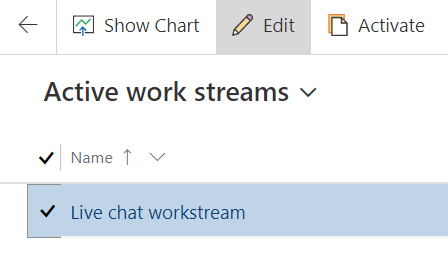

1. In the **Live chat workstream** record, select the **Context Variables** tab. Select **New**.

    > [!div class="mx-imgBorder"]
    > [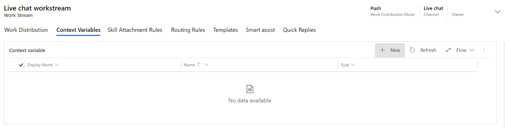](../media/57-context-variables.png#lightbox)

1. Create the new context variable with the following details:

    1. **DisplayName:** EscalateToAgent

    1. **Name:** EscalateToAgent

    1. **Type:** Number

    > [!div class="mx-imgBorder"]
    > 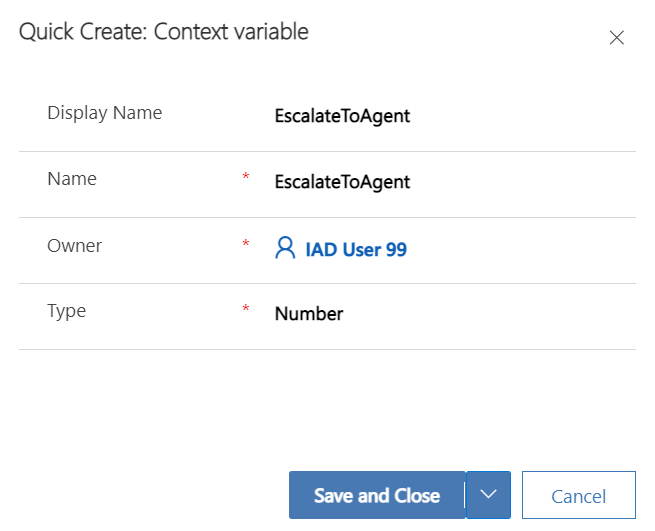

1. Select **Save and Close**.

1. You should now see the new context variable in the Live chat workstream.

    > [!div class="mx-imgBorder"]
    > [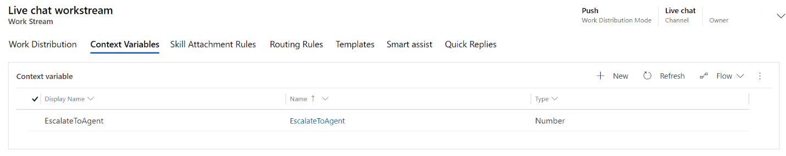](../media/59-live-chat-context-variables.png#lightbox)

1. Select the **Routing Rules** tab. Select **Add** to create a new routing rule.

    > [!div class="mx-imgBorder"]
    > [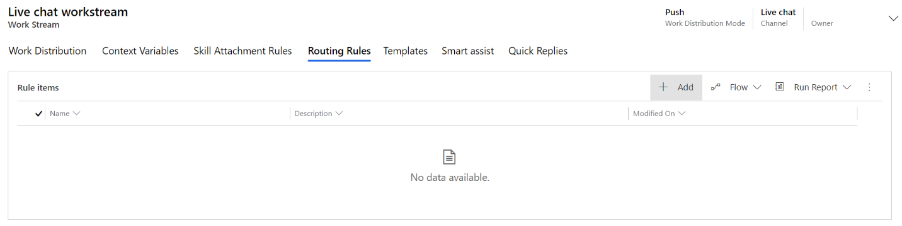](../media/60-routing-rules.png#lightbox)

1. Create the new Health Bot routing rule with the following details:

    1. **Name:** ToHealthcareBot

    1. **Queue**: Default messaging queue

    1. **Conditions**: None

    > [!div class="mx-imgBorder"]
    > 

1. Select **Save & Close.** On the Live chat workstream, select **Add** to add another new Routing Rule.

    > [!div class="mx-imgBorder"]
    > [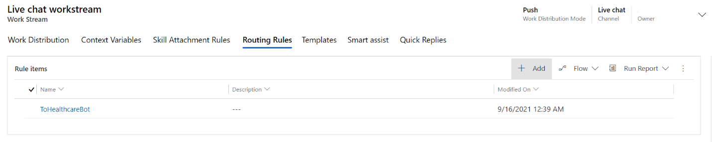](../media/62-add-routing-rule.png#lightbox)

1. Create the new Omnichannel Agent routing rule with the following details:

    1. **Name:** ToAgent

    1. **Queue:** EscalateToHuman

    1. **Condition:** Context Variable | EscalateToAgent | Equals | 1

    > [!div class="mx-imgBorder"]
    > [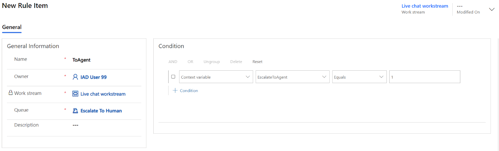](../media/63-new-rule-general.png#lightbox)

    > [!div class="mx-imgBorder"]
    > [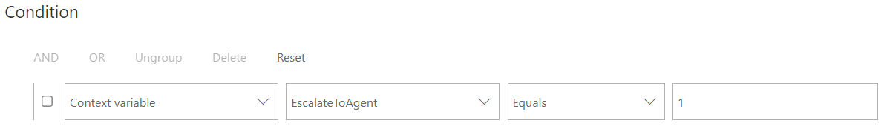](../media/64-condition.png#lightbox)

1. Select **Save & Close.**

1. On the Live chat workstream, you should now see the two **Routing Rules** we created for **Bot** (ToHealthcareBot) and **Agent** (ToAgent).

    > [!div class="mx-imgBorder"]
    > [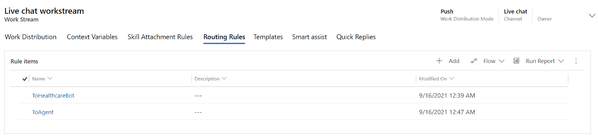](../media/65-bot-agent-rule.png#lightbox)

**Congratulations!** You've created the proper context variable and routing rules that will allow customers to begin conversation with a health bot and escalate to a human agent.

## Task 5: Create chat widget for Health Bot

1. Navigate to **Chat**.

    > [!div class="mx-imgBorder"]
    > 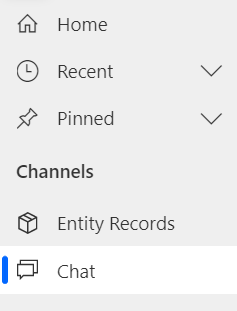

1. Select **New** Chat Widget.

    > [!div class="mx-imgBorder"]
    > 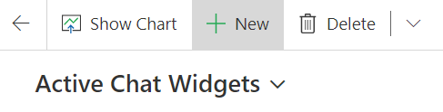

1. Give the chat widget a **Name**, for example Patient Portal Chat Widget.

    > [!div class="mx-imgBorder"]
    > [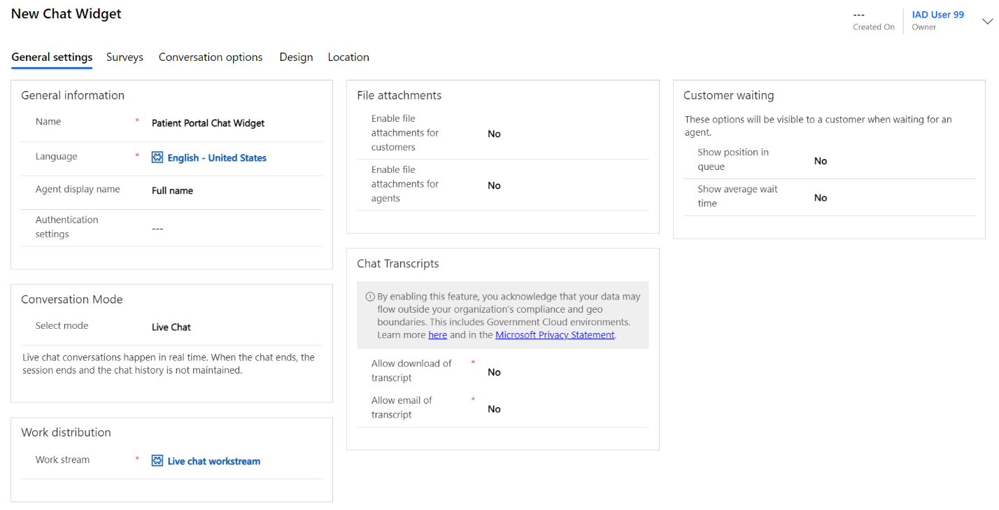](../media/68-chat-widget-name.png#lightbox)

1. Select **Save**.

1. After the record is saved, a **Widget Code Snippet** will be generated. **Copy** the code snippet and store it for later use.

    > [!div class="mx-imgBorder"]
    > [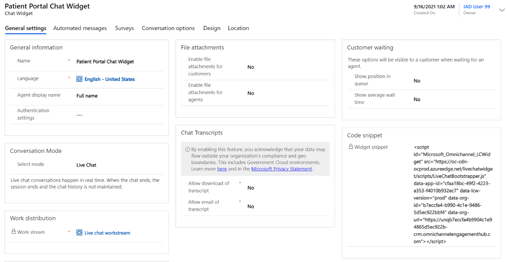](../media/70-widget-code-snippet.png#lightbox)

**Congratulations!** In this exercise, you have successfully configured Customer Service Omnichannel Live chat by creating the necessary Users, Queues, Work Streams, Context Variables, Routing Rules, and Chat Widget. These all work together and allow patients to chat with a virtual health bot with the option to escalate up to a human agent if needed.
