**Dynamics 365 Omnichannel** integration allows the patient to interact with **Azure Health Bot** using the Dynamics 365 chat widget to access the medical knowledge and your custom scenarios. It also, allows the escalation of a bot conversation to a live agent to continue the interaction. When escalating a conversation, Dynamics passes along the conversation history and the context to the agent.

In this exercise, you will be doing the following:

1. Designing the below Health Bot Scenario called **MCH_PatientService**

    > [!div class="mx-imgBorder"]
    > 

1. Design another Health Bot Scenario called **MCH_PatientServiceWelcome**. This scenario holds the starting statement which will allow the user to invoke the **MCH_PatientService** scenario.

1. Set the **Automatic Welcome Scenario** to be the MCH_PatientServiceWelcome custom scenario you create. This will begin the scenario when a user first interacts with the Health Bot.

## Task 1: Create MCH_PatientService Scenario

In this task, you will create the **MCH_PatientService** bot scenario using the designer canvas.

Navigate back to the Azure Health Bot instance homepage where you set the bot settings. This is the portal management link you copied from the Azure portal.

> [!div class="mx-imgBorder"]
> 

1. Click to Expand the Side navigation bar. Navigate to **Scenario** > **Manage.**

    > [!div class="mx-imgBorder"]
    > [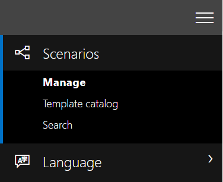](../media/80-scenario-manage.png#lightbox)

1. Click **+ New** button on the top ribbon.

    > [!div class="mx-imgBorder"]
    > 

1. Provide the following details for the new health bot scenario:

    a.  **Name**: MCH_PatientService

    b.  **Scenario ID**: MCH_PatientService

    > [!div class="mx-imgBorder"]
    > [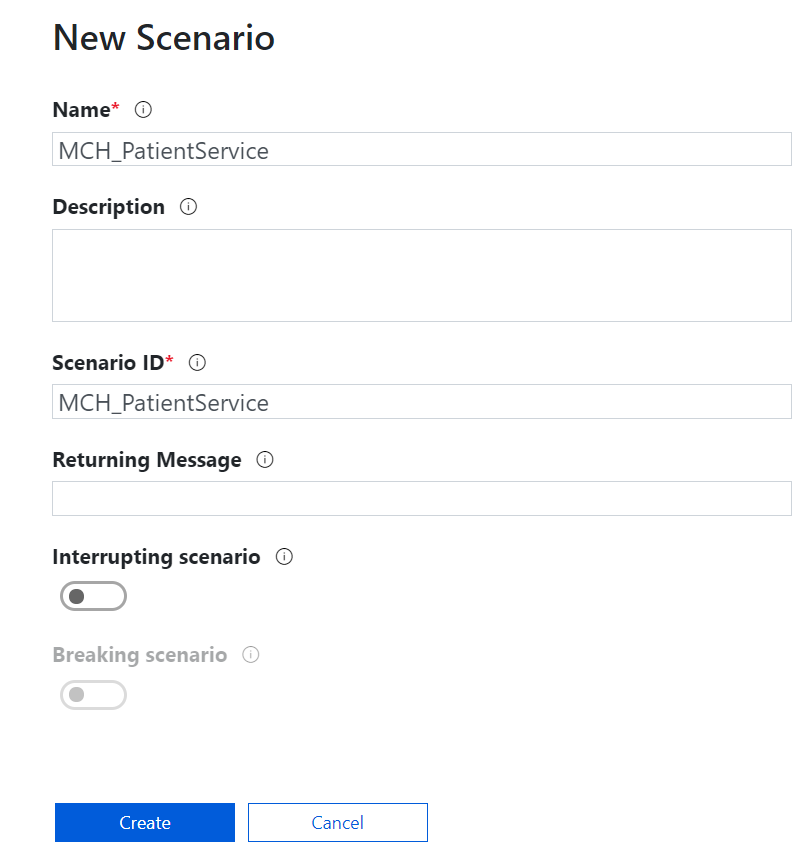](../media/82-new-scenario.png#lightbox)

1. Now let's design the scenario conversation. It should navigate you directly to the designer. If not, select the MCH_PatientService scenario in **Scenarios** > **Manage** to edit.

    > [!div class="mx-imgBorder"]
    > [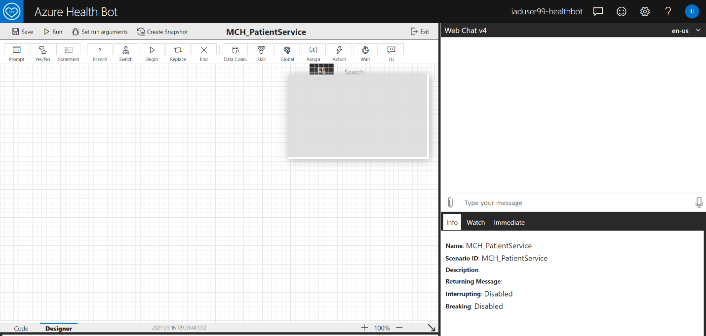](../media/83-manage-scenarios.png#lightbox)

### Step 1: Add Bot Introduction Statement

1. Add a beginning **Statement** to the scenario by **selecting** the icon **and** **dragging** Statement icon onto the editor.

    > [!div class="mx-imgBorder"]
    > [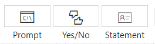](../media/84-prompt-statement.png#lightbox)

1. Enter the **Display Text**:

Hi there, I'm your Healthcare Assistant. How can I help you today?

1. Select the **pencil** next to Statement in the top bar and Change Title to "**Intro**". Click **OK**.

    > [!div class="mx-imgBorder"]
    > [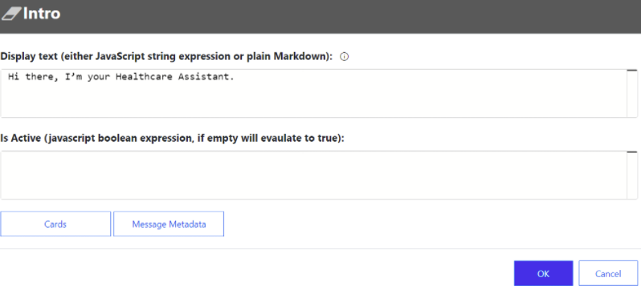](../media/85-introduction.png#lightbox)

1. Select **OK**. You will see the intro statement added to the designer canvas. Double select anytime to edit.

    > [!div class="mx-imgBorder"]
    > 

### Step 2: Add Statement for Medication Request or Live Agent

This section prompts two buttons Medication Refill and Live Agent. When user click any one of the buttons it will set the appropriate text to the variable MedicationOrAgent.

1. Select **Prompt** icon and drag down onto canvas

    > [!div class="mx-imgBorder"]
    > 

1. Enter the following details:

    a.  **Display Text**: Would you like to request a medication refill or chat with a live agent?

    b.  **Variable name:** MedicationOrAgent

    c.  **Data type**: string

    d.  Rename title to **Medication Request**.

1. Click **Cards** button.

    > [!div class="mx-imgBorder"]
    > [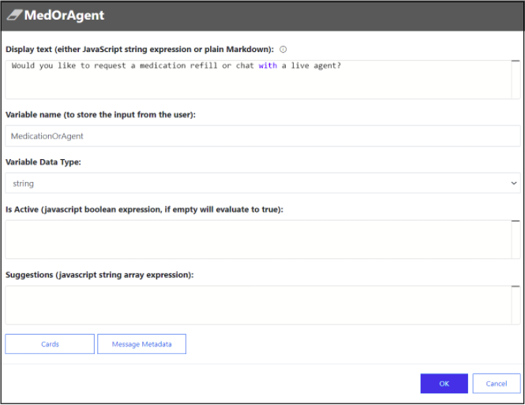](../media/87-medication-request.png#lightbox)

1. Select **Add Card**.

    > [!div class="mx-imgBorder"]
    > 

1. Select Card Type as **HeroCard** and fill in the title as "**Medication Refill or Live Agent**".

1. Click **Add Action** button twice to add two actions:

    a.  For the first action, select the following:

        i.  Action type: imBack

        ii. Action value: MedicationRefill

        iii. Action title: "Medication Refill"

    b.  For the second action, fill in the following:

        i.  Action type: imBack

        ii. Action value: LiveAgent

        iii. Action title: "Live Agent"

    > [!div class="mx-imgBorder"]
    > [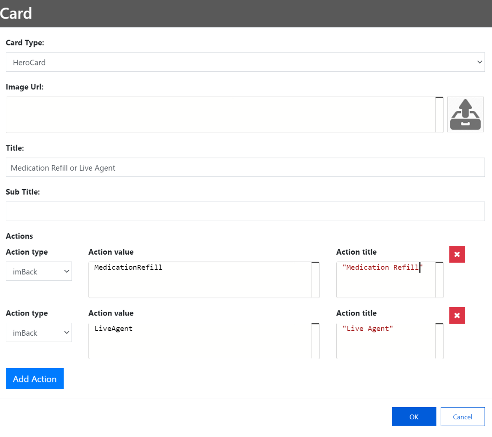](../media/89-add-action.png#lightbox)

1. Click Ok three times to get back to designer.

    > [!div class="mx-imgBorder"]
    > [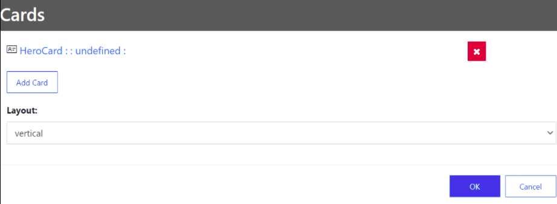](../media/90-select-ok.png#lightbox)

    > [!div class="mx-imgBorder"]
    > [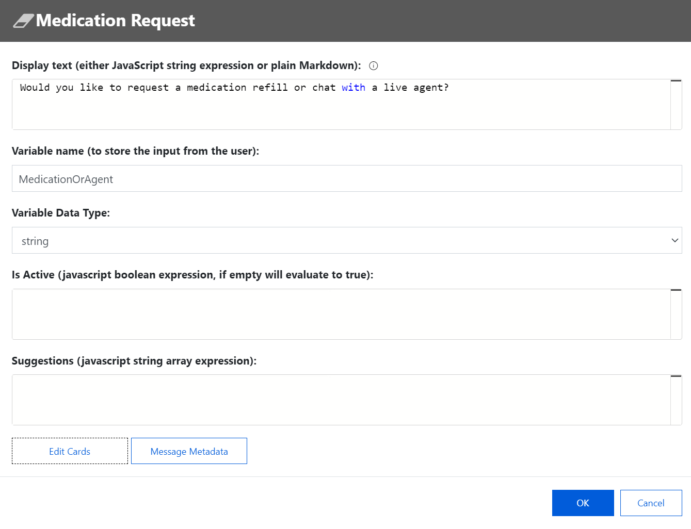](../media/91-request-ok.png#lightbox)

1. Connect Intro and Appointment boxes. Select the bottom circle on intro and drag it to the top circle on the new promp. An arrow will automatically appear when you try to connect Intro and Appointment boxes using ellipse pointer.

    > [!div class="mx-imgBorder"]
    > [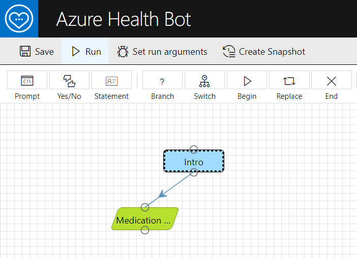](../media/92-connect-boxes.png#lightbox)

1. Select **Save**.

    > [!div class="mx-imgBorder"]
    > [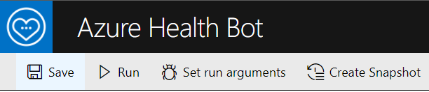](../media/93-save-button.png#lightbox)

1. Select **Run** to see the output in the WebChat on the right.

    > [!div class="mx-imgBorder"]
    > [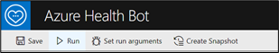](../media/94-run-button.png#lightbox)

    > [!div class="mx-imgBorder"]
    > [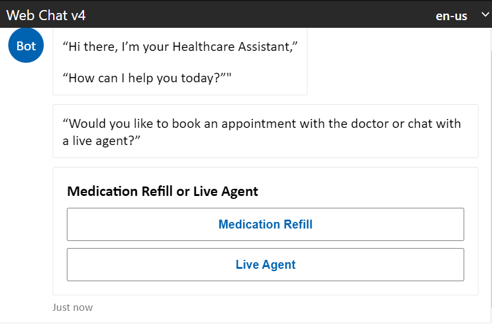](../media/94-web-chat.png#lightbox)

### Step 3: Add MedicationOrAgent Decision Branch

This section checks whether the user has clicked Medication Refill or Live Agent with the help of the variable MedicationOrAgent. It will redirect the message accordingly.

1. Add a **Branch** to the designer canvas**.**

    > [!div class="mx-imgBorder"]
    > [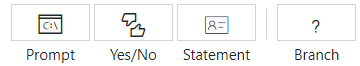](../media/95-branch.png#lightbox)

1. Enter the following in the **javascript Boolean expression**:

    scenario.MedicationOrAgent === \"MedicationRefill\"

1. Rename to **MedicationOrAgent.** Select **OK**.

> [!div class="mx-imgBorder"]
> [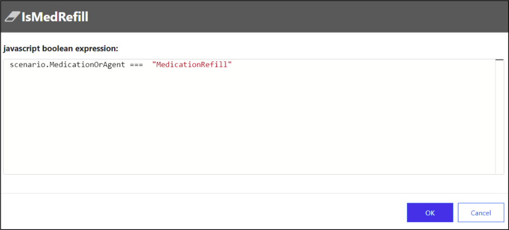](../media/96-medication-agent.png#lightbox)

1. Drag the medication prompt to the MedicationOrAgent branch decision to connect the boxes.

    > [!div class="mx-imgBorder"]
    > [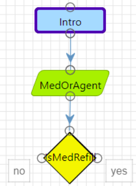](../media/97-medication-branch.png#lightbox)

### Step 4: Prompt User to Enter Data for Medication Refill Option

1. Add a **Prompt** element. This will be used to display the Form data (using Adaptive Card) to capture Patient name, email, and phone to create an appointment.

    > [!div class="mx-imgBorder"]
    > [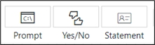](../media/98-prompt.png#lightbox)

1. Add the following details:

    a.  **Display Text**: Submit

    b.  **Variable name**: formData

    c.  **Variable Data Type**: Object

    d.  Change Title to **Submit**

    > [!div class="mx-imgBorder"]
    > [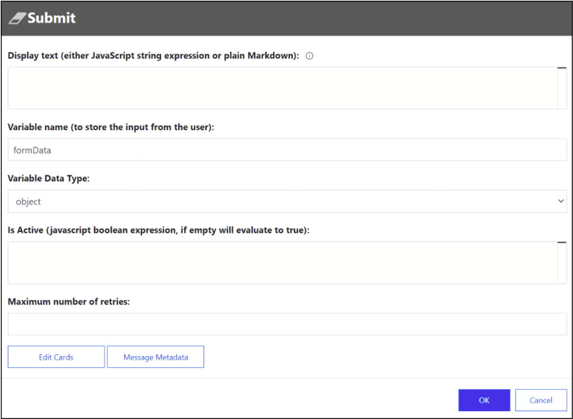](../media/98-submit.png#lightbox)

1. Click **Cards** button > **Add Card** > **Adaptive Card**.

1. Refer to the lab resources file **AdaptiveCardForMedicationRefill.txt** and copy the json content and paste it in the json section of your card.

    > [!div class="mx-imgBorder"]
    > [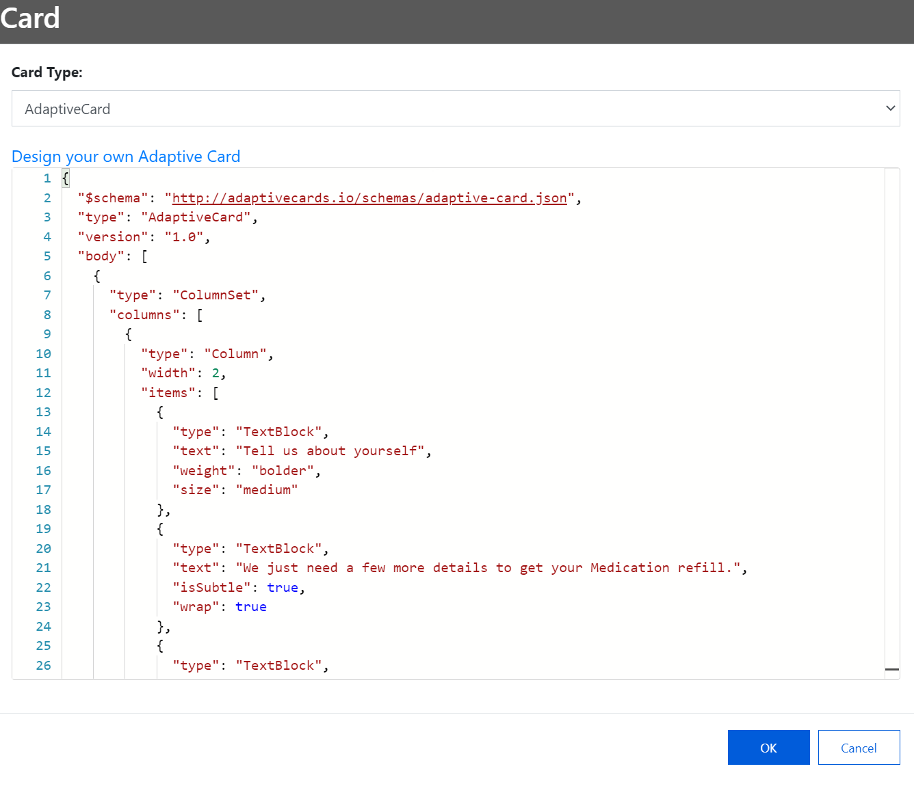](../media/99-adaptive-card.png#lightbox)

1. Select **OK** three times to get back to the designer.

1. **Connect** the **Yes** condition of the **MedicationOrAgent** branch to the **Submit** prompt.

    > [!div class="mx-imgBorder"]
    > [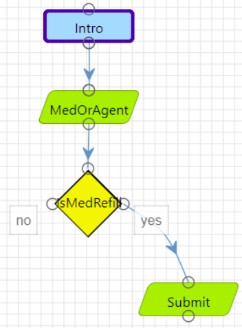](../media/100-connect-yes.png#lightbox)

1. **Save** and **run** your current scenario. If you don't save the scenario first, it won't run with updates since the last save. If you haven't saved at all, it won't recognize any conversation.

1. You should see the below output when running the conversation and selecting "Medication Refill" card when prompted to show the AdaptiveCard.

> [!div class="mx-imgBorder"]
> [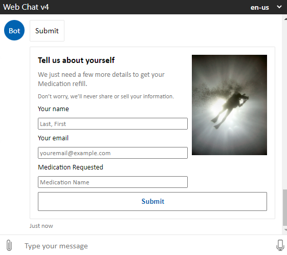](../media/101-medication-refill.png#lightbox)

### Step 5: Add Confirmation Statement

1. Add a **Statement** element.

    > [!div class="mx-imgBorder"]
    > 

1. Add **Display text** as the following:

scenario.formData.myName + \" - Thanks for providing the information, we have created a Medication Request for you regarding the following medication: \" + scenario.formData.myMedReq

1. Rename the statement to **Confirmation**.

    > [!div class="mx-imgBorder"]
    > [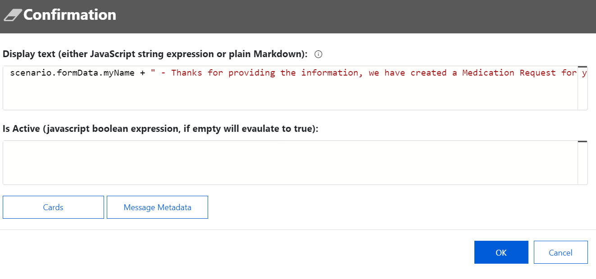](../media/102-confirmation.png#lightbox)

1. Connect the Submit icon to the Confirmation icon in the designer canvas.

    > [!div class="mx-imgBorder"]
    > [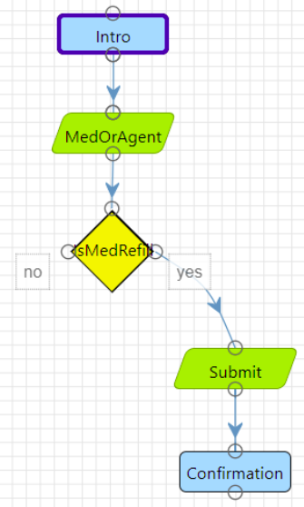](../media/103-connect-submit.png#lightbox)

1. Select **Save** and **Run** to see your scenario in the webchat.

    > [!div class="mx-imgBorder"]
    > [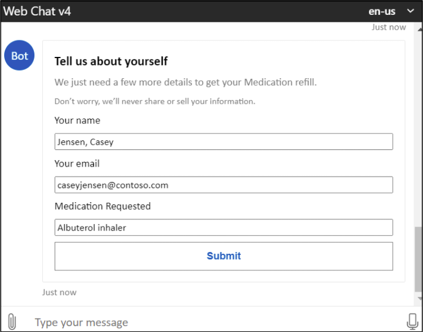](../media/104-webchat-scenario.png#lightbox)

1. **Fill in information** for the request and click **Submit** to see the confirmation text.

    > [!div class="mx-imgBorder"]
    > [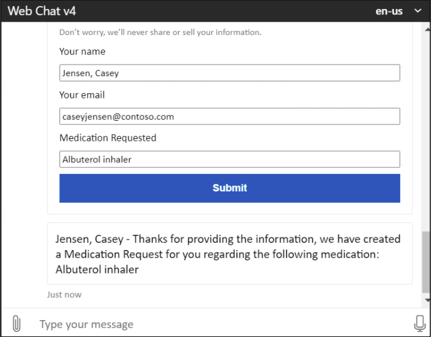](../media/105-information-submit.png#lightbox)

### Step 6: Invoke Live Agent Action

1. Add a **Statement** element to the canvas.

    > [!div class="mx-imgBorder"]
    > 

1. Enter **Display Text**: Please wait, I am transferring your request to a live agent for further assistance.

1. Rename the statement to **Live Chat**.

    > [!div class="mx-imgBorder"]
    > [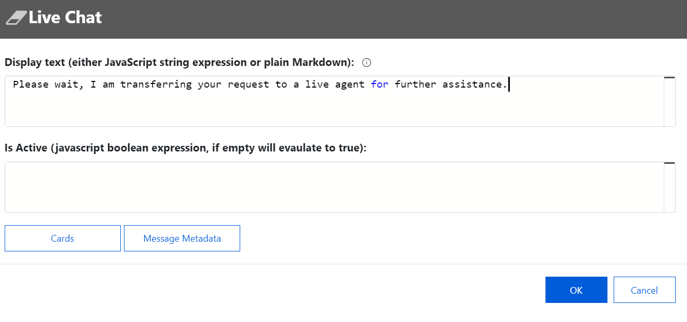](../media/106-statement-rename.png#lightbox)

1. Click **OK** to return to the designer page.

1. **Connect** the **No** decision of **MedicationOrAgent** to the **Live Chat** statement.

    > [!div class="mx-imgBorder"]
    > [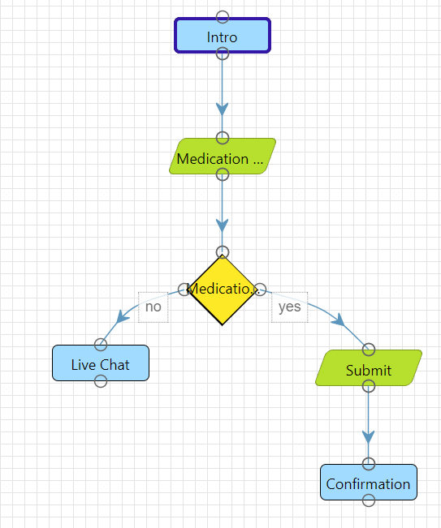](../media/107-connect-no.png#lightbox)

### Step 7: Add Action to Invoke Escalation

1. Add an **Action** element to the canvas, used to trigger an escalation to Omnichannel Live Agent

    > [!div class="mx-imgBorder"]
    > [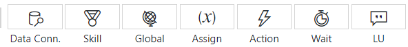](../media/108-action-element.png#lightbox)

1. Add the following code in the action, which will trigger the Live agent chat:

    > session.sendChannelData(\'Escalating\...\', {
    >
    > \"tags\": JSON.stringify({type: \"Escalate\", context: {\"EscalateToAgent\": 1}})
    >
    > });

1. Name the action **EscalateToAgent**. Click **OK** to return to the designer page.

    > [!div class="mx-imgBorder"]
    > [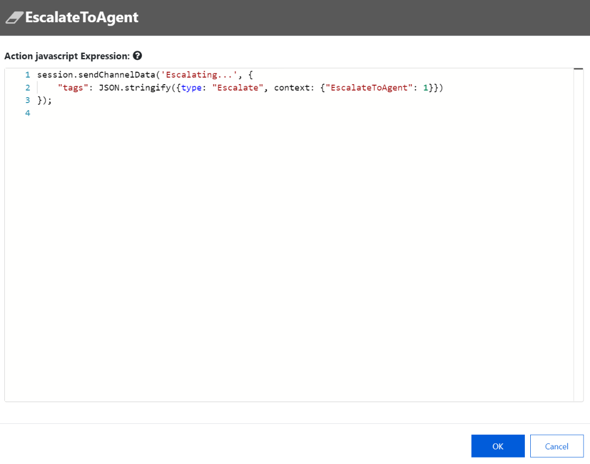](../media/109-escalate-agent.png#lightbox)

1. **Connect** the **Live Chat** to the new **EscalateToAgent** action.

    > [!div class="mx-imgBorder"]
    > [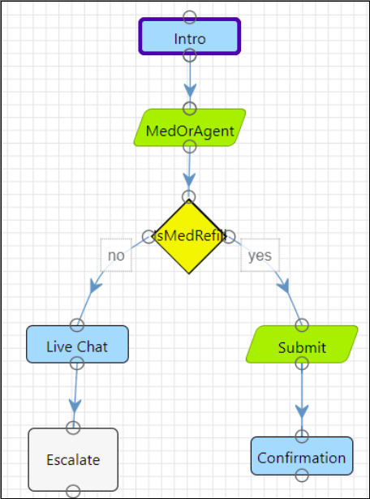](../media/110-connect-live-chat.png#lightbox)

1. You have completed the final connection! Here is your full scenario:

    > [!div class="mx-imgBorder"]
    > [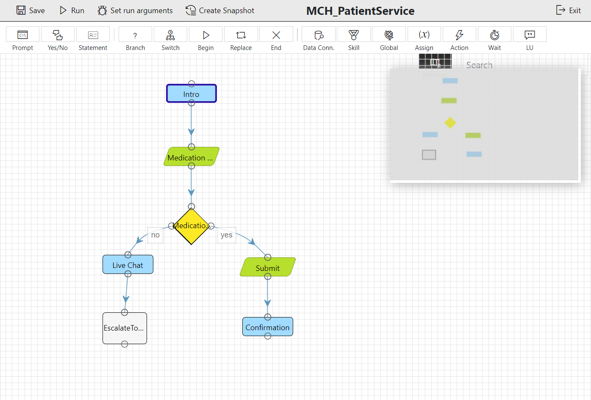](../media/111-connection-complete.png#lightbox)

1. **Save** and **run** your scenario to see the full scenario output.

1. Selecting Live Agent in the authored card should show the escalation action.

    > [!div class="mx-imgBorder"]
    > [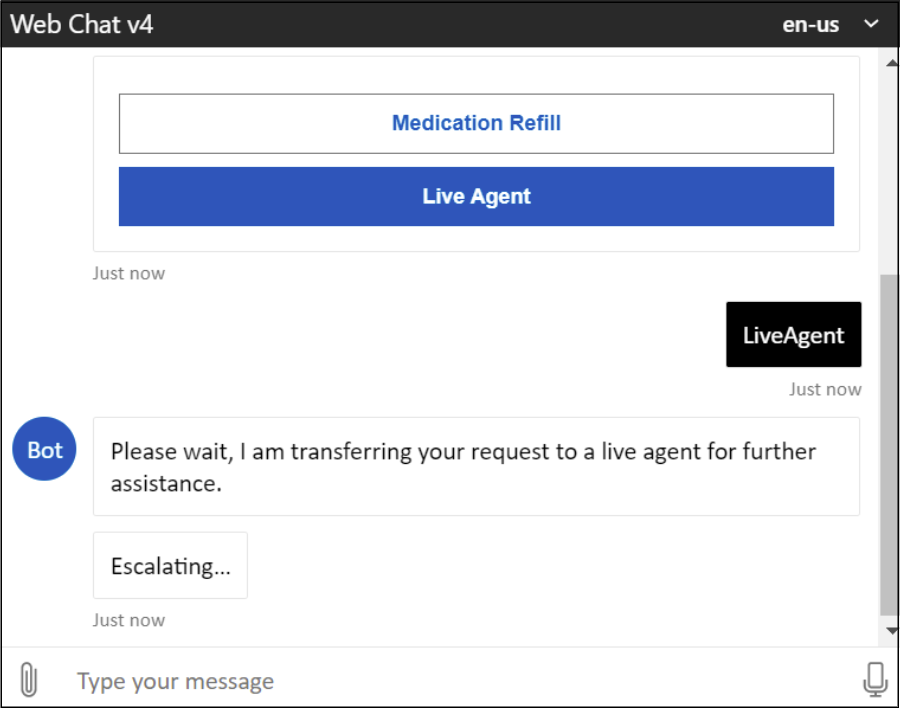](../media/112-live-agent.png#lightbox)

1. **Exit** the MCH_PatientSerivce scenario editor. Make sure you save before confirming to exit.

    > [!div class="mx-imgBorder"]
    > [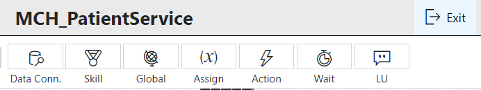](../media/113-scenario-editor.png#lightbox)

### Task 2: Create MCH_PatientServiceWelcome Scenario

In this task, we will create another bot scenario called **MCH_PatientServiceWelcome** scenario to invoke the **MCH_PatientService** scenario.

1. On the Azure Health Bot scenarios page, select **+New** to create another new scenario

    > [!div class="mx-imgBorder"]
    > [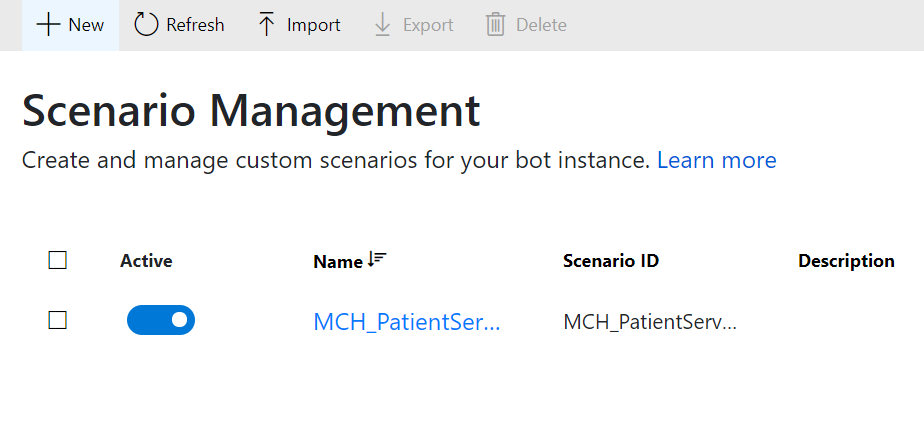](../media/114-scenario-management.png#lightbox)

1. Provide the following details for the new scenario:

    a.  **Name**: MCH_PatientServiceWelcome

    b.  **Scenario ID**: MCH_PatientServiceWelcome

    c.  Select **Create**.

    > [!div class="mx-imgBorder"]
    > [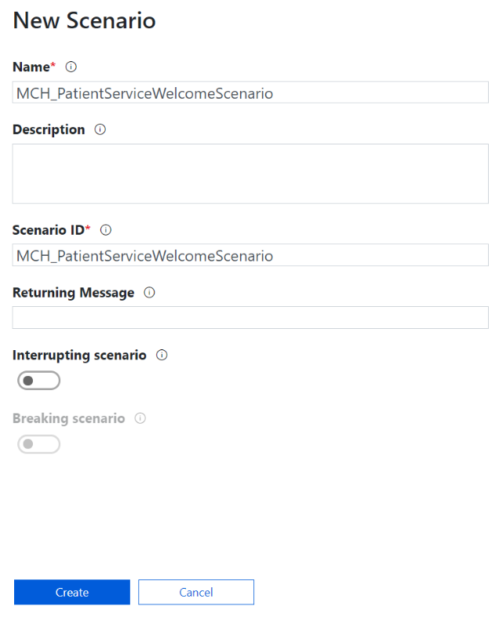](../media/115-create-new-scenario.png#lightbox)

1. On the scenario editor designer, add a **Statement** element

    > [!div class="mx-imgBorder"]
    > 

1. Enter **Display text**: "Welcome to Lamna Healthcare Patient Service Portal!"

1. Rename the statement **Intro**.

    > [!div class="mx-imgBorder"]
    > [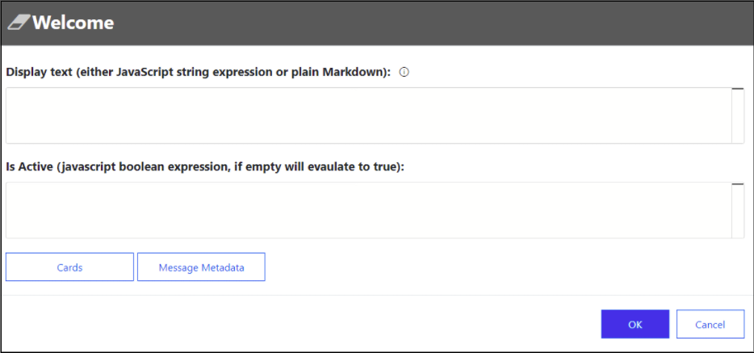](../media/116-statement-intro.png#lightbox)

1. Select **Cards.**

    > [!div class="mx-imgBorder"]
    > [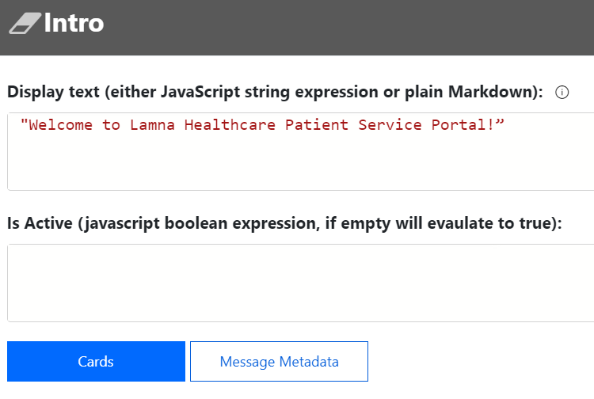](../media/117-select-card.png#lightbox)

1. Select **Add Card**.\

    > [!div class="mx-imgBorder"]
    > [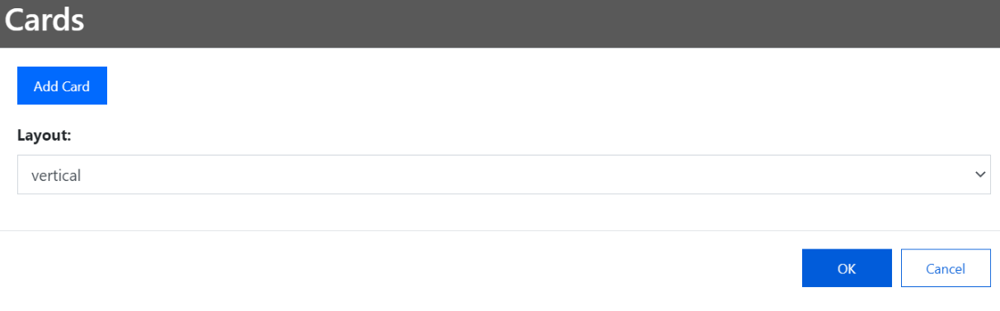](../media/118-add-card.png#lightbox)

1. Choose **HeroCard**

1. Add **Title**: Welcome to Lamna Healthcare Patient Service Portal

    > [!div class="mx-imgBorder"]
    > [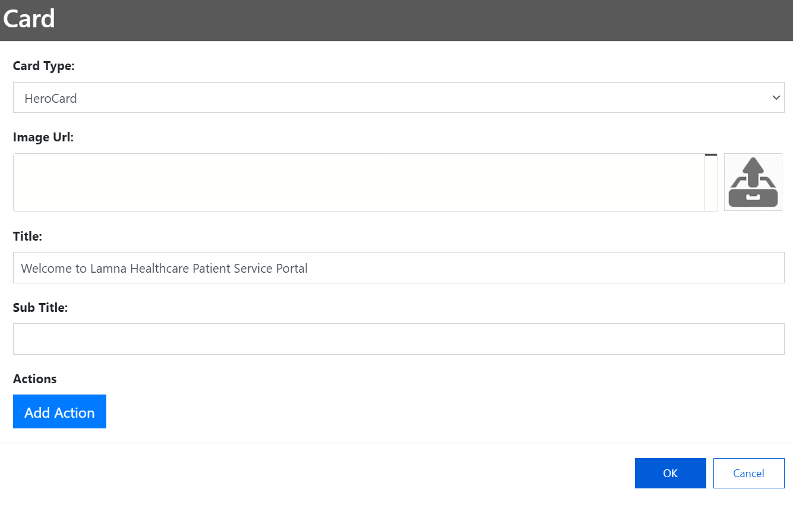](../media/119-title-card.png#lightbox)

1. Select **Add Action** and provide the following details:

    a.  **Action type**: imBack

    b.  **Action value**: \"begin MCH_PatientService\"

    c.  **Action title**: \"Lamna Healthcare Support\"

    > [!div class="mx-imgBorder"]
    > 

1. Click **OK** and view your completed scenario. This will be used to kick off the conversation and allow the other MCH_PatientService scenario to be invoked through the authored card.

    > [!div class="mx-imgBorder"]
    > [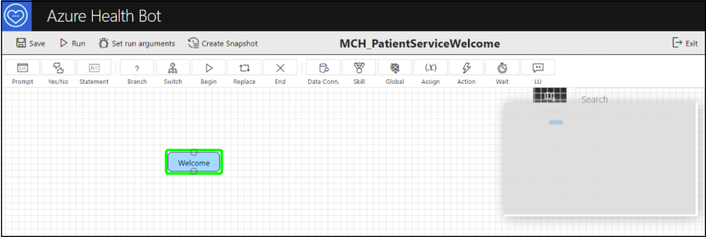](../media/121-scenario-introduction.png#lightbox)

1. **Save** and **run** to test your bot scenario **MCH_PatientServiceWelcome** scenario in the Web Chat.

    > [!div class="mx-imgBorder"]
    > [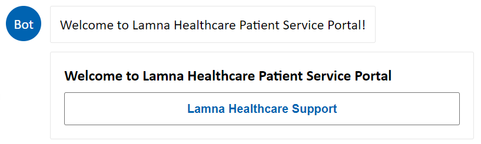](../media/122-test-welcome.png#lightbox)

1. **Exit** the scenario designer.

### Task 3: Configure Welcome Scenario as Automatic

In this task, we will set the MCH\_ PatientServiceWelcome to be the "Automatic Welcome Scenario" in settings. This will always trigger the scenario when a user starts conversion with **Health Bot** from Portal.

1. Navigate to Configuration > Conversation

    > [!div class="mx-imgBorder"]
    > [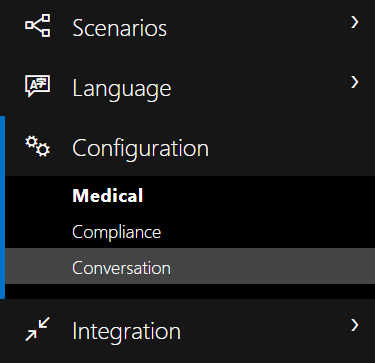](../media/123-configuration-conversation.png#lightbox)

1. In the Interactions tab, scroll down to the **Automatic Welcome** section.

    > [!div class="mx-imgBorder"]
    > [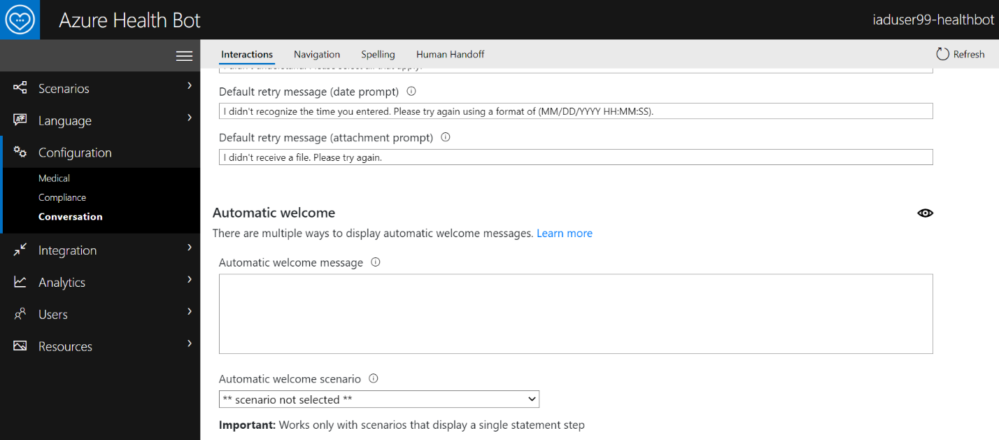](../media/124-automatic-welcome.png#lightbox)

1. In the **Automatic welcome scenario** dropdown, select the **MCH\_ PatientServiceWelcome** scenario.

    > [!div class="mx-imgBorder"]
    > [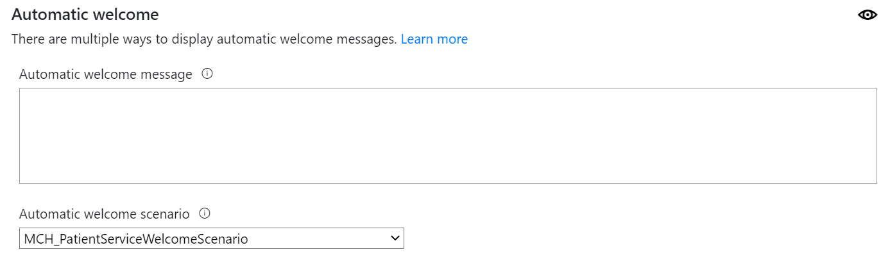](../media/125-automatic-message.png#lightbox)

> **Congratulations!** You have successfully set MCH_PatientServiceWelcome scenario to be the default scenario that kicks off when a user interacts with the Health Bot.

### Task 4: Test Health Bot Escalation from Power Apps Portal to Dynamics 365 Omnichannel

In this task, you will test the escalation experience from Power Apps portal to a live agent in Omnichannel.

1. Navigate to <https://make.powerapps.com> and click to open **Lamna Healthcare Patient Portal**.

    > [!div class="mx-imgBorder"]
    > [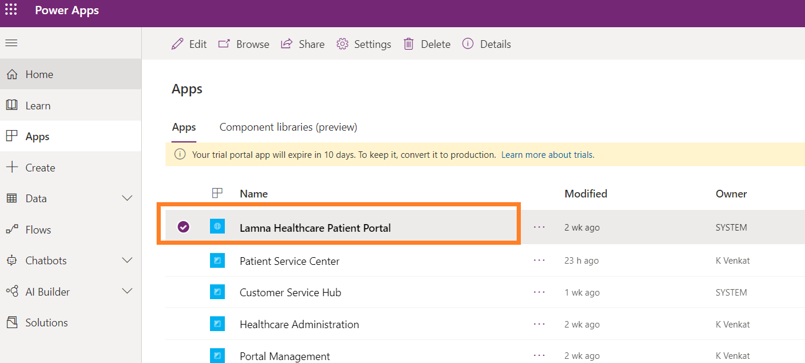](../media/126-test-escalation.png#lightbox)

1. You should see the Health Bot "Let's Chat" button in the lower right-hand corner of the screen. This means the chat widget was successfully embedded into the Customer Self-service portal.

    > [!div class="mx-imgBorder"]
    > [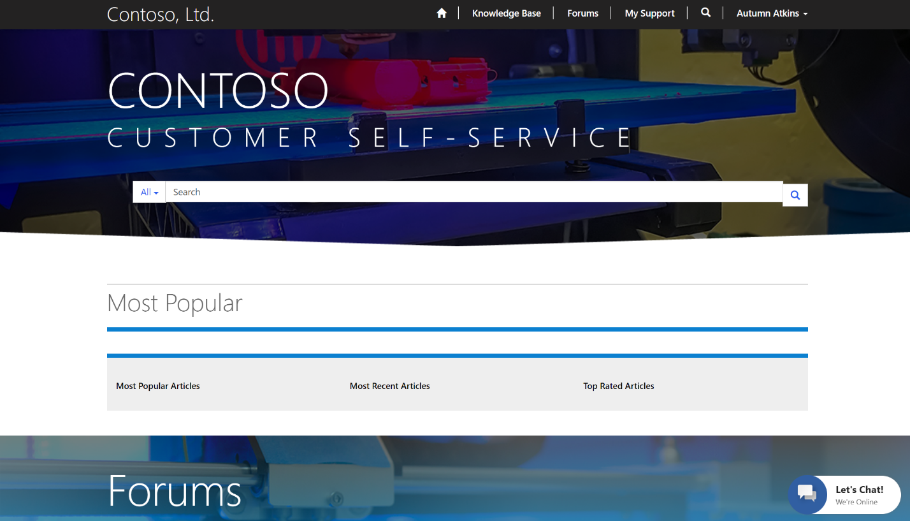](../media/127-lets-chat.png#lightbox)

1. When you the click chat widget, bot will trigger a welcome scenario message we created and set as the default welcome message (**MCH_PatientServiceWelcome)**.

    > [!div class="mx-imgBorder"]
    > 

1. Navigate back to Power Apps and open **Customer Service Workspace.**

    > [!div class="mx-imgBorder"]
    > [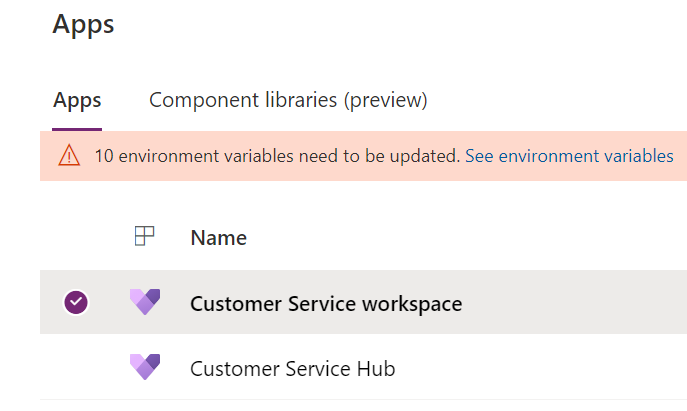](../media/129-customer-service-workspace.png#lightbox)

> [!NOTE]
> Omnichannel for Customer Chat Widget will work only when you see the presence status is enabled. There should be a splash loading screen that goes through multiple steps and then displays the status indicator as available once loaded. (Status is enabled when green with checkmark in circle**)**
>
    > [!div class="mx-imgBorder"]
    > [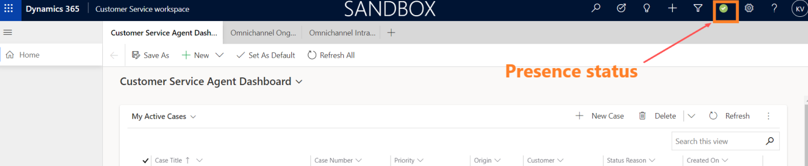](../media/130-presence-status.png#lightbox)
>
> Splash screen looks like the following. Refresh the page if you do not see the splash screen.
>
    > [!div class="mx-imgBorder"]
    > [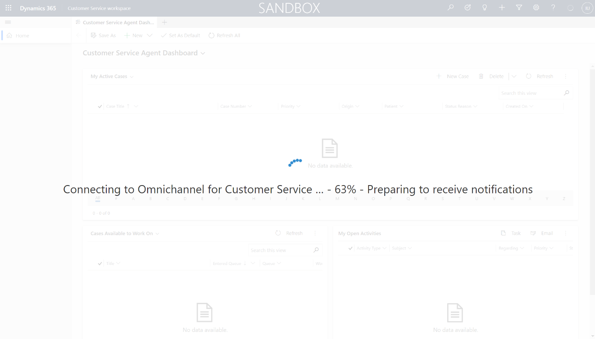](../media/131-splash-screen.png#lightbox)

1. In the Health Bot dialog in the Patient Portal, click **Lamna Healthcare Support** button, then the **Live Agent** button to witness the escalation into Omnichannel to chat with a live agent (your user!)

    > [!div class="mx-imgBorder"]
    > [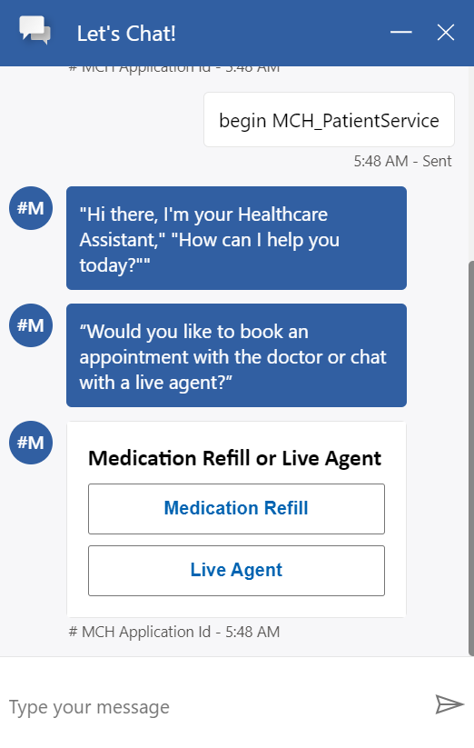](../media/132-live-agent.png#lightbox)

    > [!div class="mx-imgBorder"]
    > [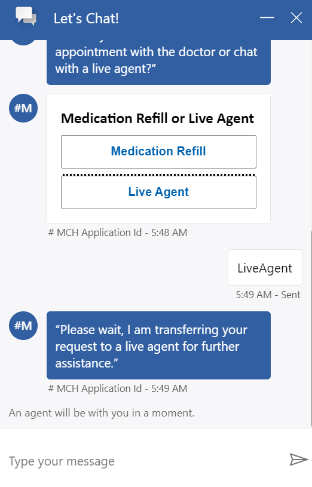](../media/133-agent-transfer.png#lightbox)

1. Navigate back to Omnichannel for Customer Service. Your user as the **Live Agent** should receive an incoming notification with **Accept/Reject** options for that chat.

1. Click **Accept** to connect and chat with customer (In this case chat with the **patient**).

    > [!div class="mx-imgBorder"]
    > [

1. As soon as Live Chat Agent accepts the incoming chat notification, Omnichannel for Customer Service has opened a **Live Chat Widget** and Agent would be able to see the entire bot conversation with user and continue the chat conversation with user for further assistance.

    > [!div class="mx-imgBorder"]
    > [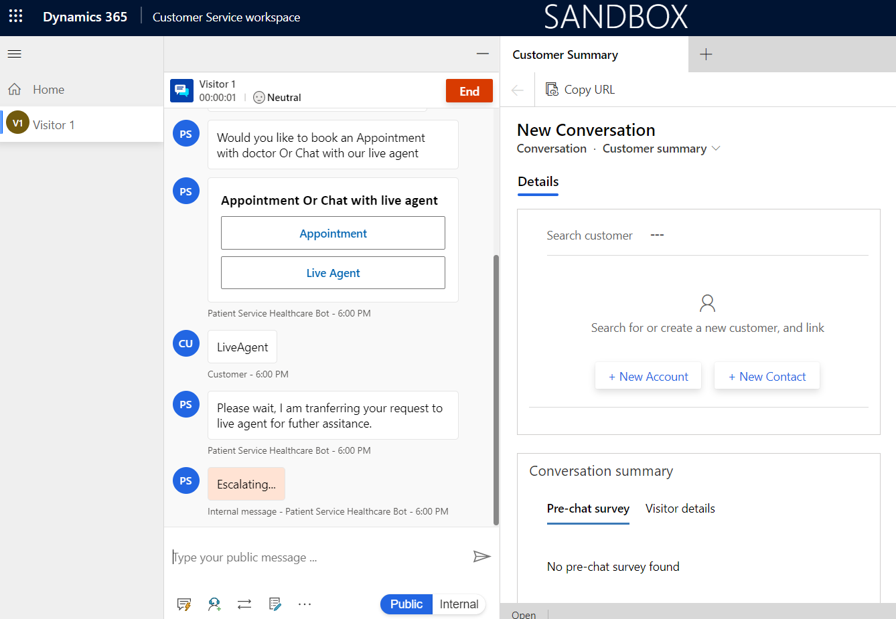](../media/135-live-chat-widget.png#lightbox)

**Congratulations!** You have successfully tested the escalation scenario from the patient using a Health Bot in the Power Apps Portal to a Live Agent in Omnichannel for Customer Service.