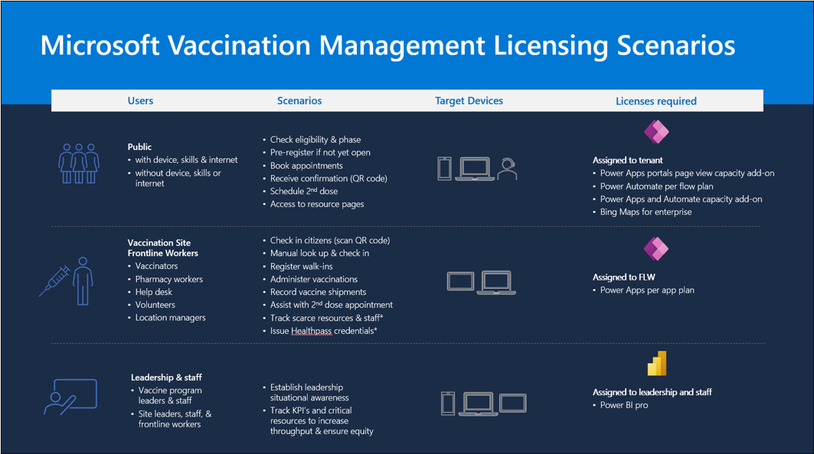

Microsoft Vaccination Management (MVM) is available only for customers in the United States through an enterprise agreement, and it's implemented by Microsoft Consulting Services or authorized partners. Contact your Microsoft representative to learn more and deploy it for your healthcare organization: [aka.ms/vaccination-management](https://aka.ms/vaccination-management/?azure-portal=true).

MVM requires various licenses to take full advantage of its offerings. The following diagram best describes the licenses that are required for MVM:

> [!div class="mx-imgBorder"]
> 
