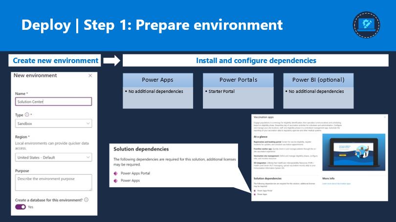
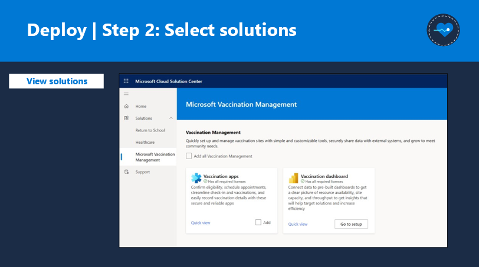
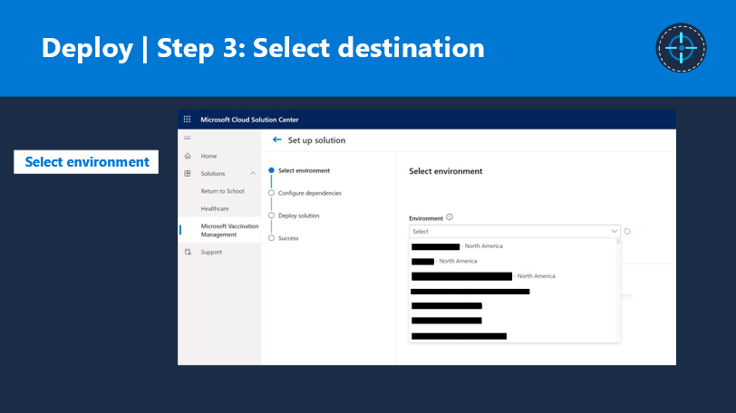
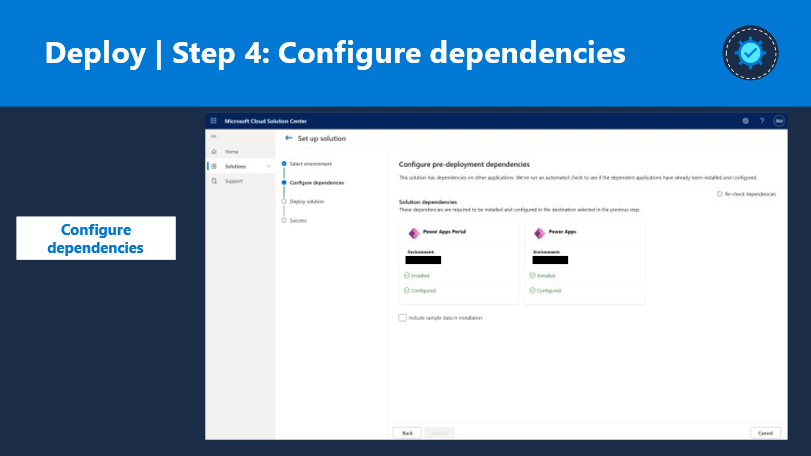
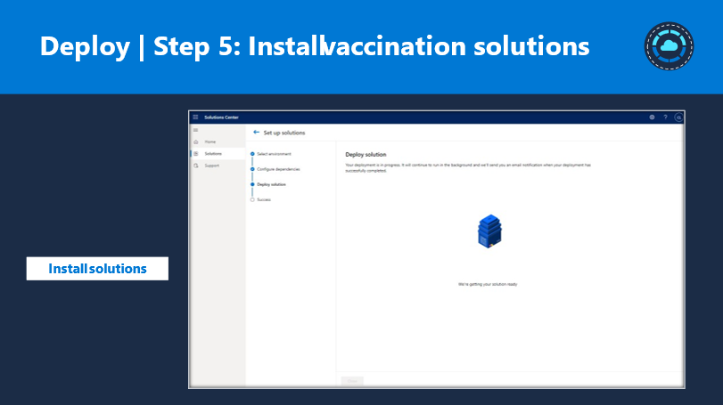
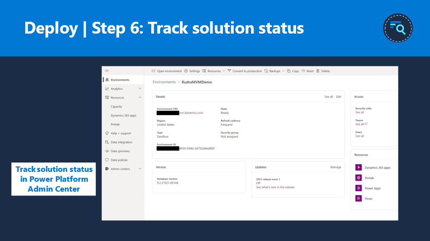
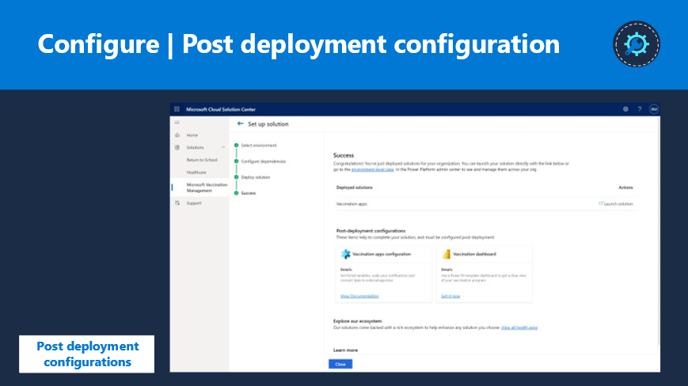

After you have learned about the licenses that are required to get started, you can learn how to deploy Microsoft Vaccination Management.

Currently, Microsoft Dynamics 365 components-based installations can be deployed through a new portal-based experience known as Microsoft Cloud Solution Center. Solution Center guides customers and partners through the deployment of capabilities for comprehensive industry clouds such as Microsoft Vaccination Management. Additionally, it is an orchestrator that simplifies the whole deployment process by checking licensing requirements and dependencies. It also brings a unified deployment and configuration experience across multiple applications.

## Prerequisites

The prerequisites that you should meet prior to beginning deployment by using Microsoft Cloud Solution Center are:

- Enterprise-required licenses for base platform dependencies

- The user who is signing in to Solution Center should have the following components: 

  - A Microsoft Power Platform or Dynamics 365 administrator role to deploy Microsoft Vaccination Management

  - The required licenses for Microsoft Vaccination Management and its dependencies

- Follow the allow-listing process for Microsoft Vaccination Management

## Deployment

The first step to deployment is to prepare the environment.

You need an environment with Microsoft Dataverse so that when you create a new environment in Microsoft Power Platform admin center, you are required to select the **Create a database for this environment** option. Then, you can install dependencies as required.

1. Create a new environment and install dependencies.

    > [!div class="mx-imgBorder"]
    > 

    - **Power Apps** - No additional dependencies

    - **Power Apps Portal** - Starter portal

    - **Power BI** (optional) - No additional dependencies

    After configuring your environment with a database and dependencies, you can move to the next step, where you will select the required healthcare solutions to install. You can choose one or many capabilities at once, select **Add**, and then start the installation process.

1. Select from the available solutions in Microsoft Vaccination Management.

    > [!div class="mx-imgBorder"]
    > 

1. Select the environment. You'll be prompted with a dropdown list that includes all organizations on your tenant. If you've created your environment but are not seeing your organization in the list, wait a few minutes before you retry because it should appear soon.

    > [!div class="mx-imgBorder"]
    > 

1. Configure your pre-deployment dependencies.

    > [!div class="mx-imgBorder"]
    > 

    When you select an environment to install, Solution Center runs a dependency check in the background to make sure that you have everything you need to get the solution working. For example, the preceding screenshot shows that the organization doesn't have the Dynamics 365 Marketing and Power Apps Portal dependencies preinstalled before they started the installation process. Consequently, they will see this error and will need to fix it before continuing with the process.

1. Install vaccination solutions.

    > [!div class="mx-imgBorder"]
    > 

    After the dependency checkpoint has completed, the installation process will start and you'll see a progress status indicating the components that are being deployed. When the deployment is ready, you should receive a confirmation status from Solution Center indicating the success or failure of the deployment.

1. Track your solution status.

    > [!div class="mx-imgBorder"]
    > 

    You can also track the solution status in Microsoft Power Platform admin center under the **Dynamics 365 apps** section.

1. Complete post-deployment configuration.

    > [!div class="mx-imgBorder"]
    > 

    When the installation is complete, you can begin the post-deployment solution configurations in Solution Center.
