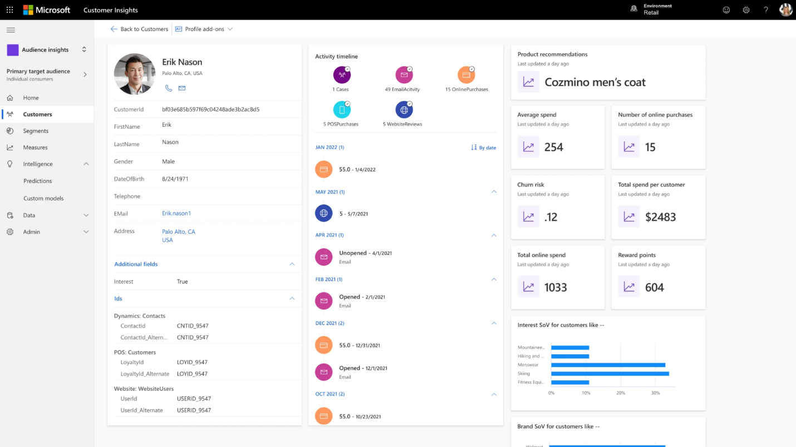
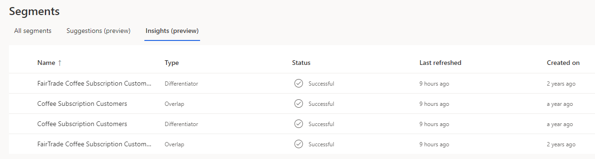
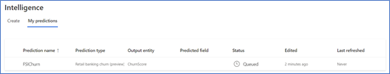
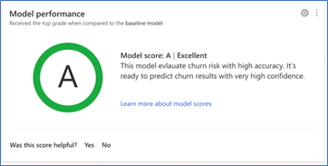
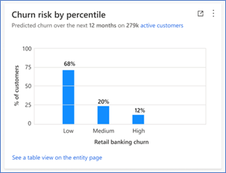

Customer data platforms share common elements such as data collection, profile unification, segmentation, and activation. With unified customer profiles in Microsoft Dynamics 365 Customer Insights, you get those functionalities and more. Customer Insights includes out-of-the-box profiles that you can enrich by using included services that will help you get to know your customer better and get a single view of them with the **Unified customer profile** feature. Business users in your organization will manage Dynamics 365 Customer Insights, which helps avoid the added expense of costly IT resources. As part of Unified customer profile in Customer Insights, you can include a custom retail churn score by using the retail channel churn predictive model in Microsoft Cloud for Retail.

## Customer Insights

Dynamics 365 Customer Insights works well with your data that is ready to process. If your data needs major transformation, consider using Microsoft Azure Synapse in addition to, or instead of, Customer Insights. For more information, see [Transform data in Azure Data Factory and Azure Synapse Analytics](/azure/data-factory/transform-data/?azure-portal=true).

When you first start with Customer Insights, you'll choose one of two paths to focus on: Audience Insights or Engagement Insights (currently in preview). Select **Audience Insights** to unify disparate data across multiple sources for a 360-degree view of your customers. Select **Engagement Insights** to better understand customer behavior across websites, mobile apps, and connected products. You can switch your path anytime. For a self-guided tour of Customer Insights, see  [Microsoft Guided Tours](https://guidedtour.microsoft.com/en-us/guidedtour/dynamics/customer-insights/5/1/?azure-portal=true).

### Unified customer profile in Customer Insights

Unified customer profile in Customer Insights is a valuable asset that provides you with a single view of an individual customer. The unified customer profile that you have in the Audience Insights path will show information and intelligence from several different data sources.

> [!div class="mx-imgBorder"]
> 

With the information in unified customer profiles, you can build segments and micro-segments to better target your customer. Additionally, AI offers insight into the influence of your customer segments.

> [!div class="mx-imgBorder"]
> 

While Customer Insights offers you more information about your customers, if you connect it to external systems, such as Microsoft Dynamics 365 Marketing, you can expand that knowledge into action and engagement. For more information, see [Unlock customer intent with Dynamics 365 Customer Insights](/learn/paths/build-customer-insights/?azure-portal=true).

Watch the following video for a further explanation of Customer Insights and the unified customer profile.

> [!VIDEO https://www.microsoft.com/videoplayer/embed/RWVHaF]

## Retail channel churn

Expand your insights into your customer with the retail channel churn predictive model. The Unified customer profile feature (currently available in the US) in Microsoft Cloud for Retail includes an AI-based churn predictive model, which is designed for omnichannel retail and built atop of Customer Insights.

You can create a retail channel churn predictive model to fit your business needs and gain cross-channel insights into the chance of retail customer churn. By running your company data through this model, you can train it to improve its predictions and identify the factors that contribute to churn, at the customer level.

### Set up and train your retail churn model

To complete setup and training of your retail churn model, you need to meet the following prerequisites:

- Retail components, available within Microsoft Cloud for Retail in Microsoft Cloud Solution Center

- At least Contributor permissions in Dynamics 365 Customer Insights

- An understanding of what churn means for your organization (a customer is considered to have *churned* if their purchase value or volume drops below thresholds that you've defined)

Three data entities require mapping to the retail churn model: customer data, session data, and transaction data. With each entity, you'll have columns of data that are required for setting up and training the model and some columns that are optional. With all AI models, the more data that you set up for training, the more accurate predictions can be. Furthermore, with more accurate predictions, the value of the churn model is greater for your organization.

> [!NOTE]
> You might notice some entities being referred to as *tables*. For the purposes of this module, consider these terms interchangeable.

To create and train your model, you need to follow a few general steps that will be explained in this module. For detailed, step-by-step instructions, see [Introduction to Azure Synapse Analytics](/learn/modules/introduction-azure-synapse-analytics/?azure-portal=true).

First, you'll name your model, and then you'll select some preferences for your model. These preferences include prediction period number of days and transaction threshold definitions. Next, you'll map the data columns from the previously mentioned entities. Finally, you'll set a frequency for retraining your model. Retraining your model improves the accuracy of your predictions. Select **Save and run** to begin the prediction process. Review the progress of your model on the **My predictions** tab in the **Intelligence** area of in Customer Insights.

> [!div class="mx-imgBorder"]
> 

### Prediction results

After initial training has been completed, you should review the results of the prediction model. Select the model for review and then select **View** from the options.

:::image type="content" source="../media/view.png" alt-text="Screen image of right-click menu with View highlighted.":::

The results page will display three primary sections of data: training model performance, churn risk by percentile, and most influential attributes.

- **Training model performance** - In this section, possible scores include **A**, **B**, or **C**. This score indicates the performance of the prediction and can help you make the decision to use the results that are stored in the output table.

  Scores are determined based on the following rules:

  - **A** - When the model accurately predicted at least 50 percent of the total predictions and when the percentage of inaccurate predictions for customers who became dormant is lower than 10 percent

  - **B** - When the model accurately predicted at least 50 percent of the total predictions and when the percentage of inaccurate predictions for customers who became dormant is greater than 10 percent

  - **C** - When the model accurately predicted less than 50 percent of the total predictions

   

- **Churn risk by percentile** - Groups of customers based on their predicted risk of churn. This data can help you later if you want to create a segment of customers with high churn risk. For example, such segments can help you understand where your cutoff should be for customer retention segments.

   

- **Most influential factors** - Many factors are considered when you're creating your prediction. Each factor has its importance calculated for the aggregated predictions that a model creates. You can use these factors to help validate your prediction results. Additionally, you can use this information to create segments that could help influence churn risk for customers.
