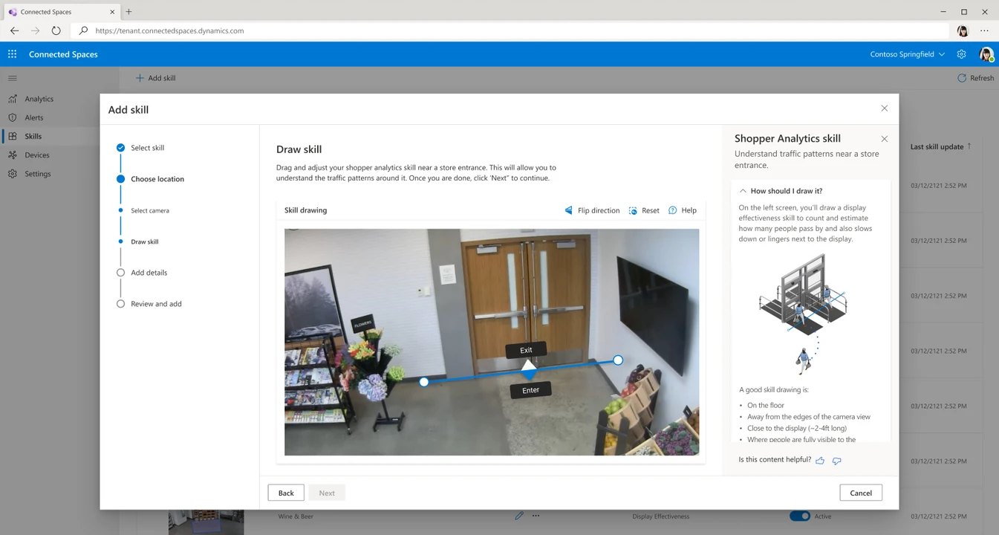
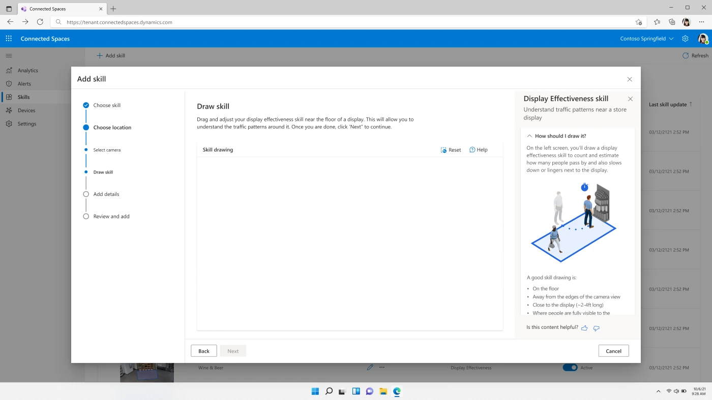
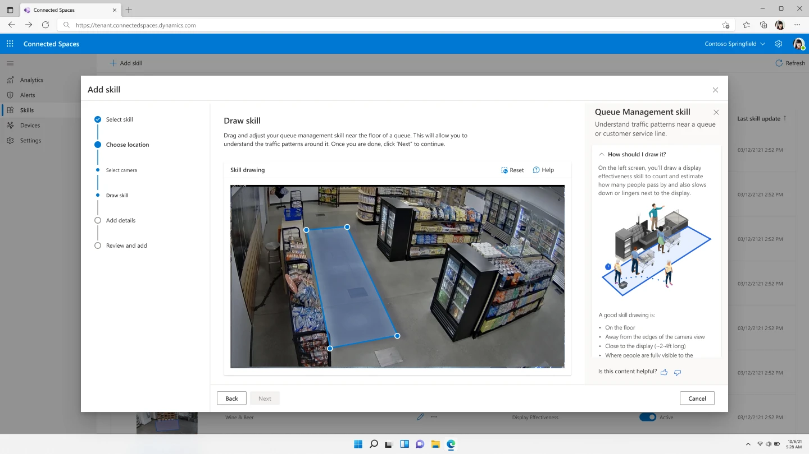
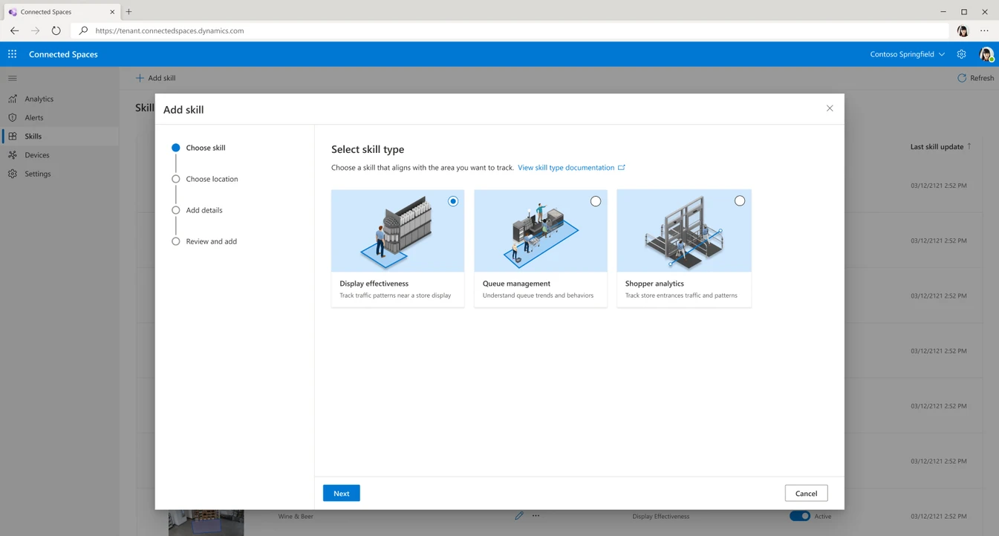
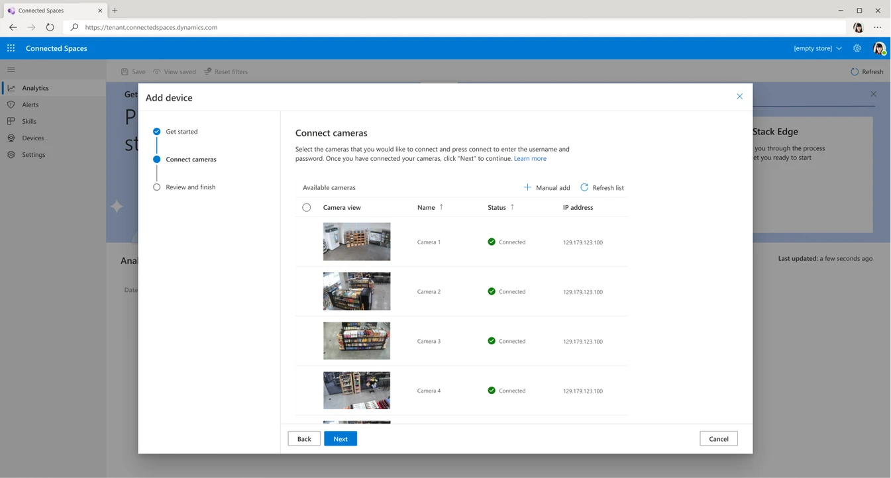
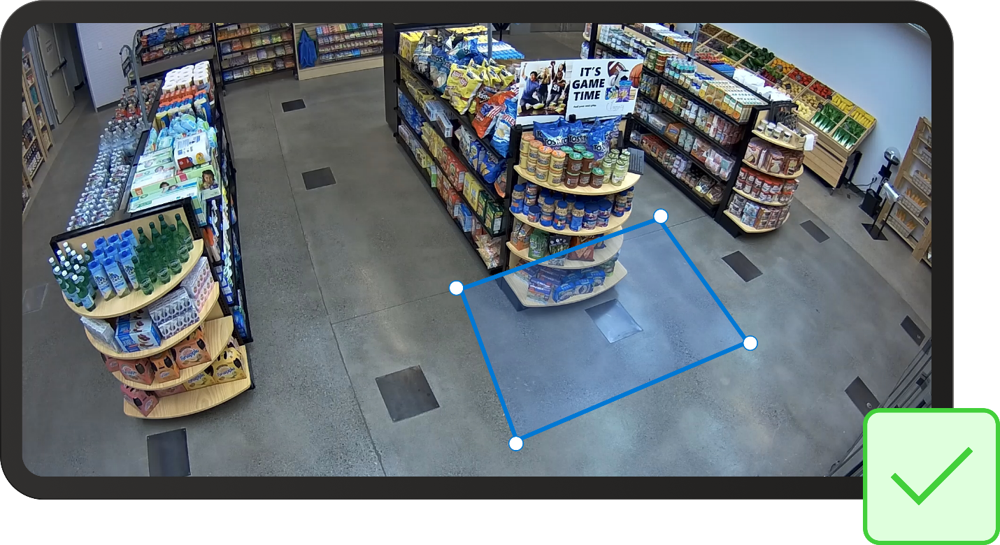
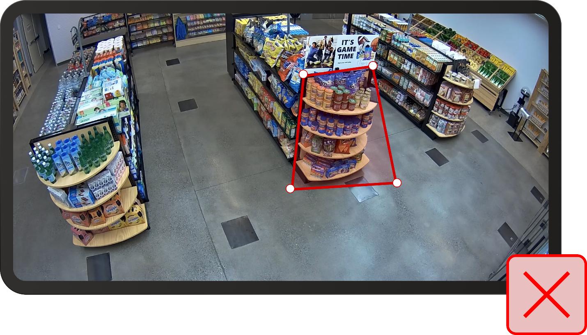
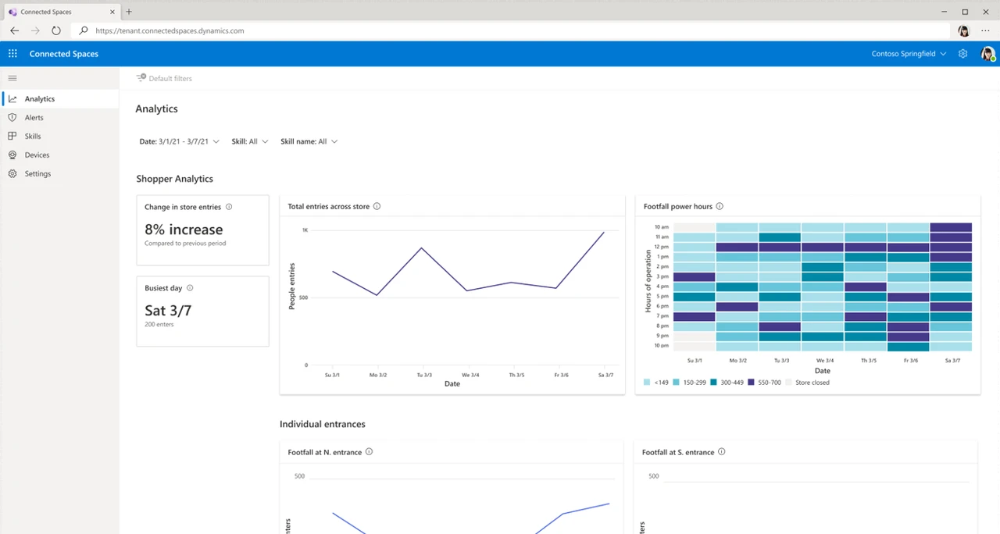
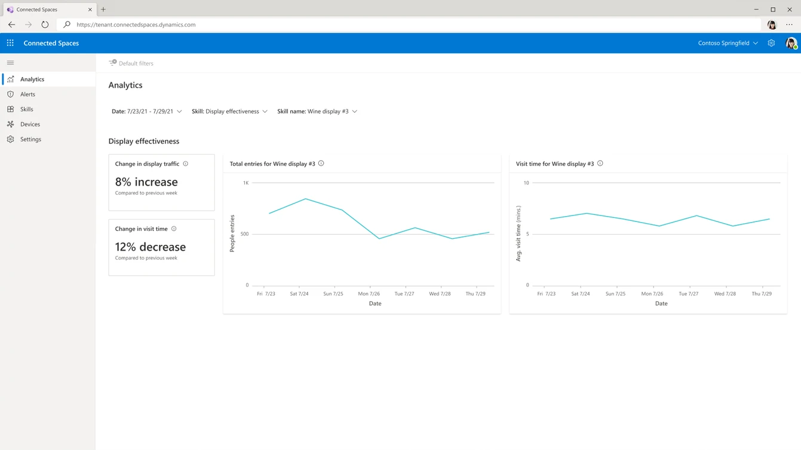
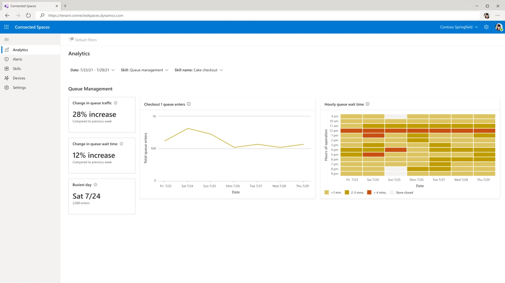

Understanding customer behavior and traffic patterns helps retail stores plan better and serve those customers better. As part of Microsoft Cloud for Retail, Dynamics 365 Connected Spaces Preview offers prebuilt skills to generate actionable insights from this information.

At the core of this solution is [Responsible AI](https://www.microsoft.com/ai/responsible-ai?activetab=pivot1%3aprimaryr6&azure-portal=true). These scenarios are powered by computer vision technology for people-counting and dwell time measurement without individual shoppers being identified or having their facial characteristics analyzed.

- **Shopper analytics** - Use cameras that are pointed at entry and exit locations, receive counts and trends for traffic in the store, and observe how shoppers change by the hour and by day. You can also identify the busiest day of the week and use it to plan shifts.

   > [!div class="mx-imgBorder"]
   > 

- **Display effectiveness** - Measure the effectiveness of displays (end caps in your store) to gain an understanding of how many people walked past the display and how many have actively engaged with it. Use this data to do A/B testing to determine the best locations to put your promotional content or to understand how the display is doing.

   > [!div class="mx-imgBorder"]
   > 

- **Queue management** - Measure the customer wait time that's experienced in queues, use the data to plan to open more queues, and achieve a better understanding of business that is lost due to queue abandonment.

   > [!div class="mx-imgBorder"]
   > 

## Get started

Dynamics 365 Connected Spaces works with the cameras that you're already using and avoids the added expense of new hardware. With a simple setup experience, you can add existing hardware and unlock new data with a turnkey software as a service (SaaS) application. Following deployment, you can turn on AI-powered models, known as skills, to help understand specific scenarios, such as customer behavior at a promotional display, traffic patterns, and insights that are unique to your space.

Essentially, setup involves the following steps:

1. Set up the account.

1. Set up your store and your gateway.

1. Add skills.

1. Add devices.

> [!div class="mx-imgBorder"]
> 

> [!div class="mx-imgBorder"]
> 

You can set up skills for each camera view. Depending on the selected skill, good and bad options will exist for setup. For example, when you're drawing the area for an end cap, make sure that the foot pattern extends at least three feet (or one meter) from the display. This approach will help you properly evaluate the traffic for more accurate insights. Because you're trying to gather information about the traffic patterns, you need to focus on the areas of traffic.

The following image shows an example of a good drawing.

The following image shows an example of a bad drawing.

To review several more examples of good and bad setup options for each skill, see [Add skills to collect data in Dynamics 365 Connected Spaces Preview](/dynamics365/connected-spaces/cameras-add-skills/?azure-portal=true).

## Analytics

After you have set up the account, you can view quick results from the collected data. With this intelligence, employees and other stakeholders can review and act on the information.

In the **Analytics** section, you can evaluate shopper traffic and recognize patterns for better staffing.

> [!div class="mx-imgBorder"]
> 

The **Analytics** section also shows the effectiveness of your end cap displays.

> [!div class="mx-imgBorder"]
> 

Additionally, you can measure customer wait time in queues and open more cash registers, as needed, for better efficiency.

> [!div class="mx-imgBorder"]
> 

## Act on insights

Dynamics 365 Connected Spaces Preview comes with built-in alerts for each scenario, enabling managers and employees to respond to important interactions with ease. Triggered by real-time activity, it sends alerts to Microsoft Outlook or Microsoft Teams when it meets a threshold, such as maximum wait time, maximum store occupancy, maximum display dwell time, and more.

The data from Dynamics 365 Connected Spaces Preview is stored in Microsoft Dataverse, part of Microsoft Power Platform. With Microsoft Power Platform, you can further enable your frontline workers with apps from Microsoft Power Apps that they carry in their pocket on mobile devices. With these apps, floor managers can reassign staff in real time to address a higher traffic point, and frontline workers can receive push notifications of this staffing change. You can also create automation with Microsoft Power Automate by using the data.

When used as part of Microsoft Cloud for Retail, Dynamics 365 Connected Spaces Preview brings physical location insights as part of a holistic retail solution.
