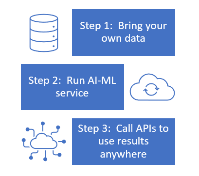

A key goal of Microsoft Cloud for Retail is to elevate the shopping experience. By using the Intelligent Recommendations feature, you can enable real-time personalization. As shoppers navigate your site or app, Intelligent Recommendations will automate the offering of targeted products. Intelligent Recommendations provides businesses with a toolkit of relevant scenarios, such as new, popular, trending, frequently bought together, people also like, picks for you, shop similar looks, and shop similar by description.

**New** - Returns a list of the newest products that have been recently added to channels and catalogs. You can highlight a specific subset of products by using various time-based or time plus popularity-based metrics to display new or trending items.

**Popular** - Returns a list of products that are ranked by the highest number of sales. You can tailor a Popular chart to focus on basic consumption, overall popularity, or revenue. Intelligent Recommendations supports metrics such as sales figures, usage counts, game play counts, time spent with content, and more.

**Trending** - Returns a list of the highest performing products for a given period, ranked by highest number of sales. Trending lists in Intelligent Recommendations enable people to browse a content catalog by using algorithmic charts that are sorted by information such as total sales, sum of clicks, release date, or a combination of different metrics. You can further scope these trending lists to specific time windows and aggregations to display the most popular or best-selling products to users.

**Frequently bought together** - Returns a list of products that are commonly purchased together (complementary) with the contents of the consumer's current cart. **Frequently bought together** is an up-sell scenario based on items that are already placed in the shopping cart. This scenario is often called a "candy rack experience." This scenario learns from other, previously purchased (completed) baskets, and returns complementary products based on what's currently in a user's cart. This scenario can be different from item-to-item relationships because it can analyze the entire basket as an entity with meaning.

**People also like** - Returns products for a given seed product based on consumer purchase patterns. You can change this setting based on consumer actions (purchase, views). One of the most effective recommendation channels is the **People also like** (or buy) list, which is most commonly found on a product details page. **People also like** is based on explicit signals (transactional, recently viewed) and creates a strong relationship between items by using information about other users' consumption.

**Picks for you** - Returns a personalized list of products based on purchase patterns of the signed-in user. For an anonymous guest user, this list will be collapsed. The **User picks** scenario is a style of personalized recommendations that focuses on capturing the user's tastes, or preferences, and then positions a user in unique locations in the item space. This scenario creates highly personalized recommendations in the context of a large catalog of items. The distance between a user and a particular item decides its strength of relationship. Vectors that are closer together represent a stronger connection.

**Shop similar looks** - Returns a list of products with visually similar images. For some items, visual similarity might supply an added point of view rather than a collaborative filtering solution. For example, consider a scenario where a consumer is looking for a similar floral shirt pattern as one that they've seen in the store. With the **Shop similar looks** scenario, Intelligent Recommendations can use content images to detect products with similar visual attributes that deliver a different item-to-item experience to the user.

**Shop similar by description** - Returns a list of products with textually similar content descriptions. Occasionally, content images can appear similar (such as a bottle of wine), so comparison by visual similarity isn't applicable. When a rich, textual description of a product has been provided, a textual similarity can be generated. In this case, Intelligent Recommendations can train a neural network to understand the written text that is used for item descriptions. For these customers, the models will supply relevant recommendations by understanding and interpreting text as an alternative similarity space.

## Get started

Intelligent Recommendations is an extensible, scalable, and headless Microsoft Azure service that's simple to introduce and start using with zero-code integration. Essentially, you'll need to bring your data, run the AI-ML service against your data, and then call APIs to use your data anywhere.

### Bring your own data

Intelligent Recommendations doesn't have a prerequisite license. You can connect it to your company's data lake storage account. Intelligent Recommendations doesn't store or process customer data outside the region that you deploy the service instance in.

Your data might include a catalog or user interactions, for example. Your catalog might contain general information about items, content, and other generic services that Intelligent Recommendations will recommend. User interactions could include interactions between users and items that Intelligent Recommendations models learn from and use to predict future interactions. Examples of user interactions include click streams, purchases, downloads, likes, and views.

### Run the AI-ML service

After data has been structured and shared, and after the Intelligent Recommendations service instance has been initiated, the process begins. Data is processed and modeled according to business needs and scenarios. You can monitor progress by examining the output logs to make sure that everything runs smoothly.

With an extensible architecture, businesses have the power to introduce more business logic and manage multiple instances of recommendation models. These multiple instances are useful for experimentation or for creating use cases with different signals.

### Call APIs to use the results anywhere

The solution integrates well on omnichannel platforms by using a simple recommendations API to create extensible, customizable experiences.

This solution provides real-time filtering, refreshed ordering of item results, and personalization of any list.

In addition to using Intelligent Recommendations, you can add real-time personalization by using Microsoft Azure Cognitive Search and Dynamics 365 Marketing to complement the recommendations as you personalize the shopping journey for a consumer across all touch points and engagements.

For more information, see [Quick start guide: Set up and run Intelligent Recommendations with sample data](/industry/retail/intelligent-recommendations/quickstart/?azure-portal=true).
