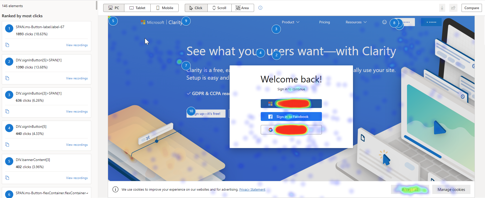
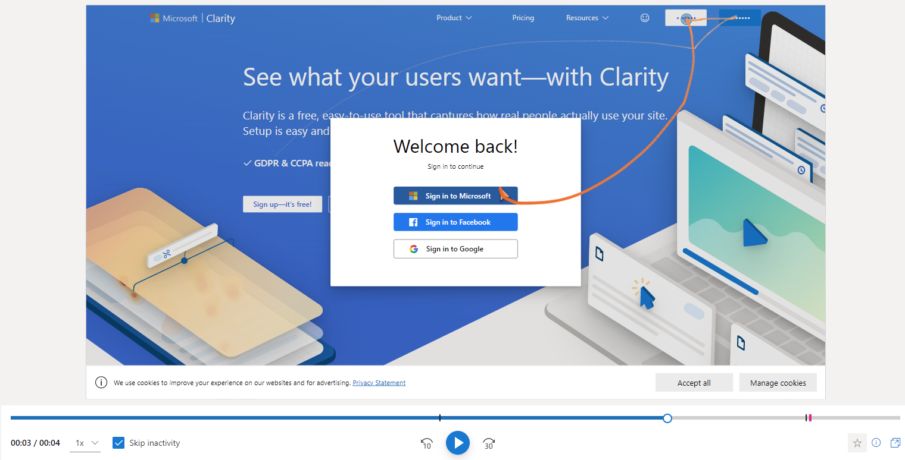
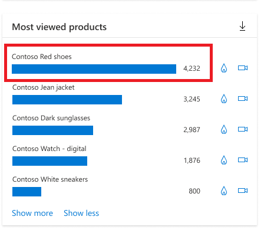

Microsoft Clarity is a free behavioral analysis tool that helps you understand how users interact with your retail site. With this information, you can make informed decisions about changes to your website to better serve your clients. Clarity supports almost any site in any modern browser by using a provided code snippet. For more information, see [Set up Clarity manually](/clarity/clarity-setup/?azure-portal=true).

The following unique features of Clarity can help you understand user behavior:

- Ability to observe how users interact with your site with session recordings.

- Heatmaps allow evaluation of user engagement.

- Simple customization makes Clarity a best choice for your site.

- Clarity won't impede your site's performance.

- Data is analyzed and ready to view in near real time so that you don't have to wait.

- No limits on the number of sites for each account. Clarity can scale to support even the largest websites.

- Clarity processes more than 1 petabyte of data from over 100 million users each month. Also, no traffic limits are placed on these sites.

- Deep AI and machine learning algorithms power insights to help you analyze user behavior efficiently.

Clarity provides heatmaps, session recordings, and machine learning insights based on the user behavior of your defined projects.

## Heatmaps

Each website has elements to encourage engagement with visitors. The heatmap shows you where site visitors are actually spending their clicks and, sometimes, it's not the path that you might have expected. Clarity tracks all visitor clicks and scrolls on mobile, desktop, and tablet, and it automatically generates a heatmap. This data helps you identify the most engaged areas and figure out gaps. For example, you can identify if users aren't scrolling down to view valuable information on pages.

> [!div class="mx-imgBorder"]
> 

## Session recordings

Session recordings give a masked view of the user's exact experience. You can view the order in which the user navigated or completed tasks. Recordings allow you to analyze user behavior throughout a session. You can replay user actions to understand their perspective, traffic source, session timing, and so on. You can group user sessions through filters and segments.

> [!div class="mx-imgBorder"]
> 

## Machine learning insights

Clarity Insights are machine learning based filters and recommendations on what content should be most important for you. The dashboard is helpful for designers, product managers, marketers, and web developers. Through the dashboard, you can understand the users without analyzing the ocean of data from user interactions. The dashboard shares important demographic information about site visitors. You can learn more about the location of your users, how long they spend on your site, and if they're efficiently navigating your site.

> [!div class="mx-imgBorder"]
> 

## Product information filters

Product information filters are useful for retail sites because they allow you to filter data from product sessions that matched with the corresponding criteria. This data includes criteria about product name, price, brand, availability, average rating, and number of ratings.

For more information, see [E-Commerce Insights Products](/clarity/e-commerce-insights/?azure-portal=true#products).

Now that you've learned some basics, watch the following video for a demonstration of Clarity in action.

> [!VIDEO https://www.microsoft.com/videoplayer/embed/RWVmnA]

## Manage Clarity projects

Clarity allows you to have as many projects as you need, and you can manage them from a central location. After you've created a project, you're the Administrator and only administrators can modify project settings. After you've selected the project that you want to work on, you'll be able to manage settings such as name and category, the team, setup, masking, and IP blocking.

To support team collaboration, you can invite other users to be members of the project. The following image shows how you can manage the project's team members.

:::image type="content" source="../media/team.png" alt-text="Screenshot of the Microsoft Clarity Team page showing the Add team member button.":::

### Review information for setup

On the project setup, you can get the code snippet that needs to be on your site. Additionally, you can set up Google Analytics integration and use of cookies. Integrating your Clarity project with Google Analytics allows Clarity to link session playbacks with your Google Analytics dashboard. After you've identified the sessions that you need more information on, go to Google Analytics Dashboard to debug and understand user pain points.

:::image type="content" source="../media/setup.png" alt-text="Screenshot of Setup with Advanced settings expanded to show Cookies, and How to install Clarity expanded to show Install tracking code manually.":::

### Review and edit masking options

Clarity masks all sensitive content on your website by default. The sensitive content includes all input box content, numbers, and email addresses. Clarity doesn't capture masked content. You can modify the configuration to choose what Clarity will track by either masking or unmasking it.

:::image type="content" source="../media/masking.png" alt-text="Screenshot of Masking options Masking mode and Mask by element.":::
