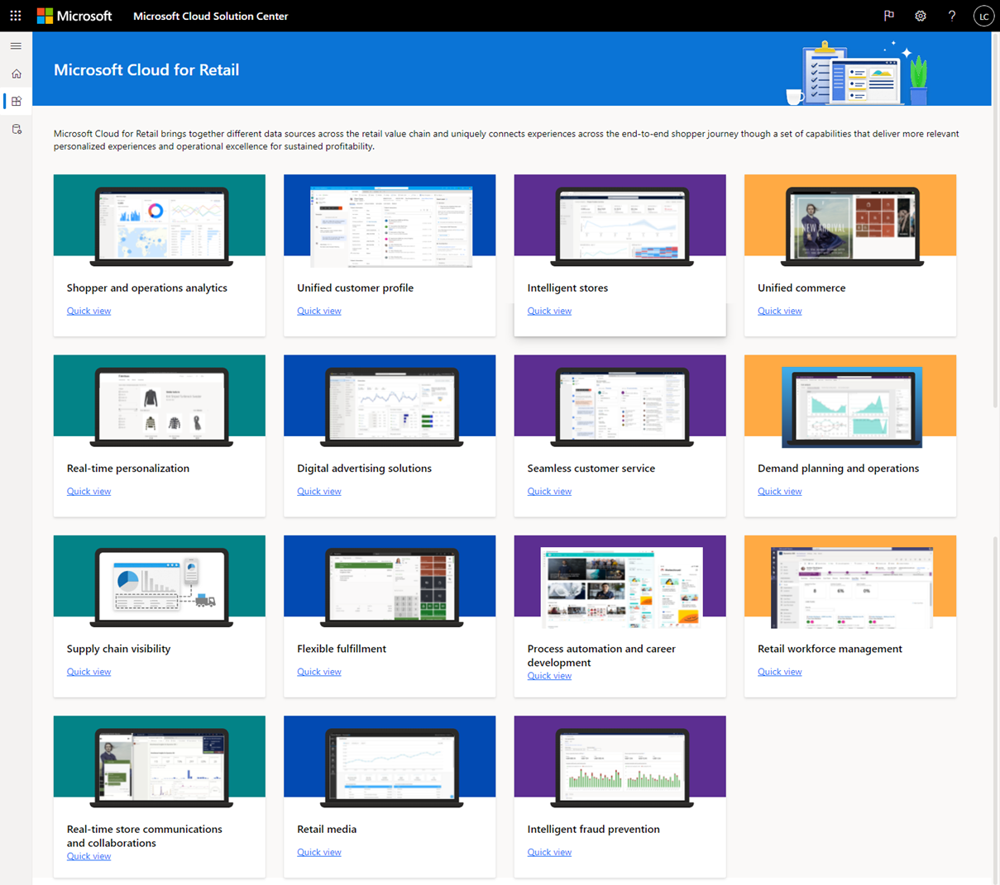
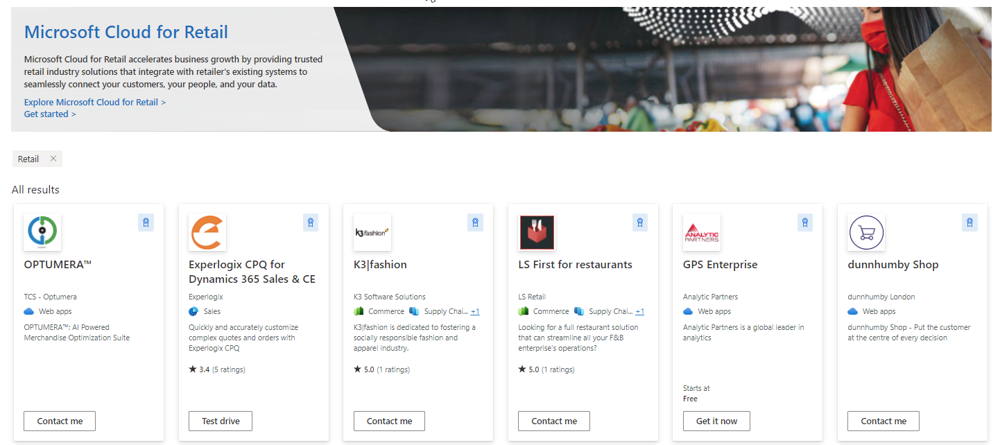

With Microsoft Cloud for Retail, you can elevate the shopping experience, empower your store associates, maximize the value of your data, and build a real-time sustainable supply chain.

To deploy the solutions from Microsoft Cloud for Retail, you'll start at the Microsoft Cloud Solution Center. You must be licensed and have administrator privileges to complete the deployment process. For more information on the deployment process and post-deployment considerations, see [Set up and configure Microsoft Cloud for Retail](/industry/retail/configure-cloud-for-retail/?azure-portal=true). You can purchase Microsoft Cloud for Retail as part of an Enterprise Agreement. Contact your account executive to buy Microsoft Cloud for Retail.

> [!div class="mx-imgBorder"]
> 

For more information about Microsoft Cloud for Retail pricing, see the [pricing data sheet](https://go.microsoft.com/fwlink/?linkid=2185750) that's available on the marketing site.

Microsoft's ecosystem of trusted retail partners enriches this cloud offering. They add and extend capabilities, which increases customer value. This cooperation between Microsoft and the partner ecosystem empowers customers to cater to their own unique needs. Go to the Microsoft commercial marketplace [Industry Gallery](https://appsource.microsoft.com/marketplace/cloudsIndustry?page=1&industry=retail-and-consumer-goods&azure-portal=true) to explore partner solutions that are offered for the retail cloud.

> [!div class="mx-imgBorder"]
> 

Microsoft Cloud for Retail includes several solutions and components that you can deploy and set up, depending on which capabilities you want to adopt. Each solution that is powered by Dynamics 365 has dependencies on other Dynamics 365 apps and solutions that might require more licenses.
