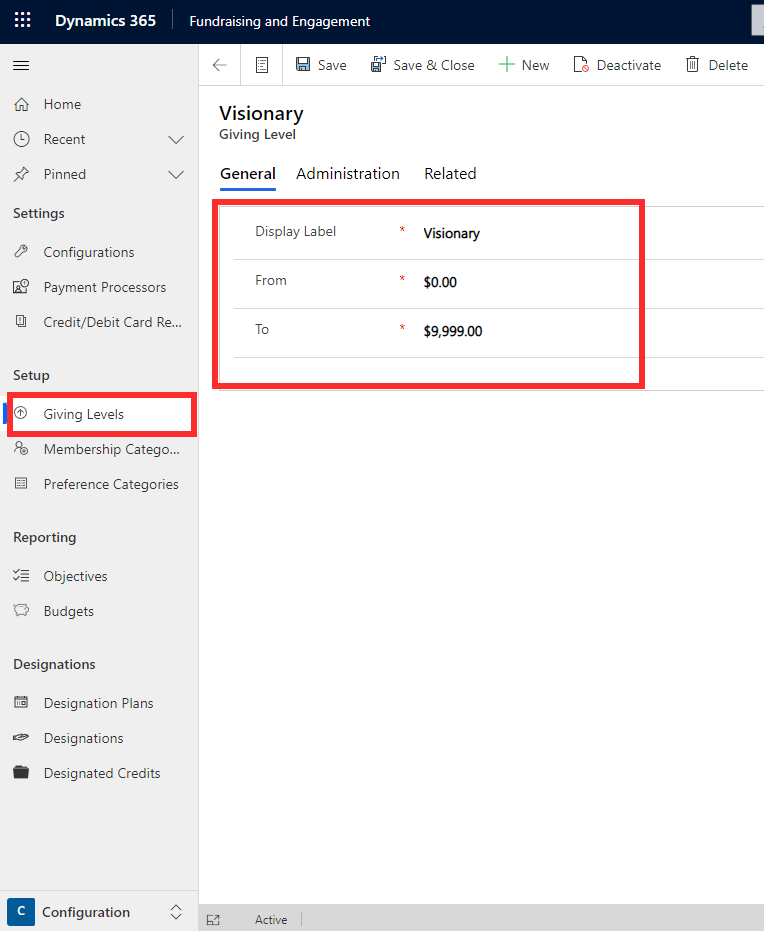
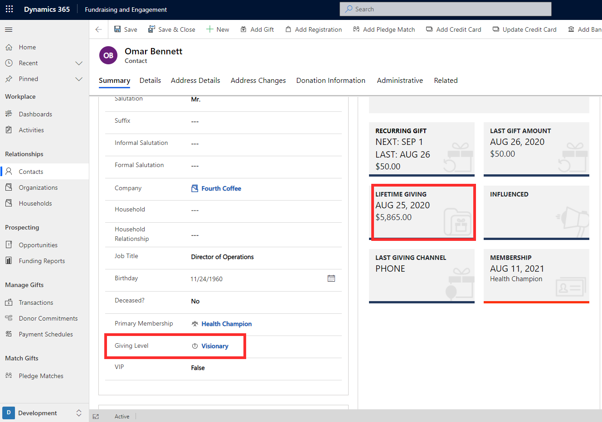

Giving levels in Fundraising and Engagement help you categorize and segment constituents based on the total donations received. Giving level ranges are set up in the Configuration area of Fundraising and Engagement and are then automatically applied to a contact or organization based on their total giving.

The screenshot below shows an example of a giving level that has been created, Visionary. When you set up your giving levels, you provide each with a name and a giving range value.

> [!div class="mx-imgBorder"]
> 

The amount set up as the range for the giving level should not overlap with other levels. For example, a nonprofit may set up the following giving levels and ranges for their constituents:

- Visionary, with a range of \$0 to \$9,999 total donations

- Supporter, with a range of \$10,000 to \$19,999 total donations

- World Changer Society, with a range of \$20,000 to \$50,000 total donations

Based on the specified ranges, the giving level for a constituent will automatically update on their record. As shown in the example below, the contact Omar Bennett has a lifetime giving of \$5,865. Thus, he falls within the giving level of Visionary. The giving level does not update immediately. Once the lifetime giving of a constituent changes, a background process is triggered to run and the giving level will update after a short amount of time. Giving level for a constituent can also be changed manually via the giving level lookup column on their record.

> [!div class="mx-imgBorder"]
> 
