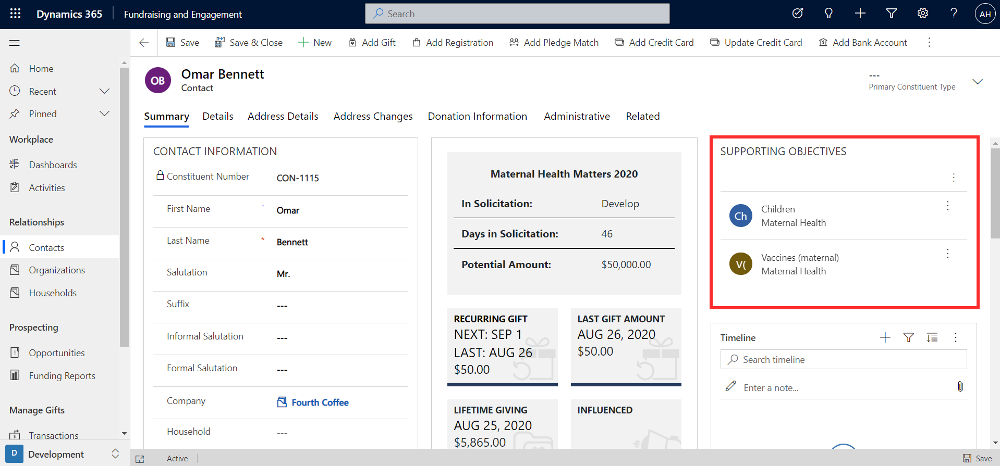
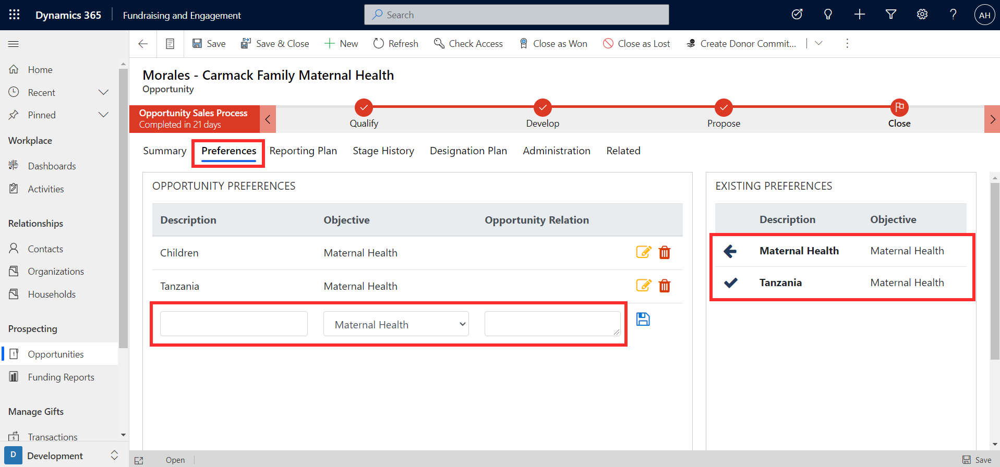
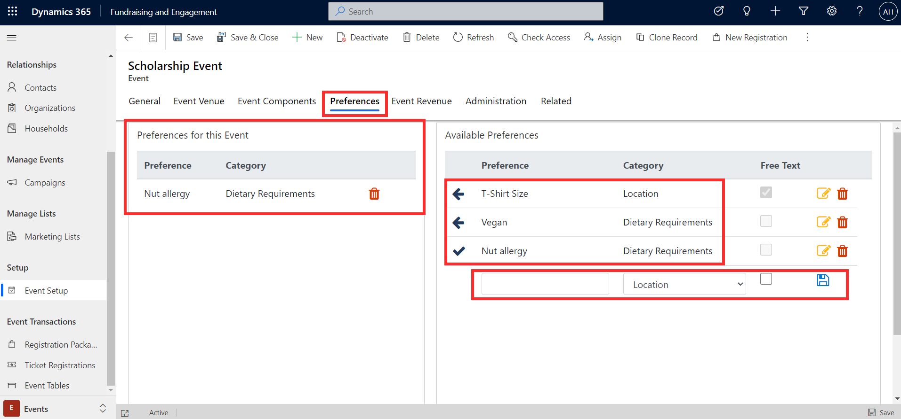
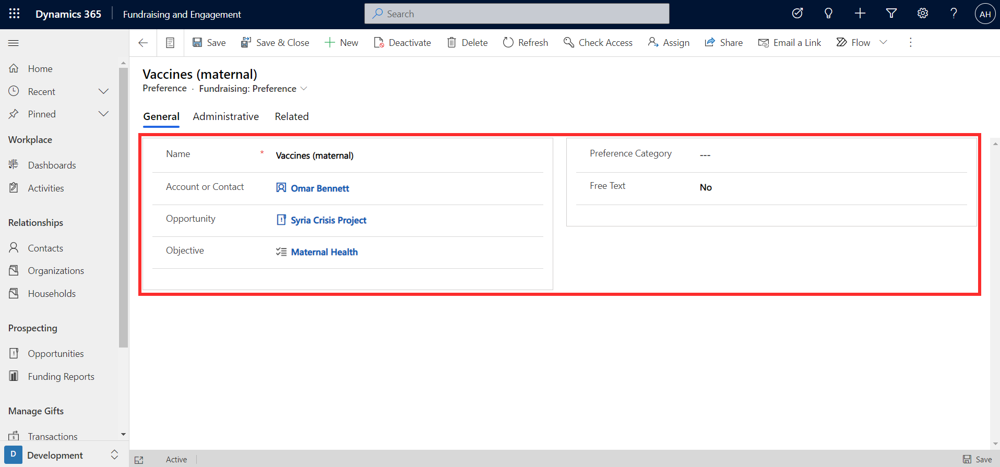
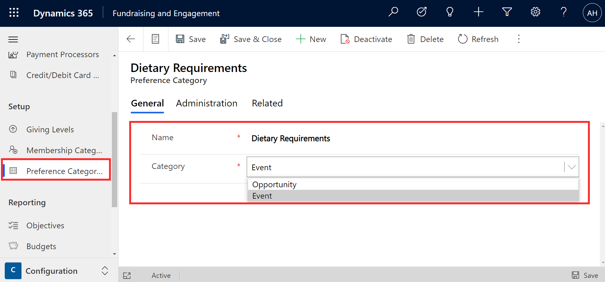

Preferences in Fundraising and Engagement can be used to track specific characteristics of a constituent or opportunity. They can be associated with an organization, contact, opportunity, or event. Tracking of preferences is key to providing a personalized experience, delivering tailored asks, and segmenting. Some examples of preferences include:

- Personal interests

- Additional affiliations that are beyond the primary constituent type (for example, being a board member)

- Additional communication or outreach preferences (e.g. newsletters on a particular subject)

For a constituent, preferences can be accessed and added from the Supporting Objectives section of their profile for either contacts or organizations.

> [!div class="mx-imgBorder"]
> 

When creating an opportunity, preferences can be added from the Preferences tab of the opportunity record. Existing preferences of the potential donor will be listed and can be added to the opportunity. New preferences can also be added.

> [!div class="mx-imgBorder"]
> 

Preferences can be linked to an event via the Preferences tab on an event record. Existing preferences will be listed, and you can select the ones you wish to add to the event. New preferences can be created by providing a name and preference category.

> [!div class="mx-imgBorder"]
> 

When a preference is created, it exists as a record linked to an account or contact and may also be linked to an opportunity or objective. The preference can also belong to a particular **preference category**. You can specify whether the preference is free text. If free text is enabled, the preference will be accompanied by a free text box to add details. This is useful for a preference like dietary requirements, where you want to add details that are different each time.

> [!div class="mx-imgBorder"]
> 

Preference categories used across Fundraising and Engagement are set up from the Configuration module. Preference category is set up with a name and a selection of whether the preference is to be used with opportunities or events.

> [!div class="mx-imgBorder"]
> 
