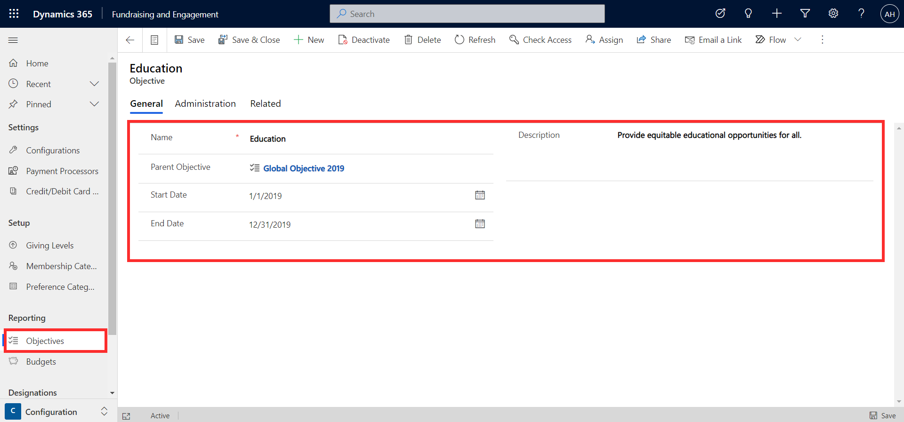
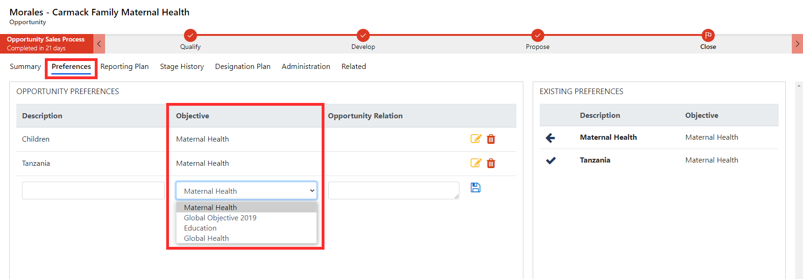
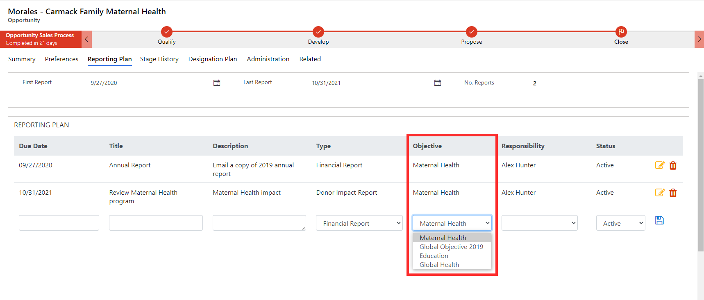
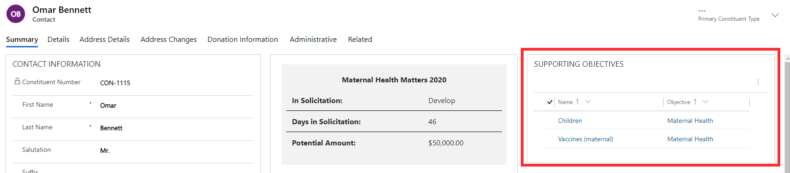

Objectives in Fundraising and Engagement are used to track your organization's priorities, strategies, and goals. Objectives are set up in the Configuration area of the system and can then be linked to other areas such as constituent preferences and opportunities. They allow your organization to track bigger picture strategic objectives throughout the application.

It's important to note that the objectives fields in Fundraising and Engagement are key fields in the Nonprofit Common Data Model. Your organization will need to configure these fields intentionally as this data is used in other Microsoft Cloud for Nonprofit solutions like Volunteer Management, Volunteer Engagement, and the Program impact dashboard.

The screenshot below shows an example of an objective, Education, that has been set up for a nonprofit organization. Objectives can be part of a hierarchy. As shown below, the Education objective forms part of the nonprofit's Global Objectives for 2019, linked in the parent objective column. You can also provide a start and end date, and description for the objective.

> [!div class="mx-imgBorder"]
> 

On an opportunity, objectives can be tracked against the associated preferences and reporting plan.

> [!div class="mx-imgBorder"]
> 

> [!div class="mx-imgBorder"]
> 

The preferences of a constituent can also be linked to an objective. On a contact and organization record, these appear in the Supporting Objectives section. In the example below, both the Children and Vaccines (maternal) preferences associated with the contact Omar Bennett support the nonprofit's Maternal Health objective.

> [!div class="mx-imgBorder"]
> 
