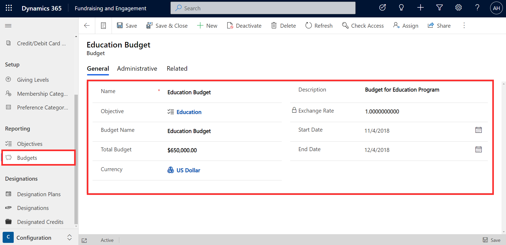
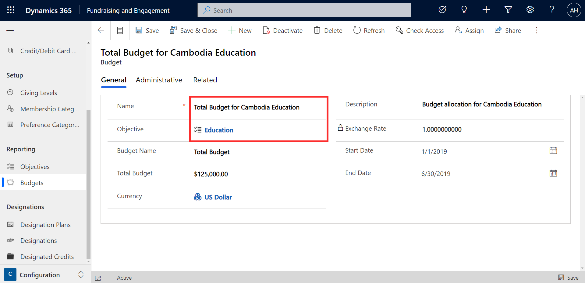

Budgets are where you can assign funds towards a particular objective.

The example below shows Education Budget, which has been created for the Education objective shown in the previous unit. You can specify the total budget amount, and optionally a description, start date, and end date.

> [!div class="mx-imgBorder"]
> 

Multiple budgets can be created for an objective. For example, there might be a different budget allocated to a particular country for the Education objective.

> [!div class="mx-imgBorder"]
> 
