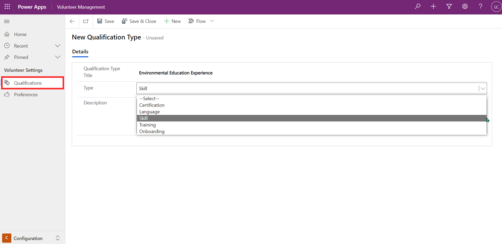

Qualifications are used in Volunteer Management to record skills, certifications, and training held by volunteers. Required qualifications can be specified on engagement opportunities and volunteers can set up their qualifications on their profile. This allows volunteers to find the opportunities that they are suitable for. Qualifications are also used for setting up onboarding templates.

Your organization can set up the types of qualifications used across the Volunteer Management app and the Volunteer Engagement portal from the Configuration area of Volunteer Management. From the Qualifications area in the left navigation menu, you can create a new qualification by providing a title, selecting the type, and entering a description.

> [!div class="mx-imgBorder"]
> 

The screenshot above shows the creation of a qualification called Environmental Education Experience. This qualification can now be added to engagement opportunities and volunteer records. Volunteers will be able to use the qualification as a filter when browsing engagement opportunities in the portal.
