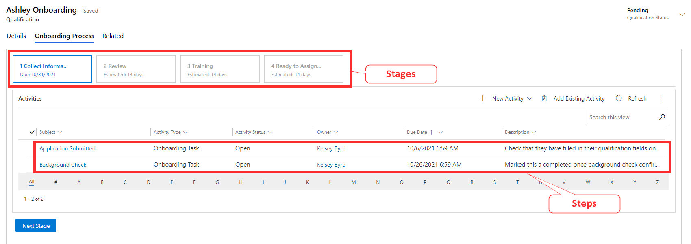
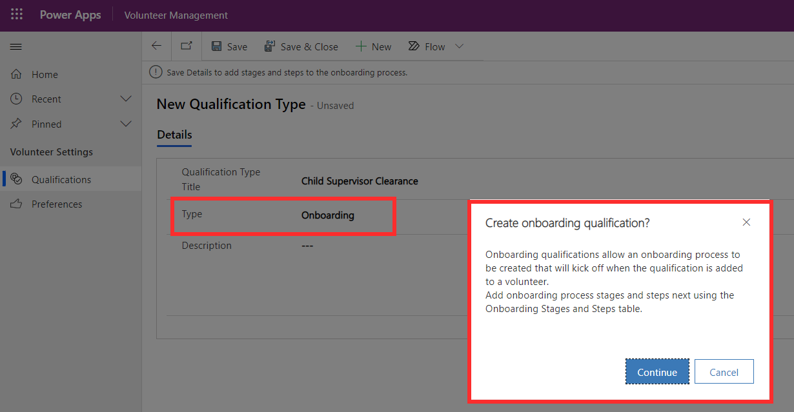
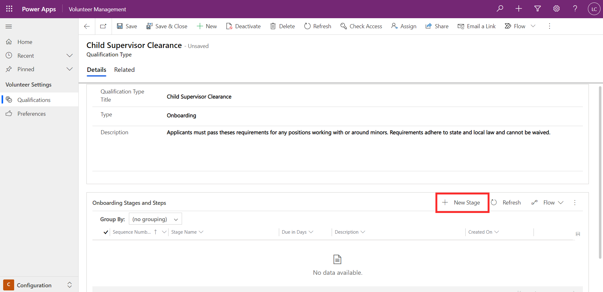
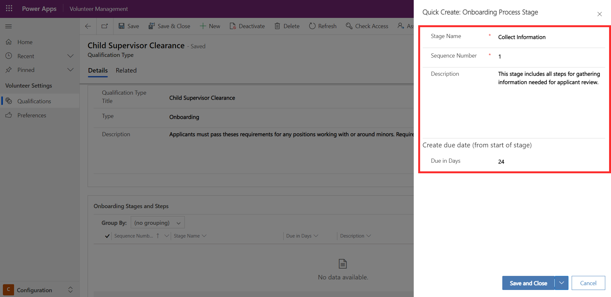
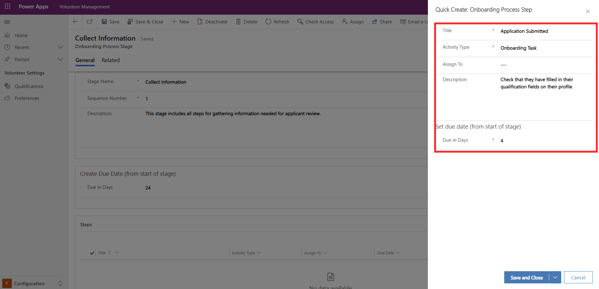
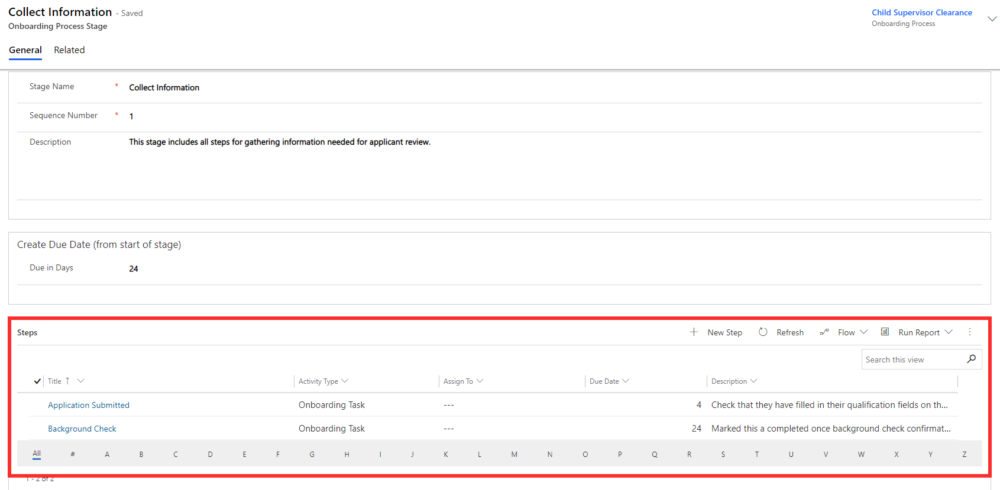
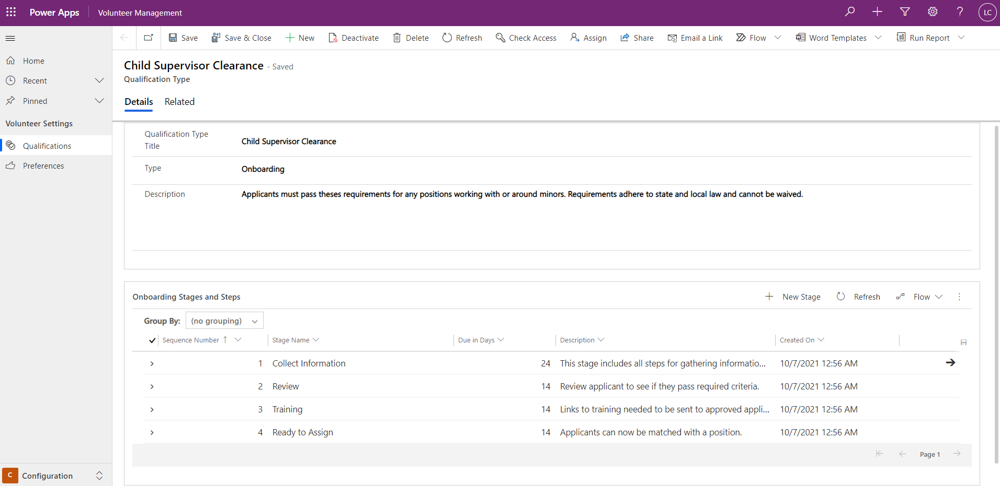
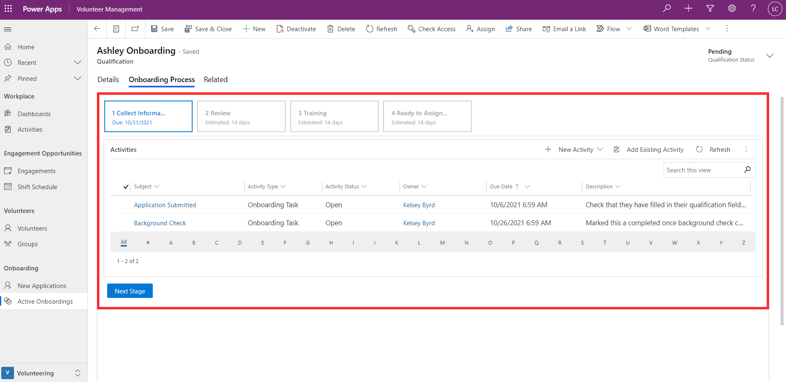

Onboarding is a special type of qualification in Volunteer Management. Onboarding templates can be configured and allow you to define the stages and steps necessary in onboarding new volunteers, while ensuring consistency and visibility across the process.

> [!div class="mx-imgBorder"]
> 

Onboarding templates can be set up when creating a qualification in the Configuration area of Volunteer Management. On the qualification type form, **onboarding** should be specified as the type. This will prompt you to create the onboarding process.

> [!div class="mx-imgBorder"]
> 

In the Onboarding Stages and Steps section, **+New Stage** will allow you to create the stages in the process.

> [!div class="mx-imgBorder"]
> 

Here, you can provide a name for the stage, sequence number of the stage, description, and relative due date.

> [!div class="mx-imgBorder"]
> 

This will create an onboarding process stage record. Within the record, you can specify the activities, or steps, that need to be completed. You can provide a name for the step, a description, and relative due date. Activity type can be either a task, phone call, or appointment.

> [!div class="mx-imgBorder"]
> 

Each stage can contain multiple activities.

> [!div class="mx-imgBorder"]
> 

The screenshot below shows the configuration of the qualification, Child Supervisor Clearance, which has been set up with an onboarding template.

> [!div class="mx-imgBorder"]
> 

When adding Child Supervisor Clearance as a qualification to a volunteer, you will be guided through the stages. Each stage will have the set of activities that need to be completed before progressing to the next stage of the process.

> [!div class="mx-imgBorder"]
> 
