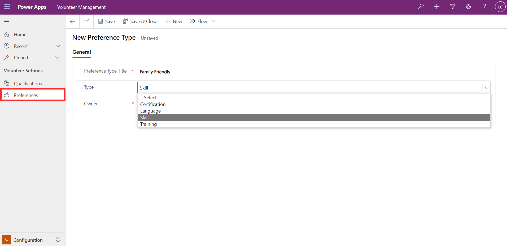

Preferences can be recorded against volunteer engagement opportunities and volunteers to indicate areas of interest or preference. It assists in finding and matching the right volunteers for an engagement.

You can set up the preference used across the Volunteer Management app and the Volunteer Engagement portal from the Configuration area of Volunteer Management. From the Preferences area in the left navigation menu, you can create a new preference type by providing a title and selecting the type.

> [!div class="mx-imgBorder"]
> 
