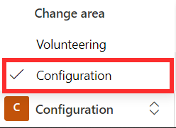
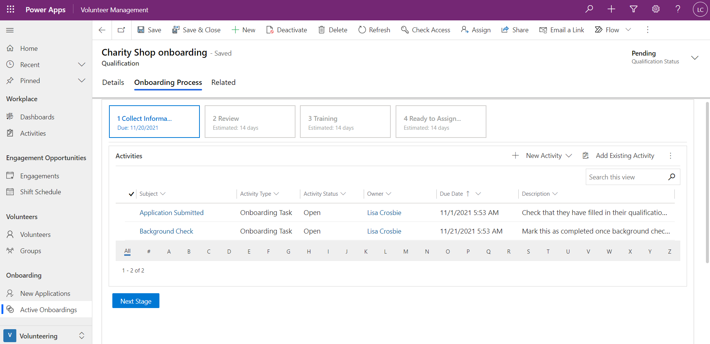

This exercise will take you through the steps of setting up an onboarding template. You will create a new onboarding qualification, set up stages for the onboarding process, and add in activities for each stage.

## Learning objectives

At the end of this exercise, you will be able to accomplish the following:

1. Create a new qualification with an onboarding template

1. Add stages to an onboarding template

1. Add steps to an onboarding stage

## Sample data

Before you begin, to achieve the maximum effect for this lab and the other labs, it is recommended that you have deployed Volunteer Management with the sample data.

## Create a new qualification

1. In Volunteer Management, select the Configuration area from the bottom of the screen.

    > [!div class="mx-imgBorder"]
    > 

1. Click on **Qualifications** from the left navigation menu.

1. Click on **+New** to add a new qualification type.

1. Enter the following information to in the new qualification type form:

    - **Qualification Type Title:** Charity Shop onboarding
    - **Type:** Onboarding

1. When prompted to create an onboarding qualification, click **Continue**.

1. **Save** the qualification.

1. A section for Onboarding Stages and Steps will appear on the qualification type record.

## Add stages to an onboarding template

1. Within the Charity Shop onboarding qualification type, click **+New Stage** found in the Onboarding Stages and Steps section.

1. Enter the following information in the onboarding process stage form:

    - **Stage Name:** Collect Information
    - **Sequence Number:** 1
    - **Description:** This stage includes all steps for gathering information needed for applicant review.
    - **Due in Days:** 24

1. **Save and Close** the onboarding process stage form.

1. The first stage of the onboarding process will now appear in the Charity Shop onboarding qualification type. You will next add three more stages for the process.

1. Click **+New Stage.**

1. Enter the following information in the onboarding process stage form:

    - **Stage Name:** Review
    - **Sequence Number:** 2
    - **Description:** Review applicant to see if they pass required criteria.
    - **Due in Days:** 14

1. **Save and Close** the onboarding process stage form.

1. Click **+New Stage.**

1. Enter the following information in the onboarding process stage form:

    - **Stage Name:** Training
    - **Sequence Number:** 3
    - **Description:** Links to training needed to be sent to approved applicants and completion verified.
    - **Due in Days:** 14

1. **Save and Close** the onboarding process stage form.

1. Click **+New Stage.**

1. Enter the following information in the onboarding process stage form:

    - **Stage Name:** Ready to Assign
    - **Sequence Number:** 4
    - **Description:** Applicants can now be matched with a position.
    - **Due in Days:** 14

1. **Save and Close** the onboarding process stage form.

1. You should now have four stages appear in the Charity Shop onboarding qualification.

> [!div class="mx-imgBorder"]
> 

## Add steps to an onboarding template

1. From the Charity Shop onboarding qualification, click to open the first onboarding stage, **Collect Information**.

1. Click on **+New Step** found in the Steps section of the onboarding process stage.

1. Enter the following information in the onboarding process step form:

    - **Title:** Application Submitted
    - **Activity Type:** Onboarding Task
    - **Description:** Check that they have filled in their qualification fields on their profile
    - **Due in Days:** 4

1. **Save and Close** the onboarding process step form.

1. The step will now appear in the Collect Information onboarding process stage.

1. Click on **+New Step**.

1. Enter the following information in the onboarding process step form:

    - **Title:** Background Check
    - **Activity Type:** Onboarding Task
    - **Description:** Mark this as completed once background check confirmation has been received and applicant has passed
    - **Due in Days:** 24

1. **Save and Close** the onboarding process step form. The Collect Information stage now contains two steps.

1. **Save and Close** the onboarding process stage to return to the Charity Shop onboarding qualification.

1. Click to open the second onboarding stage, **Review**.

1. Click on **+New Step**.

1. Enter the following information in the onboarding process step form:

    - **Title:** Schedule Interview
    - **Activity Type:** Onboarding Task
    - **Description:** Schedule interview with volunteer
    - **Due in Days:** 21

1. **Save and Close** the onboarding process step form.

1. The step will now appear in the Review onboarding process stage. **Save and Close** the onboarding process stage to return to the Charity Shop onboarding qualification.

1. Click to open the third onboarding stage, **Training**.

1. Click on **+New Step**.

1. Enter the following information in the onboarding process step form:

    - **Title:** Provide Training
    - **Activity Type:** Onboarding Task
    - **Description:** Provide training links to volunteer
    - **Due in Days:** 4

1. **Save and Close** the onboarding process step form.

1. The step will now appear in the Training onboarding process stage. **Save and Close** the onboarding process stage to return to the Charity Shop onboarding qualification.

1. Click to open the fourth onboarding stage, **Ready to Assign**.

1. Click on **+New Step**.

1. Enter the following information in the onboarding process step form:

    - **Title:** Assign Volunteer
    - **Activity Type:** Onboarding Task
    - **Description:** Assign volunteer to opportunity
    - **Due in Days:** 14

1. **Save and Close** the onboarding process step form.

1. The step will now appear in the Ready to Assign onboarding process stage. **Save and Close** the onboarding process stage to return to the Charity Shop onboarding qualification.

1. Save & Close the Charity Shop onboarding qualification.

## Use the onboarding template

1. To use the onboarding template you have created, switch to the **Volunteering** area from the bottom of the screen in Volunteer Management.

1. Click on **Volunteers** from the left navigation menu and open the record for a volunteer.

1. Go to the **Qualifications & Preferences** tab of the volunteer's record.

1. Click **+New Qualification**.

1. Enter the following details in the qualification form:

    - **Qualification Title:** Charity Shop onboarding
    - **Type:** Charity Shop onboarding

1. When prompted, click **Start Onboarding**.

1. **Save and Close** the qualification form. Click **Cancel** to return to the volunteer's record.

1. From the volunteer's list of qualifications, click to open **Charity Shop onboarding**.

1. You will see the template you created appear in the **Onboarding Process** tab of the qualification record.

> [!div class="mx-imgBorder"]
> 
