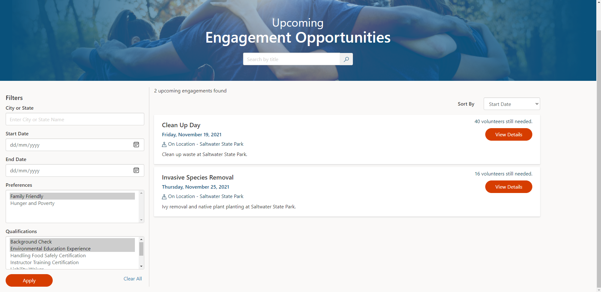
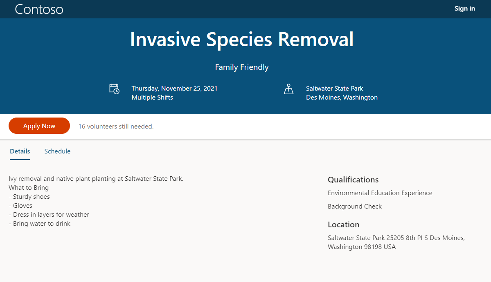
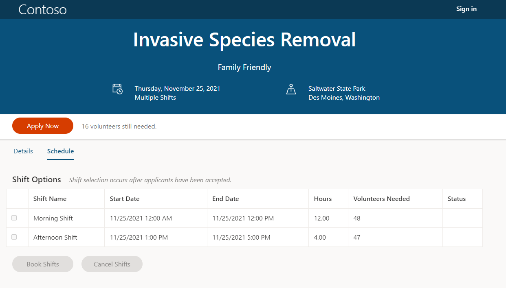

From the Volunteer Engagement portal, prospective volunteers can search for and view upcoming engagement opportunities that your organization has published. Volunteers can browse all engagement opportunities, search by title, or use the filters provided to find the right engagement for themselves. Engagement opportunities can be filtered by location, date, preferences, or the qualifications necessary.

> [!div class="mx-imgBorder"]
> 

As shown in the screenshot above, Invasive Species Removal is an upcoming engagement that matches the volunteer's selected preferences and qualifications. They can select **View Details** to read more about the engagement. Here, they can see the details that were set up and made public when the engagement was created in the Volunteer Management app.

> [!div class="mx-imgBorder"]
> 

Volunteers can see details such as the engagement description, date, location, qualifications, preferences, and number of volunteers required. They can also view the shift schedule, if relevant.

> [!div class="mx-imgBorder"]
> 
