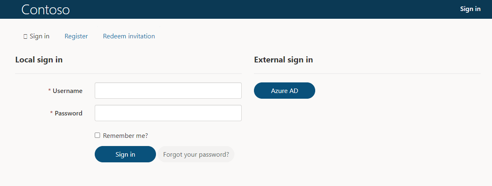
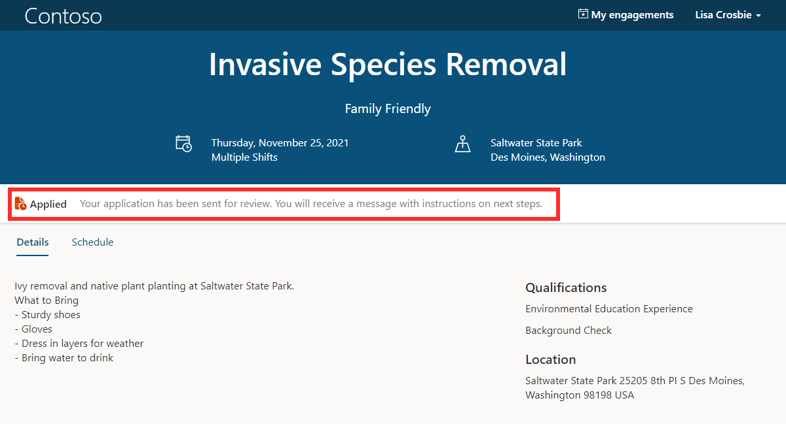

When a volunteer is ready to sign up for an engagement, they can click **Apply Now** on the engagement opportunity and will be prompted to sign in or create an account. Creating an account allows the volunteer to apply for engagement opportunities, view the status of their applications, select shifts when they are approved, and manage their profile details.

As an organization you can set up the options for account creation. This can include the ability for volunteers to sign in with services such as Azure Active Directory, Facebook, Google, or LinkedIn.

> [!div class="mx-imgBorder"]
> 

Identity providers can be configured from Power Apps. See here for more information about configuring authentication: [Get started with configuring your portal authentication - Power Apps \| Microsoft Docs](/powerapps/maker/portals/configure/use-simplified-authentication-configuration).

Once the volunteer has signed up for an engagement opportunity, they will see that their application is currently pending. Unless the engagement was set up to automatically approve all applications, the application will remain as pending until it is approved by the volunteer manager in Volunteer Management.

> [!div class="mx-imgBorder"]
> 
