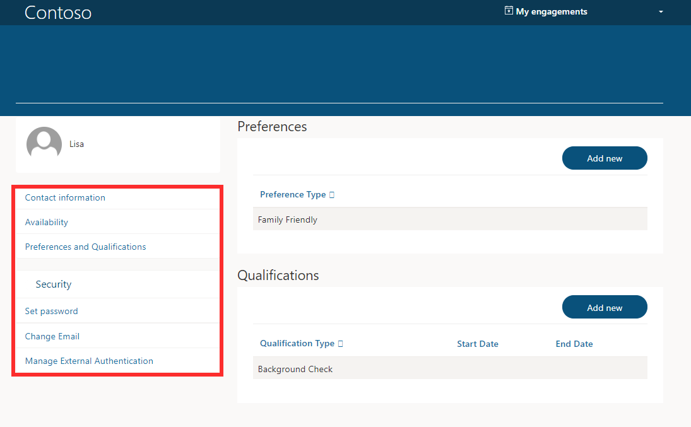
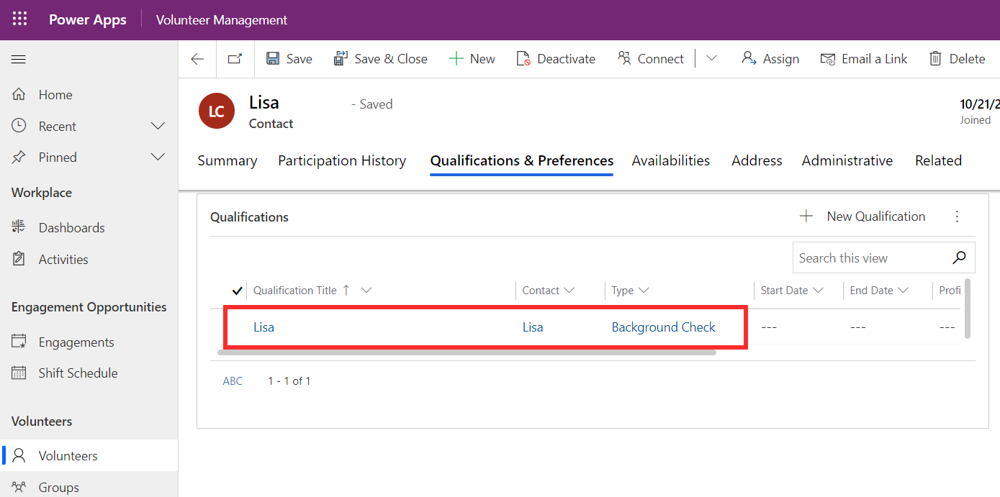
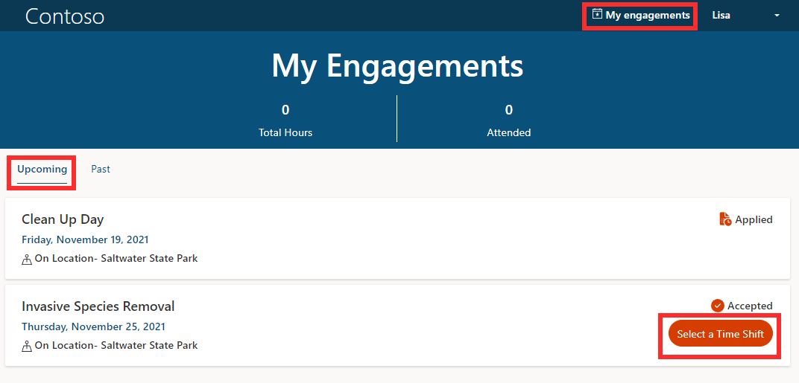
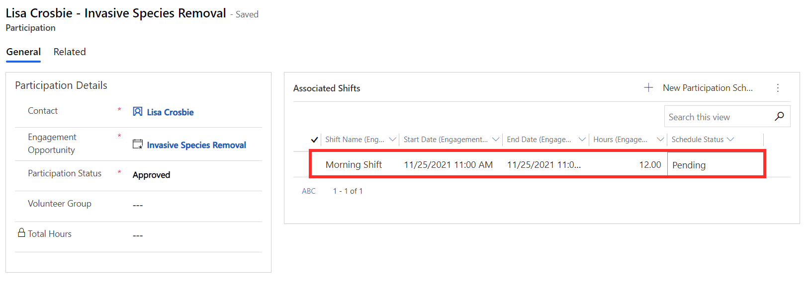

When logged into Volunteer Engagement, volunteers can update their profile and view their upcoming and past engagements.

## Update your profile

Volunteers can access and update their details such as contact information, availability, preferences, and qualifications. They can also update their account security settings, including setting their password, updating their email address, and managing external authentication.

> [!div class="mx-imgBorder"]
> 

The information updated or added here will be reflected in the Volunteer Management app. For example, the screenshot above shows that the volunteer Lisa has added Background Check as a qualification. Back in Volunteer Management, you will be able to see that she now has this qualification associated on her contact record.

> [!div class="mx-imgBorder"]
> 

## View upcoming engagements and select shifts

From the portal, volunteers can click **My engagements** to view details of upcoming engagements they have either applied to or been approved for. In the example below, the volunteer has been accepted to participate in Invasive Species Removal. Since the engagement opportunity shown below is shift-based, the volunteer can now select a time shift from here.

> [!div class="mx-imgBorder"]
> 

As a volunteer manager, you can see the selected shift appear in Volunteer Management on the engagement opportunity and volunteer's participation record.

> [!div class="mx-imgBorder"]
> 

## View past engagements

Volunteers can also access a history of the engagements they have previously participated in. This can be found in the **My engagements** area of the portal.
