The Vaccination Management App is a model-driven Power App that is used by the healthcare administrator to set up and manage phases, vaccines, doses, and schedules. The healthcare administrator can also see who has registered, vaccine inventory, and view basic reports on the daily schedule and activities, and outcomes of vaccinations.

In this exercise, you will be playing the role of a Site/Location manager and learn how to do the following:

- Set up Vaccine manufacturer's details.

- Record the Vaccine details along with its dosage, storage, and immunization education details.

- Setup Provider's details.

- Setup Vaccination site details and then associate the vaccinators to a site.

- Create schedules and autocreate slots.

- Record vaccination shipments.

## Task 1: Create manufacturer

In this task, you will create a Vaccine manufacturer record. This will enable you to onboard new vaccine manufacturer into the system.

1.  In the left pane, click on **Manufacturer** and then you can view the list of active manufacturers.

	> [!div class="mx-imgBorder"]
	> [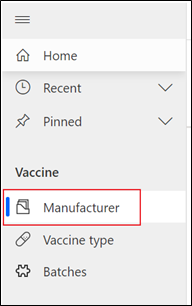](../media/manufacturer.png#lightbox)

1.  On the **Manufacturer** form, click on **New** button.

	> [!div class="mx-imgBorder"]
	> 

1.  On the new manufacturer form, enter the values as mentioned below and then click on **Save** button.

	- **Account Name**: Provide the Vaccine manufacturer's name. For Ex: Contoso Pharmaceuticals
	
	- **Account Type** : Select the type as "Manufacturer"
	
	- **Manufacturer Code**: Provide the manufacturer's code. For Ex: 1001
	
	- **Phone** : 425-555-0100
	
	- **Fax** : 425-555-0100
	
	- **Website** : `https://www.contoso.com/`
	
	- **Ticker Symbol** : CONTOSO
	
	- **Address 1:Street 1** : 3422 DELASKO Lane
	
	- **Address 1:City** : Elko New Market
	
	- **Address 1:State/Province** : MN
	
	- **Address 1:ZIP/Postal Code** : 99887
	
	- **Address 1: Country/Region** : US

	> [!div class="mx-imgBorder"]
	> [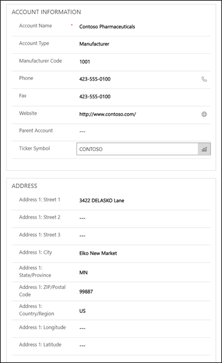](../media/account-information.png#lightbox)

## Task 2: Create a vaccine type

In this task, you will create a vaccine type. This will enable you to create new a vaccine record along with its dosage, storage, and education details.

1.  In the left pane, click on **Vaccine type** and then you can view the list of active vaccines.

	> [!div class="mx-imgBorder"]
	> [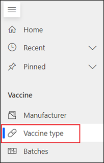](../media/vaccine-type.png#lightbox)

1.  On the **Vaccine type** form, click on **New** button.

	> [!div class="mx-imgBorder"]
	> [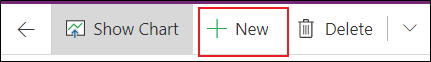](../media/new-vaccine-type.png#lightbox)

1.  On the new vaccine form, enter the values as mentioned below and then click on **Save** button.

	- **Name**: Contoso Covid Vaccine
	
	- **Manufacturer**: Contoso Pharmaceuticals.
	
	- **Code(CVX)**: Choose the **210** record that you created in the previous exercise.
	
	- **GTIN**: Provide the GTIN code of the vaccine. For Ex: 1234567890
	
	- **NDC Code**: The National Drug **Code** (**NDC**) is the **number** which identifies a vaccine/drug. For Ex: 12345-678-09
	
	- **Standard Dose Range High**: Provide the higher standard dosage range. For Ex: 0.3
	
	- **Standard Does Range Low**: Provide the lower standard dosage range. For Ex: 0.3
	
	- **Standard Dose Range Unit**: Provide the unit of measure for the dose ranges value. For Ex: mL
	
	- **Standard Dose Quantity**: Provide a value for the standard dosage quantity. For Ex: 1
	
	- **Period to Next Dose**: Provide a value for the wait time for the next dose. For Ex: 21
	
	- **Period to Next Dose**: Enter the wait time for the next dose in words. For Ex: Twenty-one days
	
	- **Storage Temperature**: Enter the temperature at which the vials need to be frozen. For Ex: 40.
	
	- **Storage Temperature Unit**: Select the temperature unit. For Ex: Fahrenheit.

	> [!div class="mx-imgBorder"]
	> [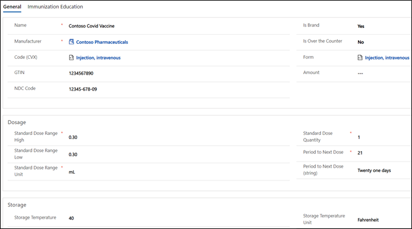](../media/general-details.png#lightbox)

**Congratulations!** You have created a new Vaccine manufacturer in the Vaccine Site management app.

## Task 3: Create provider

In this task, you will create a Provider record. A provider is an organization that manages a vaccination site. This will enable you to onboard new providers into the system.

1.  In the left pane, click on **Provider** and then you can view the list of active providers.

	> [!div class="mx-imgBorder"]
	> [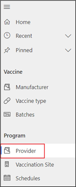](../media/provider.png#lightbox)

1.  On the **Provider** form, click on **New** button.

	> [!div class="mx-imgBorder"]
	> [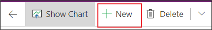](../media/new-provider.png#lightbox)

1.  Set the Account form type to Organization.

	> [!div class="mx-imgBorder"]
	> [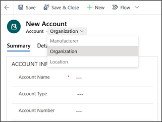](../media/organization.png#lightbox)

1.  On the new provider form, make sure that the view is set as Organization and then enter the values as mentioned below and then click on **Save** button.

	- **Account Name**: Lamna Healthcare Company
	
	- **Account Type** : Organization
	
	- **Account Number**: 1001
	
	- **Phone**: 425-555-0100
	
	- **Fax**: 425-555-0100
	
	- **Website**: `http://www.lamnahealthcarecompany.com/`
	
	- **Address 1:Street 1**: 3422 DELASKO Lane
	
	- **Address 1:City**: Elko New Market
	
	- **Address 1:State/Province**: MN
	
	- **Address 1:ZIP/Postal Code**: 99887
	
	- **Address 1: Country/Region**: US

	> [!div class="mx-imgBorder"]
	> [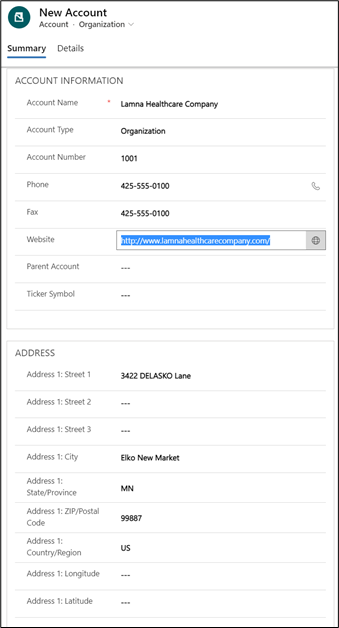](../media/new-account-details.png#lightbox)

**Congratulations!** You have successfully created a Vaccination Provider in the Vaccination Site Management App.

## Task 4: Create Vaccination Site details and associate vaccinators

In this task, you will create vaccination site details and associate vaccinators/frontline worker to a site so that these users can be selected on the canvas app for the respective site. This will enable you to onboard new providers into the system.

1.  In the left pane, click on **Vaccination Site** and then you can view the list of vaccination sites.

	> [!div class="mx-imgBorder"]
	> [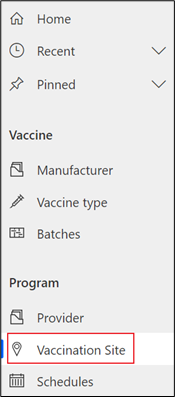](../media/vaccination-site.png#lightbox)

1.  On the new Vaccination site form, enter the values as mentioned below and then click on **Save** button.

	- **Name**: Provide a name for the site. For Ex: Lamna - Redmond
	
	- **Provider**: Select a provider. For Ex: Lamna Healthcare Company
	
	- **Location Number**: Provide a unique location number. For Ex: 1234
	
	- **Timezone**: Select a timezone and it will be used in Frontline worker app. For Ex: (GMT-08:00) Pacific Time (US & Canada)
	
	- **Street 1**: 8582 PALMITER Court
	
	- **City**: Redmond
	
	- **Country/Region**: US
	
	- **State/Province**: WA
	
	- **ZIP/Postal Code**: 98052
	
	- **Latitude:** 47.6701
	
	- **Longitude: -**122.1182
	
	- **Timezone**: (GMT-8:00) Pacific Time (US & Canada)
	
	- **Timezone IANA**: America/Tijuana

	> [!div class="mx-imgBorder"]
	> [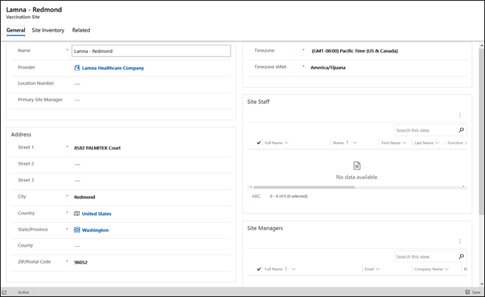](../media/site-details-large.png#lightbox)

1. Upon saving the record, the controls in the **Vaccinators** group will be visible. Click on **Add Existing Vaccination Performer** button to associate an existing user to a vaccination site.

	> [!div class="mx-imgBorder"]
	> [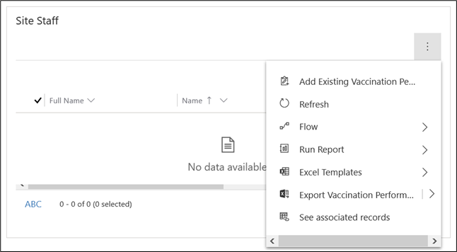](../media/site-staff.png#lightbox)

1. On the pop-up, **search** for the name of any Performer that is already created. Select the **Performer** name and click on **Add** button.

	> [!div class="mx-imgBorder"]
	> [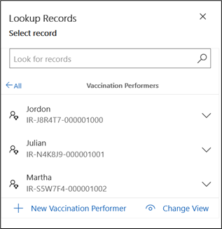](../media/performer-search.png#lightbox)

**Congratulations!** You have successfully created a Vaccination Site in the Vaccination Site Management App.

## Task 5: Create schedule and slots

In this task, you will learn to create new schedules and automatically create slots. Once the slots are created, it will be displayed in the

1.  On the left site map, select **Schedules** and then click **+ New**.

	> [!div class="mx-imgBorder"]
	> [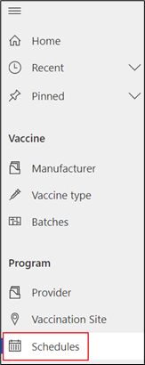](../media/schedules.png#lightbox)

1. On the new Schedule record, fill out the following information:

	- **Name**: Lamna Vaccine Event
	
	- **Location**: Contoso - Redmond
	
	- **Enable Schedule Builder Automation**: Yes
	
	- **Dose**: Dose 1
	
	- **Vaccine**: Contoso Covid Vaccine
	
	- **Start Date**: Yesterday
	
	- **End Date**: Tomorrow
	
	- **Start Time**: 08:00
	
	- **End Time**: 18:00
	
	- **Slot Interval**: 30 minutes
	
	- **Slots Per Interval**: 5
	
	- **Monday - Saturday**: Yes

	> [!IMPORTANT]
	> Be sure to check off at least one day prior to saving the record for the first time, otherwise no slots will be created.

	> [!div class="mx-imgBorder"]
	> [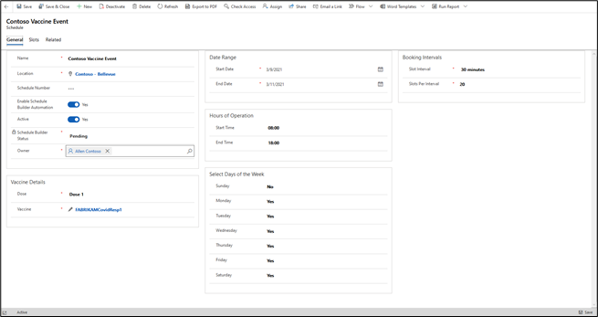](../media/event-record.png#lightbox)

1. Click **Save & Close.** The Schedule Builder will then process and create the slots for the Schedule record.

	> [!div class="mx-imgBorder"]
	> [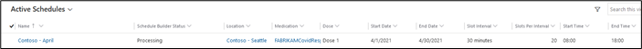](../media/processing-status.png#lightbox)

**Congratulations!** You have successfully created a slot schedule for a vaccination site in the Vaccination Site Management App.

## Task 6: Create a batch

In this task you will create a batch of newly received vaccine doses to be made available to residents.

1.  On the left site map, navigate to **Batches** under the Vaccine section and then click **+ New.**

	> [!div class="mx-imgBorder"]
	> [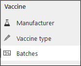](../media/batches.png#lightbox)

	> [!div class="mx-imgBorder"]
	> [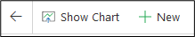](../media/new-batches.png#lightbox)

1.  Create a new Vaccine Batch record by entering in the following information:

    **Medication ID**: Contoso Covid Vaccine

    **Batch Expiration Date**: Two weeks from now, 8:00 PM

    **Batch Lot Number**: 85

    **Dose Quantity**: 10

    **Dose Quantity (string):** 10

    **Location**: Contoso - Redmond

	> [!div class="mx-imgBorder"]
	> 

**Congratulations!** You have successfully created a vaccine batch in the Vaccination Site Management App.

## Task 7: Open a vaccine phase for booking

To address the situation of when demand for appointments is greater than the availability of appointment slots, vaccination program administrators can set a phase to allow or not allow eligible residents to make an appointment.

-   If **Book During Registration** is set to **Yes**, upon registering currently eligible residents can continue and directly book a vaccination appointment.

-   If **Book During Registration** is set to **No**, currently eligible residents cannot book an appointment upon registering. Eligible residents are presented with a screen that informs them that they are eligible. If they provide their contact information, they will be notified in email about when and how to make an appointment.

To make access to vaccination appointments more equitable, a vaccination program administrator can specify that the selection of eligibility is random. This uses a lottery method to select which eligible residents are sent email invitations. The default selection method is first in, first out (FIFO).

In this task, we will open a Vaccine Phase for Registration & Booking.

1.  Select **Reference Data** from the bottom-left site map.

	> [!div class="mx-imgBorder"]
	> [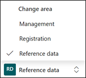](../media/reference-data-selected.png#lightbox)

1.  On the left site map, select **Phases** and then open the **Phase 2** record.

	> [!div class="mx-imgBorder"]
	> [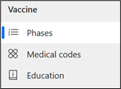](../media/phases.png#lightbox)

	> [!div class="mx-imgBorder"]
	> 

1.  Change the '**Booking open'** field from No to **Yes**. This will lock the field once changed so that it cannot be changed back. All future Vaccine Eligibility records will now be tracked against this phase. Click **Save & Close** to close the record.

	> [!div class="mx-imgBorder"]
	> 

**Congratulations!** You have open up a Vaccine Phase for registration and booking in the Vaccination Site Management app.

