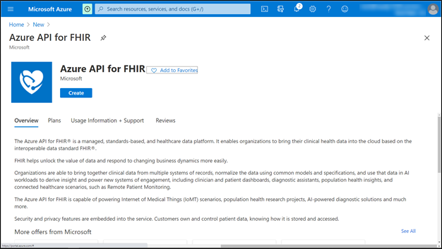
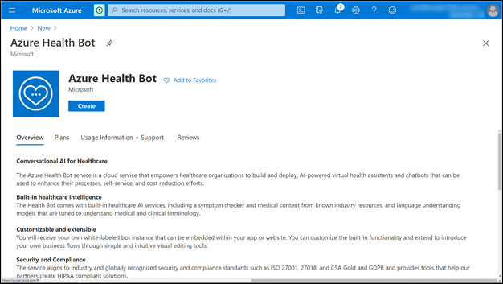
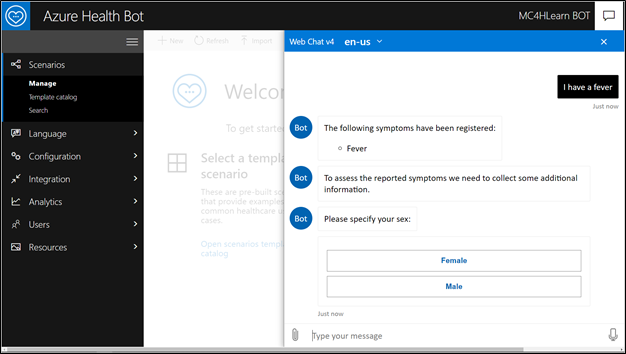

Currently, the Microsoft Cloud for Healthcare applications are only supported on the North American Microsoft 365 tenants. 

## Microsoft Azure

Microsoft Azure is a cloud-based platform that is the foundation for applications, databases, and services. Microsoft services such as Microsoft 365, Microsoft Power Platform, and other services run on Microsoft Azure. IT professionals can create and provision their own solutions by using Microsoft Azure.

Azure API for FHIR (fast healthcare interoperability resources) and Azure Health Bot are features of Microsoft Cloud for Healthcare that are powered by Microsoft Azure.

The main benefits of these healthcare features are that they can be deployed without the requirement of hardware resources or platform configuration. The foundational capacity can be increased or decreased depending on the needs of the organization.

## Subscription requirements

Many Microsoft Azure services are licensed on a consumption model, meaning that the costs are determined by computing resources that have been used during a particular billing cycle. Azure API for FHIR does not have a fixed monthly cost. Additionally, Azure API for FHIR can be provisioned on an Azure portal, and the monthly costs can be calculated based on projected usage by using the [Azure Pricing Calculator](https://azure.microsoft.com/pricing/calculator/?azure-portal=true).

Azure Health Bot is offered as a free or standard plan. The free plan is only recommended for testing and experimenting with Azure Health Bot. The standard plan is a fixed monthly fee with a set package of messages and content consumption with additional fees for messages and content that are required beyond the fixed monthly fee. For more information, see [Choosing the right Health Bot plan](/azure/health-bot/resources/pricing-details/?azure-portal=true).

## Microsoft Cloud for Healthcare Azure deployment

Microsoft Cloud for Healthcare Azure deployment includes the Azure API for FHIR and Azure Health Bot features.

### Azure API for FHIR

Azure API for FHIR allows organizations to take data from various medical systems and centralize them in cloud-based systems. The information can then be accessed and updated from Microsoft Cloud for Healthcare applications, and you can also enable various AI and analytics features.

Azure API for FHIR can be deployed by adding a new resource to an existing Azure deployment. The deployment process will provision all services and APIs to be integrated and accessed from the different electronic medical record systems.

For more information, see [Quickstart: Deploy Azure API for FHIR using Azure portal](/azure/healthcare-apis/fhir-paas-portal-quickstart/?azure-portal=true).

> [!div class="mx-imgBorder"]
> 

### Azure Health Bot

Azure Health Bot service provides an AI-powered virtual assistant for use with various medical solutions, including Microsoft Cloud for Healthcare. Specifically, an Azure Health Bot can be displayed on a Patient Access portal, and transcriptions of the interaction between patient and bot can be added to a case record in the Patient Service Center.

> [!div class="mx-imgBorder"]
> 

Azure Health Bot can be deployed by adding a new resource to an existing Azure subscription. The provisioning process will prompt for the choice of subscription plan (free or standard) and will deploy the required assets.

For more information, see [Create your first Health Bot](/azure/health-bot/quickstart-createyourhealthcarebot/?azure-portal=true).

When Azure Health Bot has been deployed, it can be further configured on the Azure Health Bot portal, and then conversations can be initiated with the bot.

> [!div class="mx-imgBorder"]
> 

