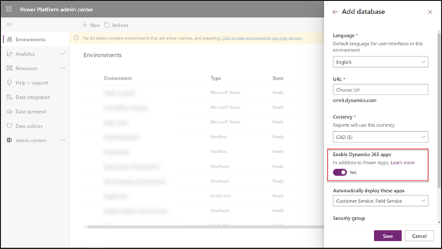
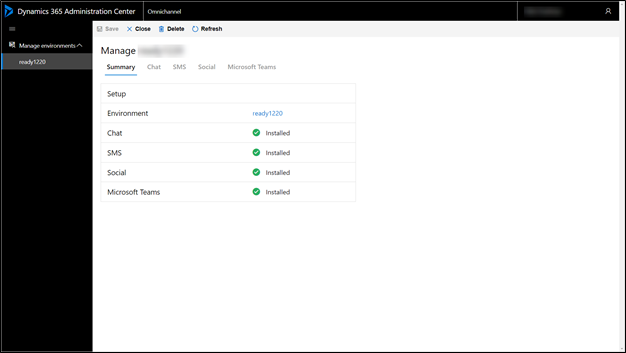
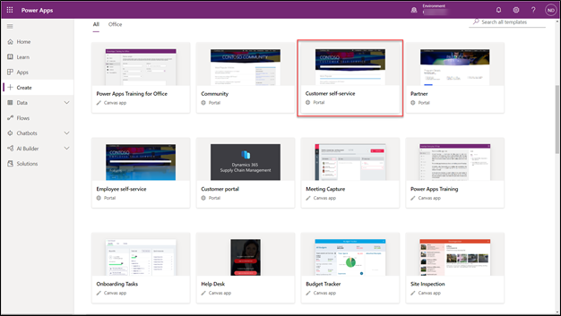
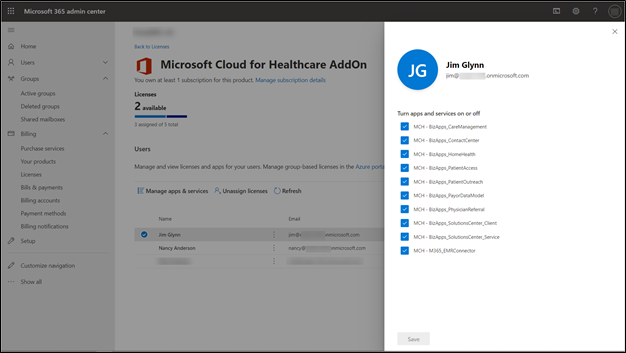
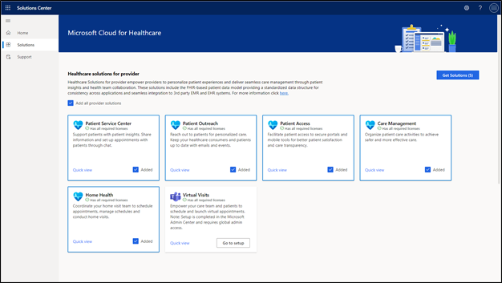
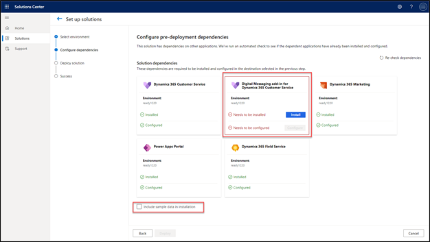
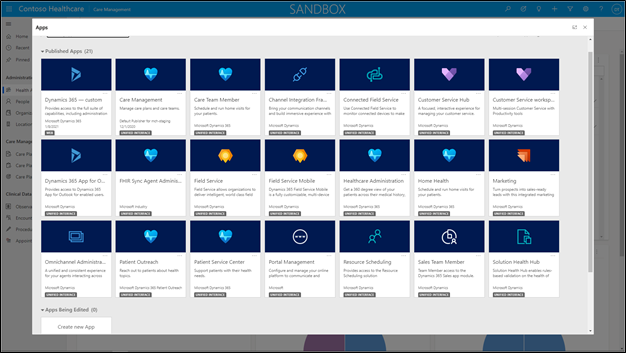

Currently, the Microsoft Cloud for Healthcare applications are only supported on North American Microsoft 365 tenants. 

## Microsoft Power Platform

Microsoft Power Platform provides a foundation for building applications, analyzing data, and automating processes. Robust business and industry applications can be quickly developed by using low-code and professional code techniques. Many of Microsoft's flagship business solutions, such as Dynamics 365 apps, are built on Microsoft Power Platform.

Many of the Microsoft Cloud for Healthcare apps are built and extended from existing Microsoft Power Platform and Microsoft Dynamics 365 solutions.

Providing healthcare applications that are built on Microsoft Power Platform has several benefits. For example, an increased pool of professional solution architects, functional consultants, and application developers might not have a background in the healthcare industry, but they can apply their application skills to collaborate on implementing robust healthcare solutions.

Microsoft Power Platform can be extended, modified, and integrated, which allows organizations to implement unique application solutions to address specific requirements.

Along with the core capabilities that are provided with the various healthcare solutions, Microsoft Power Platform offers other services that can be used such as custom apps with Microsoft Power Apps, Power Automate, Power BI, AI Builder, and Power Virtual Agents.

To configure Microsoft Cloud for Healthcare, you need to install and configure several prerequisite applications before deploying the healthcare solutions. Deployment of Microsoft Cloud for Healthcare is facilitated in the [Dynamics 365 Solutions Center.](https://admin.solutions.dynamics.com/?azure-portal=true).

## Subscription requirements

Depending on what specific applications and features will be implemented, to install Microsoft Cloud for Healthcare, you will need to ensure that the tenant has a combination of either trial or full subscriptions of the following products:

-   Microsoft Power Apps Per user plan (Care Management only)

-   Microsoft Dynamics 365 Customer Service Enterprise (Patient Service Center, Patient Access)

-   Microsoft Dynamics 365 Field Service (Home Health)

-   Digital Messaging Add-in for Microsoft Dynamics 365 Customer Service (Patient Service Center)

-   Microsoft Dynamics 365 Marketing (Patient Outreach)

-   Microsoft Power Apps portals Login capacity add-on (Patient Access)

-   Power Apps portals Page view capacity add-on (Patient Access)

-   Dynamics 365 Customer Engagement Plan trial (30-day trial for Dynamics 365 Customer Service and Dynamics 365 Field Service)

-   Microsoft Cloud for Healthcare add-on (all solutions)

During deployment, the Dynamics 365 Solution Center will verify that the tenant has the appropriate licenses. Because requirements might evolve over time, we recommend that you review the Dynamics 365 Licensing Guide. The guide provides up-to-date information on pricing and licensing requirements for Dynamics 365 applications. Also, you should review the [How to buy the Microsoft Cloud for Healthcare](/industry/healthcare/buy/?azure-portal=true) documentation for up-to-date steps on pricing information and how to acquire the Microsoft Cloud for Healthcare add-on.

## Dataverse environment

A Microsoft Dataverse environment will need to be provisioned with a database. Using the default Microsoft Power Platform environment is not supported. Multiple environments for production, development, and testing need to be considered for healthy application lifecycle management (ALM).

The Home Health, Patient Service Center, Patient Outreach, and Patient Access applications will also require a Dataverse environment with Dynamics 365 apps enabled.

> [!NOTE]
> Dynamics 365 apps, such as Customer Service, must be enabled when the environment database is created; it cannot be added later.

> [!div class="mx-imgBorder"]
> 

## Microsoft Cloud for Healthcare applications prerequisites

The following sections explain the prerequisites for applications in Microsoft Cloud for Healthcare.

### Care Management

The Care Management solution does not require dependencies on existing Microsoft Dynamics 365 applications. The solution can be installed and configured on a standard Dataverse environment with a database installed. The Care Management solution will be installed with a model-driven app from Power Apps and uses the existing Dataverse functionality to integrate with Microsoft 365.

### Patient Service Center

The Patient Service Center application requires the [Dynamics 365 Customer Service](/dynamics365/customer-service/?azure-portal=true) app and the [Digital Messaging Add-in for Dynamics 365 Customer Service](/dynamics365/customer-service/introduction-omnichannel/?azure-portal=true) (also known as Omnichannel for Customer Service).

Dynamics 365 Customer Service provides case management capabilities to track the life cycle and communication that are associated with a particular incident that is related to a customer. Cases can also be routed or managed through queues, and a searchable library of knowledge base articles can be reviewed and attached to specific cases.

These features support a healthcare environment by tracking various patient healthcare cases and tracking the communications and interactions between healthcare workers and patients.

The Microsoft Cloud for Healthcare deployment process will configure Dynamics 365 Customer Service for the Patient Service Center app.

The Digital Messaging Add-in for Dynamics 365 component enables healthcare agents to interact with patients by using various communication methods. The Patient Service Center application can be linked to Microsoft Health Bot and the Patient Access portal to help automate and facilitate these conversations.

To deploy Microsoft Cloud for Healthcare, you will need to provision the Digital Messaging Add-in and have the various channels enabled.

For more information, see [Provision Omnichannel for Customer Service](/dynamics365/customer-service/omnichannel-provision-license/?azure-portal=true).

> [!div class="mx-imgBorder"]
> 

### Patient Outreach

The Patient Outreach application requires [Dynamics 365 Marketing](/dynamics365/marketing/help-hub/?azure-portal=true).

With the Dynamics 365 Marketing app, users can create targeted communication campaigns and customer journeys, manage events, and manage subscription lists.

Patient Outreach extends these concepts into allowing healthcare professionals to use prebuilt patient segments based on Healthcare Effectiveness Data and Information Set (HEDIS) to manage lists of their patients and create healthcare-specific outreach and communication campaigns.

The Microsoft Cloud for Healthcare deployment process will configure Dynamics 365 Marketing for the Patient Outreach application.

### Patient Access

The Patient Access application uses [Power Apps portals](/powerapps/maker/portals/overview/?azure-portal=true), specifically an enhancement of the Customer self-service portal. The Customer self-service portal allows external stakeholders to interact with the Dynamics 365 Customer Service app.

The Patient Access portal allows patients to sign in, request appointments, and send and receive confidential communications with their healthcare professionals.

Prior to deployment of the Microsoft Cloud for Healthcare Patient Access solution, you will need to provision a Power Apps portal on the Dataverse environment. Ideally, the environment should not have other portals deployed because the process could overwrite existing portal configurations.

For more information, see [Create a portal with Dynamics 365 environment](/powerapps/maker/portals/create-dynamics-portal/?azure-portal=true).

> [!div class="mx-imgBorder"]
> 

### Home Health

The Home Health application uses [Dynamics 365 Field Service](/dynamics365/field-service/overview/?azure-portal=true), which is designed to manage onsite service to customer locations. The Home Health application extends this concept to help health coordinators effectively schedule care team member home visit appointments, optimize routes, and coordinate tasks and processes during the visit. If Dynamics 365 Field Service was not added when the initial Dataverse database was created, it will need to be installed prior to deployment of the Home Health app.

For more information, see [How to install Dynamics 365 Field Service](/dynamics365/field-service/install-field-service/?azure-portal=true).

The Microsoft Cloud for Health deployment process will configure Dynamics 365 Field Service for the Home Health app.

### Virtual Visits (Teams)

Virtual Visits is an extension of Microsoft Teams. The deployment process is separate from Dynamics 365 apps. Virtual Visits (Microsoft Teams meetings) can be launched from the Patient Access portal.

The Virtual Visits installation process helps installers link to the Epic Electronic Medical Record (EMR) system so that healthcare providers can view and update a patient's medical information during the virtual visit.

## Deployment of Microsoft Cloud for Healthcare

To deploy Microsoft Cloud for Healthcare apps, the user who is performing the installation must be assigned a license.

> [!div class="mx-imgBorder"]
> 

With the prerequisites installed and the user licensed, Microsoft Cloud for Healthcare solutions powered by Dynamics 365 can be deployed.

For more information, see [Deploy Microsoft Cloud for Healthcare solutions powered by Dynamics 365](/dynamics365/industry/healthcare/deploy/?azure-portal=true).

Most provider solutions can be deployed in one process or individually, depending on the requirements.

> [!div class="mx-imgBorder"]
> 

The process will also verify prerequisites or configurations that are required to deploy Microsoft Cloud for Healthcare solutions. After all requirements have been met, the deployment process can continue. The deployment process will also allow for the installation of sample data for testing and training purposes.

> [!div class="mx-imgBorder"]
> 

The deployment might take several hours. When the process is complete or encounters issues, an email will be sent to the installation user.

The various Microsoft Cloud for Healthcare Dynamics 365 apps will then be available.

> [!div class="mx-imgBorder"]
> 

> [!VIDEO https://www.microsoft.com/videoplayer/embed/RE4MBqf]

