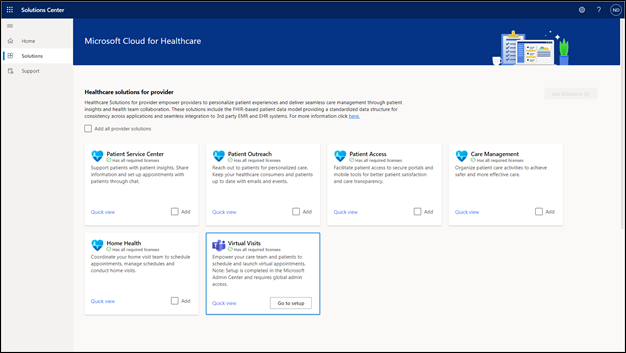
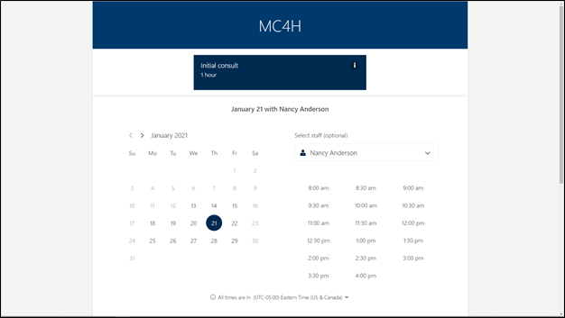

Currently, the Microsoft Cloud for Healthcare applications are only supported on North American Microsoft 365 tenants. 

## Microsoft 365

Microsoft 365 is a suite of cloud-based productivity and collaboration tools. Along with various tools to address regular business administrator requirements, Microsoft Cloud for Healthcare enhances Microsoft Teams to help health care professionals conduct virtual patient visits while connecting with Electronic Healthcare Records (EHR).

Microsoft Bookings allow for online scheduling of virtual patient visits. Regular patient appointments can be booked if the organization doesn't have the capability in their EHR system.

## Subscription requirements

To use Microsoft Teams and the Microsoft 365 EHR integration to the Epic platform, the following Microsoft 365 subscriptions are required:

-   Microsoft 365 Business Standard, Premium, Enterprise (Microsoft Teams)

-   Microsoft Cloud for Healthcare Add-on (Microsoft 365 EHR integration)

-   Epic version November 2018 or later (Microsoft 365 EHR integration)

For more information, see [How to buy the Microsoft Cloud for Healthcare](/industry/healthcare/buy/?azure-portal=true).

Microsoft Bookings can be used for patient appointments with Microsoft Teams for organizations without an EHR system, and it requires Microsoft 365 Business Standard, Premium, A3, A5, E3, or E5.

## Deployment of Microsoft Cloud for Healthcare

The following sections review the requirements to deploy the Microsoft Cloud for Healthcare application.

### Microsoft 365 EHR integration

The deployment of the Microsoft 365 EHR integration is launched from the Solutions Center. You will need information from your Epic system to complete the integration and access to an Epic administrator account.

For more information, see [Virtual visits with Teams - Integration into EHR](/MicrosoftTeams/expand-teams-across-your-org/healthcare/ehr-admin/?azure-portal=true).

> [!div class="mx-imgBorder"]
> 

### Microsoft Bookings

The Microsoft Bookings application doesn't have dependencies to the Microsoft Cloud for Healthcare applications. For more information, see [Virtual Visits with the Microsoft Teams and the Bookings app](/microsoftteams/bookings-app-admin/?azure-portal=true).

> [!div class="mx-imgBorder"]
> 
