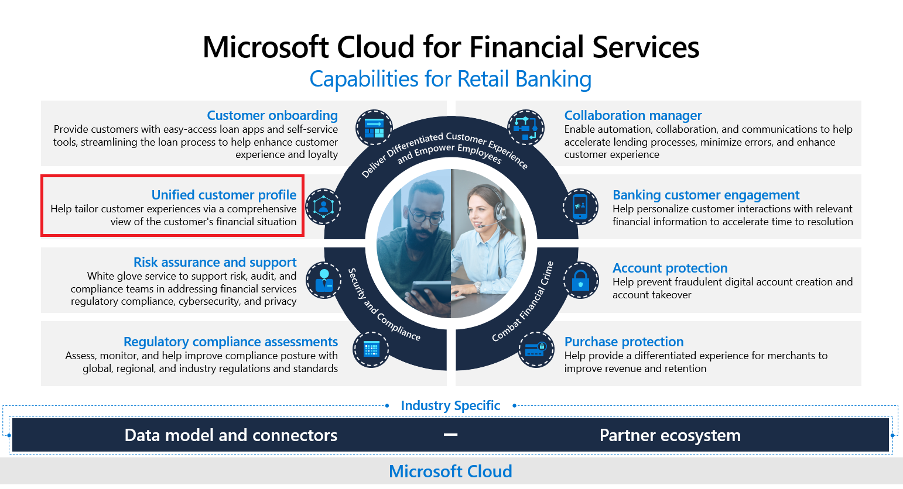

The **Unified customer profile** application shows a 360-degree perspective of the customer, consolidated into a unified dashboard. It offers an accurate, consistent, and cohesive source of truth about the customer. You can use this customer information to provide personalized experiences, reveal important opportunities, prevent potential loss or churn, and improve customer satisfaction.

Key capabilities of Unified customer profile include:

-   **Summary** - Consists of an at-a-glance summary of the customer, their personal details, life moments, financial holdings, and credit and debit cards.

-   **Connections** - Helps capture relationships between a customer and the related groups and contacts. This information will help you better understand the overall financial strength of the customer in reference to the relationships/groups (such as household) that they participate in.

-   **Financial holdings** - View detailed information about all financial holdings that are associated with the customer.

## Industry prioritized scenarios

Unified customer profile focuses on the **Deliver differentiated Customer Experience** and **Empower Employees** priority scenarios. It helps you benefit from a data-first experience that brings together financial details, life events, and household information into a single view. It also helps centralize your customer data in a single place through Microsoft Dataverse and the industry data model.

> [!div class="mx-imgBorder"]
> 

## Reference architecture

The following diagram shows the reference architecture of Unified customer profile.

> [!div class="mx-imgBorder"]
> 
